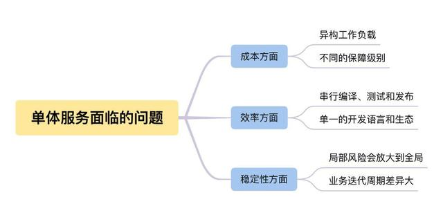
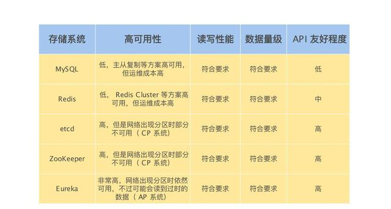
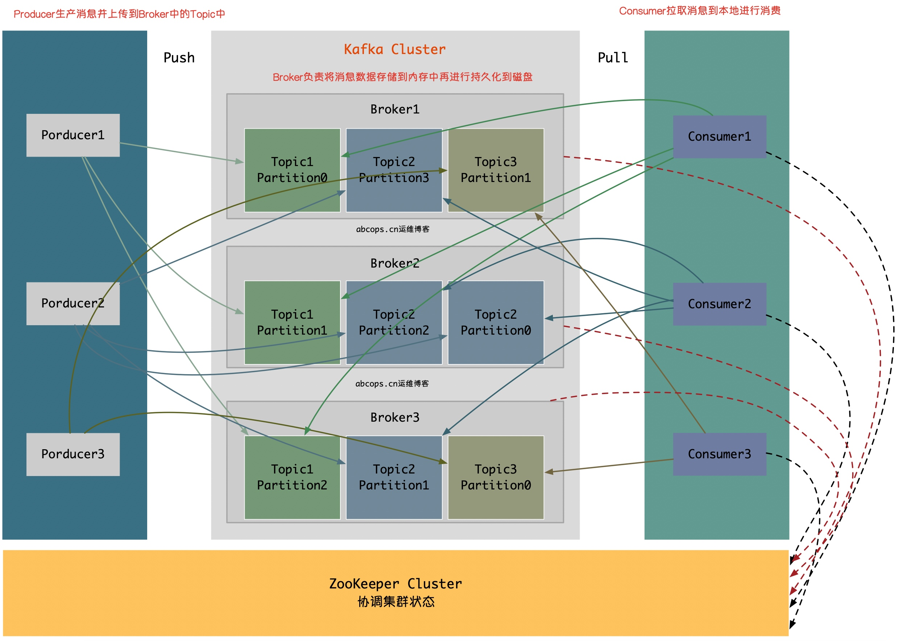
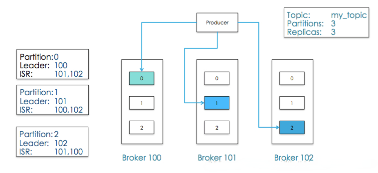
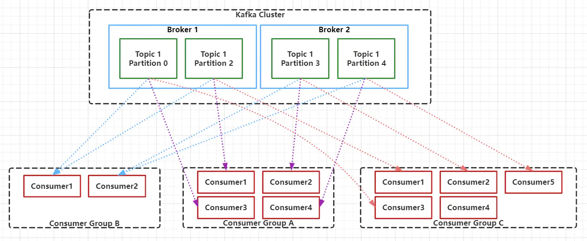
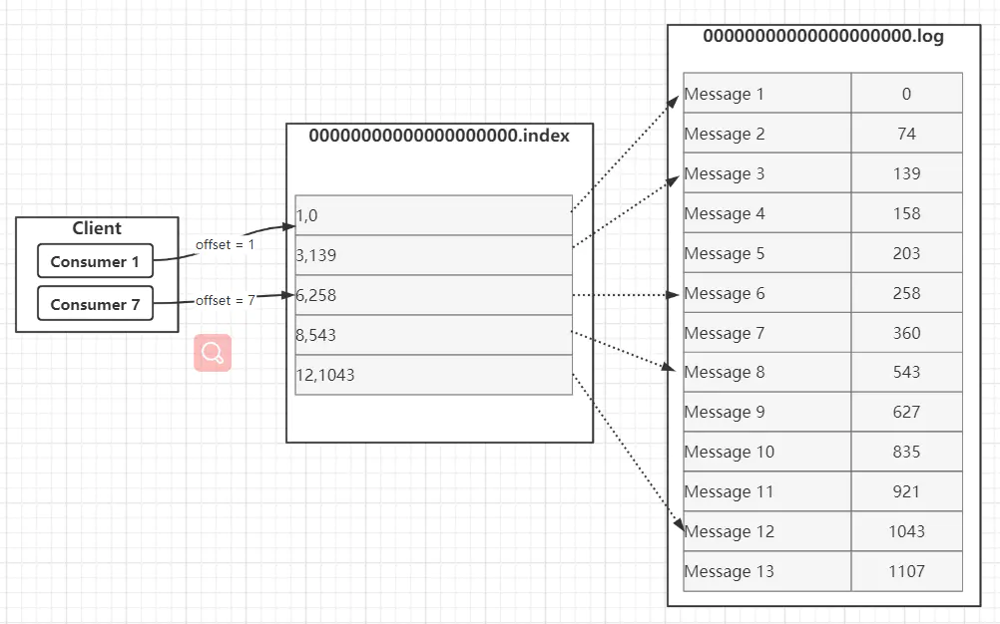
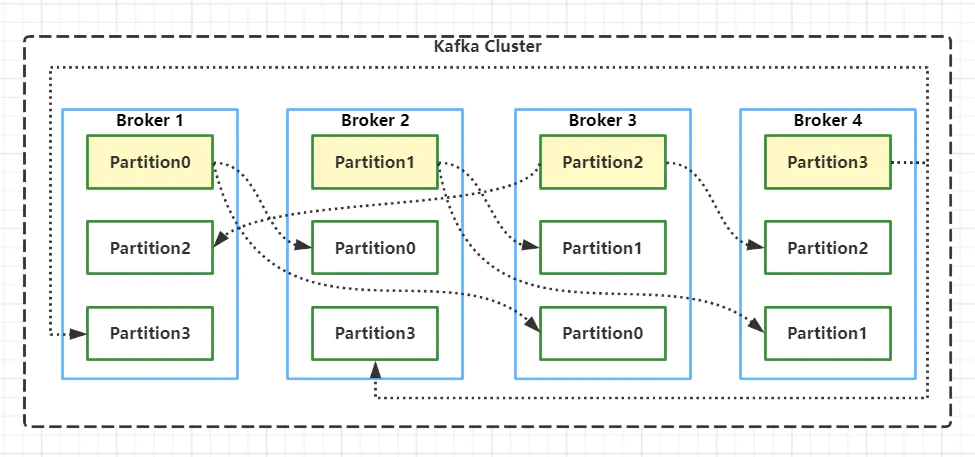
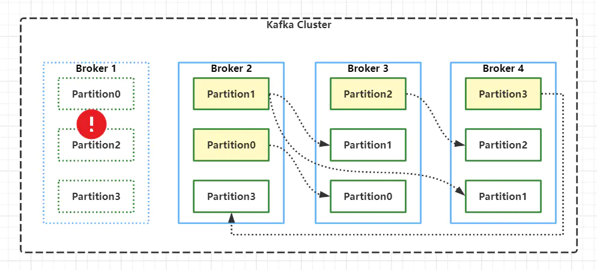
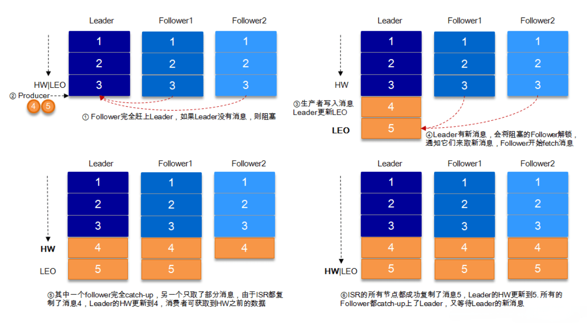
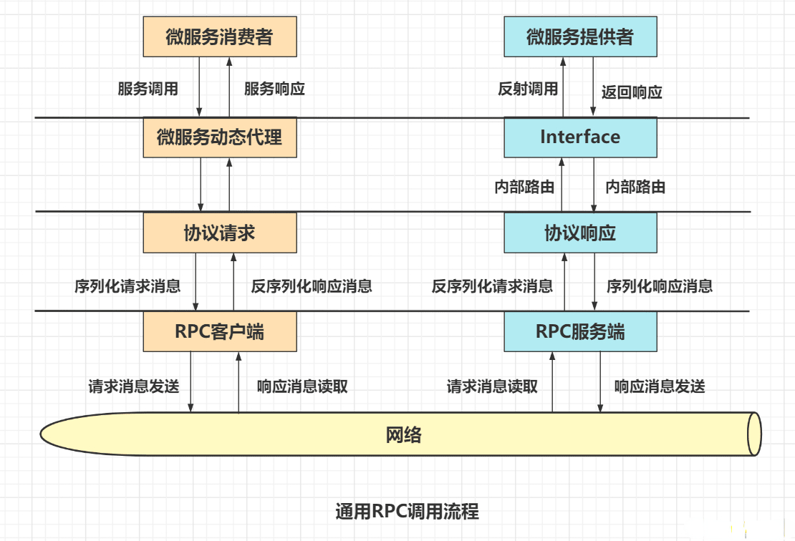

#  概述


# 微服务架构

单体架构面临的问题：




<p align="center">

</p>

就目前而言，业界对于微服务并没有一个统一的、标准的定义（While there is no precise definition of this architectural style ) 。但通常而言，微服务架构是一种架构模式或者说是一种架构风格，它提倡将单一应用程序划分成一组小的服务，每个服务独立运行在自己的进程之中，服务之间互相协调、互相配合，为用户提供最终价值。服务之间采用轻量级的通信机制互相沟通（通常是基于 HTTP 的 RESTful API） 。每个服务都围绕着具体业务进行构建，并且能够被独立地部署到生产环境、类生产环境等。另外，应尽量避免统一的、集中式的服务管理机制，对具体的一个服务而言，应根据业务上下文，选择合适的语言、工具对其进行构建，可以有一个非常轻量级的集中式管理来协调这些服务。可以使用不同的语言来编写服务，也可以使用不同的数据存储。

<p align="center">

</p>


## 微服务的利与弊

### 微服务架构的优点

- 解决了复杂性问题

微服务架构将单体应用分解为一组服务。虽然功能总量不变，但应用程序已被分解为可管理的模块或服务。这些服务定义了明确的 RPC 或消息驱动的 API 边界。微服务架构强化了应用模块化的水平，而这通过单体代码库很难实现。因此，微服务开发的速度要快很多，更容易理解和维护。

- 每个服务都可以由专注于此服务的团队独立开发

只要符合服务 API 契约，开发人员可以自由选择开发技术。这就意味着开发人员可以采用新技术编写或重构服务，由于服务相对较小，所以这并不会对整体应用造成太大影响。

- 每个微服务独立部署

开发人员无需协调对服务升级或更改的部署。这些更改可以在测试通过后立即部署。所以微服务架构也使得 CI/CD 成为可能。

- 每个服务都可独立扩展

我们只需定义满足服务部署要求的配置、容量、实例数量等约束条件即可。比如我们可以在 EC2 计算优化实例上部署 CPU 密集型服务，在 EC2 内存优化实例上部署内存数据库服务。


### 微服务架构的缺点和挑战

- 缺少统一标准

微服务强调了服务大小，但实际上这并没有一个统一的标准。业务逻辑应该按照什么规则划分为微服务，这本身就是一个经验工程。有些开发者主张 10-100 行代码就应该建立一个微服务。虽然建立小型服务是微服务架构崇尚的，但要记住，微服务是达到目的的手段，而不是目标。微服务的目标是充分分解应用程序，以促进敏捷开发和持续集成部署。

- 微服务的分布式特点带来的复杂性

开发人员需要基于 RPC 或者消息实现微服务之间的调用和通信，而这就使得服务之间的发现、服务调用链的跟踪和质量问题变得的相当棘手。

- 分区的数据库体系和分布式事务

更新多个业务实体的业务交易相当普遍。这些类型的事务在单体应用中实现非常简单，因为单体应用往往只存在一个数据库。但在微服务架构下，不同服务可能拥有不同的数据库。CAP 原理的约束，使得我们不得不放弃传统的强一致性，而转而追求最终一致性，这个对开发人员来说是一个挑战。

- 测试的复杂性

传统的单体 WEB 应用只需测试单一的 REST API 即可，而对微服务进行测试，需要启动它依赖的所有其他服务，这种复杂性不可低估。

- 跨多个服务的更改

比如在传统单体应用中，若有 A、B、C 三个服务需要更改，A 依赖 B，B 依赖 C。我们只需更改相应的模块，然后一次性部署即可。但是在微服务架构中，我们需要仔细规划和协调每个服务的变更部署。我们需要先更新 C，然后更新 B，最后更新 A。

- 部署的复杂性

单体应用可以简单的部署在一组相同的服务器上，然后前端使用负载均衡即可。每个应用都有相同的基础服务地址，例如数据库和消息队列。而微服务由不同的大量服务构成，每种服务可能拥有自己的配置、应用实例数量以及基础服务地址。这里就需要不同的配置、部署、扩展和监控组件。此外，我们还需要服务发现机制，以便服务可以发现与其通信的其他服务的地址。因此，成功部署微服务应用需要开发人员有更好地部署策略和高度自动化的水平。


## 服务发现

服务发现之所以重要，是因为它解决了微服务架构最关键的问题：如何精准的定位需要调用的服务 ip 以及端口。无论使用哪种方式来提供服务发现功能，大致上都包含以下三点：

- `Register` 服务启动时候进行注册
- `Query` 查询已注册服务信息
- `Healthy Check` 确认服务状态是否健康
  

整个过程很简单。大致就是在服务启动的时候，先去进行注册，并且定时反馈本身功能是否正常。由服务发现机制统一负责维护一份正确或者可用的服务清单。因此，服务本身需要能随时接受查询，反馈调用方所要的信息。


## 服务注册发现的实现

如何选择服务注册发现的中介存储：

- 可用性要求非常高：因为服务注册发现是整个分布式系统的基石，如果它出现问题，整个分布式系统将不可用；
- 性能要求中等：只要设计得当，整体的性能要求还是可控的，不过需要注意的是性能要求会随分布式系统的实例数量变多而提高；
- 数据容量要求低：因为主要是存储实例的 IP 和 Port 等元数据，单个实例存储的数据量非常小；
- API 友好程度：是否能很好支持服务注册发现场景的“发布 / 订阅”模式，将被调用服务实例的 IP 和 Port 信息同步给调用方。




### 主要模式

#### 注册模式

**自注册模式**

自注册，顾名思义，就是上述这些动作由服务（client）本身来维护。每个服务启动后，需要到统一的服务注册中心进行注册登记，服务正常终止后，也可以到注册中心移除自身的注册记录。

在服务执行过程中，通过不断的发送**心跳信息**，来通知注册中心，本服务运行正常。注册中心只要超过一定的时间没有收到心跳消息，就可以将这个服务状态判断为异常，进而移除该服务的注册记录。

**三方注册模式**

这个模式与自注册模式相比，区别就是健康检查的动作不是由服务本身来负责，而是由其它第三方服务来确认。

有时候服务自身发送心跳信息的方式并不精确，因为可能服务本身已经存在故障，某些接口功能不可用，但仍然可以不断的发送心跳信息，导致注册中心没有发觉该服务已经异常，从而源源不断地将流量打到已经异常的服务上来。

这时候，要确认服务是否正常运转的健康检查机制，就不能只依靠心跳，必须通过其它第三方的验证（ping），不断的从外部来确认服务本身的健康状态。


#### 发现模式

服务发现的主要组成部分为：

- 服务提供者：服务启动时将服务信息注册到注册中心，服务退出时将注册中心的服务信息删除掉；
- 服务消费者：从服务注册表获取服务提供者的最新网络位置等服务信息，维护与服务提供者之间的通信；
- 注册中心：服务提供者和服务消费者之间的一个桥梁。

服务发现机制的关键部分是注册中心。注册中心提供管理和查询服务注册信息的 API。当服务提供者的实例发生变更时（新增/删除服务），服务注册表更新最新的状态列表，并将其最新列表以适当的方式通知给服务消费者。目前大多数的微服务框架使用 Netflix Eureka、Etcd、Consul 或 Apache Zookeeper 等作为注册中心。

为了说明服务发现模式是如何解决微服务实例地址动态变化的问题，下面介绍两种主要的服务发现模式：

##### 客户端发现模式

在客户端模式下，如果要进行微服务调用，首先要进行的是到服务注册中心获取服务列表，然后再根据调用端本地的负载均衡策略，进行服务调用。

<p align="center">

</p>

在上图中，client 端提供了负载均衡的功能，其首先从注册中心获取服务提供者的列表，然后通过自身负载均衡算法，选择一个最合理的服务提供者进行调用:

1、服务提供者向注册中心进行注册，提交自己的相关信息;
2、服务消费者定期从注册中心获取服务提供者列表;
3、服务消费者通过自身的负载均衡算法，在服务提供者列表里面选择一个合适的服务提供者，进行访问.

客户端发现模式的优缺点如下：

- 优点：
    - 负载均衡作为 client 中一个功能，用自身的算法，从服务提供者列表中选择一个合适服务提供者进行访问，因此 client 端可以定制化负载均衡算法。优点是服务客户端可以灵活、智能地制定负载均衡策略，包括轮询、加权轮询、一致性哈希等策略；
    - 可以实现点对点的网状通讯，即去中心化的通讯。可以有效避开单点造成的性能瓶颈和可靠性下降等问题；
    - 服务客户端通常以 SDK 的方式直接引入到项目，这种方式语言的整合程度最佳，程序执行性能最佳，程序错误排查更加容易。

- 缺点：
    - 当负载均衡算法需要更新时候，很难做到同一时间全部更新，所以就造成新旧算法同时运行；
    - 与注册中心紧密耦合，如果要换注册中心，需要去修改代码，重新上线。微服务的规模越大，服务更新越困难，这在一定程度上违背了微服务架构提倡的技术独立性。

目前来说，大部分服务发现的实现都采取了客户端模式。

##### 服务端发现模式

在服务端模式下，调用方直接向服务注册中心进行请求，服务注册中心再通过自身负载均衡策略，对微服务进行调用。这个模式下，调用方不需要在自身节点维护服务发现逻辑以及服务注册信息。

<p align="center">

</p>

在服务端模式下： 

1、服务提供者向注册中心进行服务注册；
2、注册中心提供负载均衡功能；
3、服务消费者去请求注册中心，由注册中心根据服务提供列表的健康情况，选择合适的服务提供者供服务消费者调用。

现代容器化部署平台（如 Docker 和 Kubernetes）就是服务端发现模式的一个例子，这些部署平台都具有内置的服务注册表和服务发现机制。容器化部署平台为每个服务提供路由请求的能力。服务客户端向路由器（或者负载均衡器）发出请求，容器化部署平台自动将请求路由到目标服务一个可用的服务实例。因此，服务注册、服务发现和请求路由完全由容器化部署平台处理。

服务端发现模式的特点如下：

- 优点：
    - 服务消费者不需要关心服务提供者的列表，以及其采取何种负载均衡策略；
    - 负载均衡策略的改变，只需要注册中心修改就行，不会出现新老算法同时存在的现象；
    - 服务提供者上下线，对于服务消费者来说无感知

- 缺点：
    - 响应时间增加，因为每次请求都要经过注册中心，由其返回一个服务提供者；
    - 注册中心成为瓶颈，所有的请求都要经过注册中心，如果注册服务过多，服务消费者流量过大，可能会导致注册中心不可用；
    - 微服务的一个目标是故障隔离，将整个系统切割为多个服务共同运行，如果某服务无法正常运行，只会影响到整个系统的相关部分功能，其它功能能够正常运行，即去中心化。然而，服务端发现模式实际上是集中式的做法，如果路由器或者负载均衡器无法提供服务，那么将导致整个系统瘫痪。


### 实现方案

#### file

以文件的形式实现服务发现，这是一个比较简单的方案。其基本原理就是将服务提供者的信息（ip:port）写入文件中，服务消费者加载该文件，获取服务提供者的信息，根据一定的策略，进行访问。

需要注意的是，因为以文件形式提供服务发现，服务消费者要定期的去访问该文件，以获得最新的服务提供者列表，这里有个小优化点，就是可以有个线程定时去做该任务，首先去用该文件的最后一次修改时间跟服务上一次读取文件时候存储的修改时间做对比，如果时间一致，表明文件未做修改，那么就不需要重新做加载了，反之，重新加载文件。

文件方式实现服务发现，其特点显而易见：

- 优点：实现简单，去中心化；

- 缺点：需要服务消费者去定时操作，如果某一个文件推送失败，那么就会造成异常现象。

#### zookeeper

ZooKeeper 是一个集中式服务，用于维护配置信息、命名、提供分布式同步和提供组服务。

<p align="center">

</p>

zookeeper 是一个树形结构，如上图所示。

使用 zookeeper 实现服务发现的功能，简单来讲，就是使用 zookeeper 作为注册中心。服务提供者在启动的时候，向 zookeeper 注册其信息，这个注册过程其实就是在 zookeeper 中创建了一个 znode 节点，该节点存储了 ip 以及端口等信息，服务消费者向 zookeeper 获取服务提供者的信息。 

服务注册、发现过程简述如下：

- 服务提供者启动时，会将其服务名称，ip 地址注册到配置中心；
- 服务消费者在第一次调用服务时，会通过注册中心找到相应的服务的 IP 地址列表，并缓存到本地，以供后续使用。当消费者调用服务时，不会再去请求注册中心，而是直接通过负载均衡算法从 IP 列表中取一个服务提供者的服务器调用服务；
- 当服务提供者的某台服务器宕机或下线时，相应的 ip 会从服务提供者 IP 列表中移除。同时，注册中心会将新的服务 IP 地址列表发送给服务消费者机器，缓存在消费者本机；
- 当某个服务的所有服务器都下线了，那么这个服务也就下线了；同样，当服务提供者的某台服务器上线时，注册中心会将新的服务 IP 地址列表发送给服务消费者机器，缓存在消费者本机；
- 服务提供方可以根据服务消费者的数量来作为服务下线的依据。

**服务注册**

假设我们服务提供者的服务名称为 services，首先在 zookeeper 上创建一个path/services，在服务提供者启动时候，向 zookeeper 进行注册，其注册的原理就是创建一个路径，路径为 /services/$ip:port，其中 ip:port 为服务提供者实例的 ip 和端口。

<p align="center">

</p>

**上线**

服务消费者会去监听相应路径（/services），一旦路径上的数据有任何变化（增加或减少），zookeeper 都会通知服务消费方服务提供者地址列表已经发生改变，从而进行更新。

**健康检查**

zookeeper 实现了一种 TTL 的机制，就是如果客户端在一定时间内没有向注册中心发送心跳，则会将这个客户端摘除。

zookeeper 提供了“心跳检测”功能，它会定时向各个服务提供者发送一个请求（实际上建立的是一个 socket 长连接），如果长期没有响应，服务中心就认为该服务提供者已经“挂了”，并将其剔除。

#### etcd

<p align="center">

</p>

Etcd 是基于 Go 语言实现的一个 KV 结构的存储系统，支持服务注册与发现的功能，官方将其定义为一个可信赖的分布式键值存储服务，主要用于共享配置和服务发现。其特点如下：

- 安装配置简单，而且提供了 HTTP API 进行交互，使用也很简单；
- 键值对存储：
- 数据存储在分层组织的目录中，如同在标准文件系统中；
- 监测特定的键或目录以进行更改，并对值的更改做出反应；
- 根据官方提供的 benchmark 数据，单实例支持每秒 2k+ 读操作；
- 采用 Raft 算法，实现分布式系统数据的可用性和一致性。

**服务注册**

每一个服务器启动之后，会向 Etcd 发起注册请求，同时将自己的基本信息发送给 etcd 服务器。服务器的信息是通过 KV 键值进行存储。key 是用户真实的 key, value 是对应所有的版本信息。keyIndex 保存 key 的所有版本信息，每删除一次都会生成一个 generation，每个 generation 保存了这个生命周期内从创建到删除中间的所有版本号。

更新数据时，会开启写事务。

- 会根据当前版本的 key，rev 在 keyindex 中查找是否有当前 key 版本的记录。主要获取 created 与 ver 的信息；
- 生成新的 KeyValue 信息；
- 更新 keyindex 记录。

**健康检查**

在注册时，会初始化一个心跳周期 ttl 与租约周期 lease。服务器需要在心跳周期之内向 etcd 发送数据包，表示自己能够正常工作。如果在规定的心跳周期内，etcd 没有收到心跳包，则表示该服务器异常，etcd 会将该服务器对应的信息进行删除。如果心跳包正常，但是服务器的租约周期结束，则需要重新申请新的租约，如果不申请，则 etcd 会删除对应租约的所有信息。

在 etcd 中，并不是直接在磁盘中删除对应的 keyValue 信息，而是对其进行标记删除。

- 首先在 delete 中会生成一个 ibytes，对其追加标记，表示这个 revision 是 delete；
- 生成一个 KeyValue，该 KeyValue 只包含 Key 的信息；
- 同时修改 Tombstone 标志位，结束当前生命周期，生成一个新的 generation，更新 kvindex。


## 用户鉴权

鉴权（authentication）是指验证用户是否拥有访问系统的权利。传统的鉴权是通过密码来验证的。这种方式的前提是，每个获得密码的用户都已经被授权。在建立用户时，就为此用户分配一个密码，用户的密码可以由管理员指定，也可以由用户自行申请。

这种方式的弱点十分明显：一旦密码被偷或用户遗失密码，情况就会十分麻烦，需要管理员对用户密码进行重新修改，而修改密码之前还要人工验证用户的合法身份。为了克服这种鉴权方式的缺点，需要一个更加可靠的鉴权方式。

网站常见的鉴权认证方式有：

- Session 机制
- Token 认证机制
- JWT（JSON Web Token）机制
- Auth2 机制

目前移动端常用的是 Token 的认证方式：

- 用户输入用户名和密码，发送给服务器。
- 服务器验证用户名和密码，正确的话就返回一个签名过的Token（Token 可以认为就是个长长的字符串），浏览器客户端拿到这个Token。
- 后续每次请求中，浏览器会把 Token 作为 HTTP Header 发送给服务器，服务器验证签名是否有效，如果有效那么认证就成功，可以返回客户端需要的数据。 

特点：客户端的 Token 中自己保留有大量信息，服务器没有存储这些信息。

<p align="center">

</p>


# 分布式缓存

使用场景：

- 对数据一致性要求不高
- 需要的缓存数量是可控的
- 提升一些并发能力

基本思想：

- 时间局部性原理，即被获取过一次的数据在未来会被多次引用；
- 以空间换时间；
- 在性能成本 Tradeoff、系统性能和开发运行成本之间做取舍。

代价：

- 服务系统中引入缓存，会增加系统的复杂度；
- 由于缓存相比原始 DB 存储的成本更高，所以系统部署及运行的费用也会更高；
- 由于一份数据同时存在缓存和 DB 中，甚至缓存内部也会有多个数据副本，多份数据就会存在一致性问题，同时缓存体系本身也会存在可用性和分区的问题。


## 缓存故障

### 缓存穿透

大量访问不存在的 key，都会 cache miss，从而导致查询 DB 的瞬间流量过大，系统的性能严重退化甚至宕机，影响正常用户的访问。

解决方案：

1. 设置默认值

查询这些不存在的数据时，没查到结果返回 NULL，仍然记录这个 key 到缓存，只是这个 key 对应的 value 是一个特殊设置的值（比如 null）。

即便只存一个简单的默认值，也会占用大量的缓存空间，导致正常 key 的命中率下降。因此这些缓存的有效时间可以设置得短一点（如 30 秒），让它们尽快过期。

2. 构建缓存过滤器

构建一个 Bloom Filter 缓存过滤器，记录全量数据，这样访问数据时，可以直接通过 Bloom Filter 判断这个 key 是否存在，如果不存在直接返回即可，根本无需查缓存和 DB。10 亿条数据以内最佳，因为 10 亿条数据大概要占用 1.2GB 的内存。

Bloom Filter 的算法是，首先分配一块内存空间做 bit 数组，数组的 bit 位初始值全部设为 0，加入元素时，采用 k 个相互独立的 Hash 函数计算，然后将元素 Hash 映射的 K 个位置全部设置为 1。检测 key 时，仍然用这 k 个 Hash 函数计算出 k 个位置，如果位置全部为 1，则表明 key 存在，否则不存在。

Bloom Filter 的优势是：全内存操作，性能很高，空间效率非常高/误判率低。平均单条记录占用 1.2 字节可达到 1% 的误判率。平均单条记录每增加 0.6 字节，还可让误判率继续变为之前的 1/10。


### 缓存击穿

大量并发请求获取相同的数据，而这个数据 key 因为正好过期、被剔除等各种原因在缓存中不存在，然后一起并发查询 DB，造成瞬时 DB 请求量大、压力骤增。

解决方案：

1. 使用互斥锁

业界比较常用的做法，是使用 mutex。简单地来说，就是在缓存失效的时候（判断拿出来的值为空），不是立即去访问 DB，而是先使用缓存工具的某些带成功操作返回值的操作（比如 Redis 的 SETNX 或者 Memcache 的 ADD）去设置一个 mutex key，当操作返回成功时，再进行访问 DB 的操作并回设缓存；否则，就重试整个 get 缓存的方法。

2. 对缓存数据保持多个备份

3. 设置热点数据永远不过期

这里的“永远不过期”包含两层意思：

- 从 Redis 上看，确实没有设置过期时间，这就保证了，不会出现热点 key 过期问题，也就是“物理”不过期。

- 从功能上看，如果不过期，那不就成静态的了吗？所以我们把过期时间存在 key 对应的 value 里，如果发现要过期了，通过一个后台的异步线程进行缓存的构建，也就是“逻辑”过期。

  从实践来看，这种方法对于性能非常友好，唯一不足的就是构建缓存时候，其余线程(非构建缓存的线程)可能访问的是旧数据，但是对于一般的互联网功能来说这个可以忍受。


### 缓存雪崩

缓存雪崩是指缓存中数据大批量过期，而查询数据量巨大，引起 DB 压力过大甚至宕机。和缓存击穿不同的是，缓存击穿指并发查同一条数据，缓存雪崩是不同数据都过期了，很多数据都查不到从而查数据库。

解决方案：

1. 缓存数据的过期时间分散设置（比如在原有的失效时间基础上增加一个随机值），防止同一时间大量数据过期现象发生；

2. 如果缓存数据库是分布式部署，将热点数据均匀分布在不同的缓存数据库中；

3. 对缓存体系进行实时监控，当请求访问的慢速比超过阀值时，及时报警。


## MySQL 和 Redis 的数据一致性

mysql 和 redis 数据一致性是一个复杂的课题，通常是多种策略同时使用，例如：延迟双删、redis 过期淘汰、通过路由策略串行处理同类型数据、分布式锁等等。


# 消息队列

我们知道常见的消息系统有 Kafka、RabbitMQ、ActiveMQ 等等，但是这些消息系统中所使用的消息模式如下：

1. Peer-to-Peer (Queue)

简称 PTP 队列模式，也可以理解为点到点。例如单发邮件，A 发送一封邮件给 B，发送过之后邮件会保存在服务器的云端，当 B 打开邮件客户端并且成功连接云端服务器后，可以自动接收邮件或者手动接收邮件到本地，当服务器云端的邮件被 B 消费过之后，云端就不再存储（这根据邮件服务器的配置方式而定）。


Peer-to-Peer 模式工作原理：

- 消息生产者 Producer1 生产消息到 Queue，然后 Consumer1 从 Queue 中取出并且消费消息。
- 消息被消费后，Queue 将不再存储消息，其它所有 Consumer 不可能消费到已经被其它 Consumer 消费过的消息。
- Queue 支持存在多个 Producer，但是对一条消息而言，只会有一个 Consumer 可以消费，其它 Consumer 则不能再次消费。
- 但 Consumer 不存在时，消息则由 Queue 一直保存，直到有 Consumer 把它消费。

2. Publish / Subscribe（Topic）

简称发布/订阅模式。例如某人微博有 30 万粉丝，今天更新了一条微博，那么这 30 万粉丝都可以接收到微博更新，大家都可以消费他的消息。


Publish / Subscribe 模式工作原理：

- 消息发布者 Publisher 将消息发布到主题 Topic 中，同时有多个消息消费者 Subscriber 消费该消息。
- 和 PTP 方式不同，发布到 Topic 的消息会被所有订阅者消费。
- 当发布者发布消息，不管是否有订阅者，都不会报错信息。
- 一定要先有消息发布者，后有消息订阅者。

> Kafka 所采用的就是发布 / 订阅模式，被称为一种高吞吐量、持久性、分布式的发布订阅的消息队列系统。


## 常见消息队列对比

### RocketMQ 和 Kafka

- RocketMQ 支持事务型消息（消息发送和 DB 操作保持两方的最终一致性）， Kafka 不支持；
- RocketMQ 支持 18 个级别的延迟消息，Kafka 不支持；
- RocketMQ 支持指定次数和时间间隔的失败消息重发，Kafka 不支持；
- RocketMQ 支持 Consumer 端 Tag 过滤，减少不必要的网络传输（即过滤由MQ完成，而不是由消费者完成）， Kafka 不支持；


### RabbitMQ 和 Kafka

- RabbitMQ 比 kafka 成熟，在可用性、稳定性、可靠性上，RabbitMQ 超过 kafka；
- Kafka 设计的初衷就是处理日志的，可以看做是一个日志系统，针对性很强，所以它并没有具备一个成熟 MQ 应该具备的特性；
- Kafka 的性能（吞吐量、tps）比 RabbitMQ 要强；


## Kafka

Kafka 是 Apache 旗下的一款分布式流媒体平台，Kafka 是一种高吞吐量、持久性、分布式的发布订阅的消息队列系统。


### 简介

Kafka 的三大**特点**：

1. 高吞吐量：可以满足每秒百万级别消息的生产和消费；
2. 持久性：有一套完善的消息存储机制，确保数据高效安全且持久化；
3. 分布式：基于分布式的扩展；Kafka 的数据都会复制到几台服务器上，当某台故障失效时，生产者和消费者转而使用其它的 Kafka。

流媒体平台有三个关键**功能**：

1. 发布和订阅记录流，类似于消息队列或企业消息传递系统；
2. 以容错的持久方式存储记录流；
3. 记录发生时处理数据流。

Kafka 通常用于两大类**应用**：

1. 构建可在系统或应用程序之间可靠获取数据的实时流数据管道；
2. 构建转换或响应数据流的实时流应用程序。

Kafka 的几个**概念**：

1. Kafka 作为一个集群运行在一个或多个服务器上，这些服务器可以跨多个机房，所以说 kafka 是分布式的发布订阅消息队列系统；
2. Kafka 集群将记录流存储在称为 Topic 的类别中；
3. 每条记录由键值 "key value" 和一个时间戳组成。

Kafka 的四个核心 **API**：


1. Producer API：生产者 API 允许应用程序将一组记录发布到一个或多个 Kafka Topic 中。
2. Consumer AIP：消费者 API 允许应用程序订阅一个或多个 Topic，并处理向他们传输的记录流。
3. Streams API：应用程序通过使用 Streams API 充当流处理器（Stream Processor），从一个或者多个 Topic 获取输入流，并生产一个输出流到一个或者多个 Topic，能够有效地将输入流进行转变后变成输出流输出到 Kafka 集群。
4. Connector API：允许应用程序通过 Connect API 构建和运行可重用的生产者或者消费者，能够把 kafka 主题连接到现有的应用程序或数据系统。Connect 实际上就做了两件事情：使用 Source Connector 从数据源（如：DB）中读取数据写入到 Topic 中，然后再通过 Sink Connector 读取 Topic 中的数据输出到另一端（如：DB），以实现消息数据在外部存储和 Kafka 集群之间的传输。

在 Kafka 中，客户端和服务器之间的通信采用 TCP 协议完成，该协议经过版本控制，新版本与旧版本保存向后兼容性。我们为 Kafka 提供了一个 Java 客户端，但是客户端可以使用多种语言。


### 架构



Kafka 的主要**组成部分**如下：

- Producer：消息和数据的生产者，主要负责生产 Push 消息到指定 Broker 的 Topic 中。
- Broker：Kafka 节点就是被称为 Broker，是由多个 server 组成的集群。Broker 主要负责创建 Topic，存储 Producer 所发布的消息，记录消息处理的过程，先将消息保存到内存中，然后持久化到磁盘。
- Topic：同一个 Topic 的消息可以分布在一个或多个 Broker 上，一个 Topic 包含一个或者多个 Partition 分区，数据被存储在多个 Partition 中。
- replication-factor：复制因子；这个名词在上图中从未出现，在我们下一章节创建 Topic 时会指定该选项，意思为创建当前的 Topic 是否需要副本，如果在创建 Topic 时将此值设置为 1 的话，代表整个 Topic 在 Kafka 中只有一份，该复制因子数量建议与 Broker 节点数量一致。
- Partition：分区；在这里被称为 Topic 物理上的分组，一个 Topic 在 Broker 中被分为 1 个或者多个 Partition，也可以说为每个 Topic 包含一个或多个 Partition，（一般为 kafka 节点数 / CPU 的总核心数量）分区在创建 Topic 的时候可以指定。分区才是真正存储数据的单元。
- Consumer：消息和数据的消费者，主要负责主动到已订阅的 Topic 中拉取消息并消费，为什么 Consumer 不能像 Producer 一样的由 Broker 去 push 数据呢？因为 Broker 不知道 Consumer 能够消费多少，如果 push 消息数据量过多，会造成消息阻塞，而由 Consumer 去主动 pull 数据的话，Consumer 可以根据自己的处理情况去 pull 消息数据，消费完多少消息再次去取。这样就不会造成 Consumer 本身已经拿到的数据成为阻塞状态。
- ZooKeeper：ZooKeeper 负责维护整个 Kafka 集群的状态，存储 Kafka 各个节点的信息及状态，实现 Kafka 集群的高可用，协调 Kafka 的工作内容。

> 我们可以看到上图，Broker 和 Consumer 有使用到 ZooKeeper，而 Producer 并没有使用到 ZooKeeper，因为 Kafka 从 0.8 版本开始，Producer 并不需要根据 ZooKeeper 来获取集群状态，而是在配置中指定多个 Broker 节点发送消息，同时跟指定的 Broker 建立连接，来从该 Broker 中获取集群的状态信息。这时 Producer 可以知道集群中有多少个 Broker 处于存活状态，每个 Broker 上的 Topic 有多少个 Partition，Producer 会将这些元信息存储到自己的内存中。如果 Producer 向集群中的一个 Broker 节点发送信息时出现超时等故障，Producer 会主动刷新该内存中的元信息，以获取当前 Broker 集群中的最新状态，转而把信息发送给当前可用的 Broker，当然 Producer 也可以在配置中指定周期性的去刷新 Broker 的元信息以更新到内存中。

注意：只有 Broker 和 ZooKeeper 才是服务，而 Producer 和 Consumer 只是 Kafka 的 SDK 。

#### topic 和 partition

kafka 将所有消息组织成多个 `topic` 的形式存储，而每个 topic 又可以拆分成多个 `partition`，每个 partition 又由一个一个消息组成。每个消息都被标识了一个递增序列号代表其进来的先后顺序，并按顺序存储在 partition 中。


这样，消息就以一个个 id 的方式，组织起来。

- producer 选择一个 topic，生产消息，消息会通过分配策略 append 到某个 partition 末尾。
- consumer 选择一个 topic，通过 id 指定从哪个位置开始消费消息。消费完成之后保留 id，下次可以从这个位置开始继续消费，也可以从其他任意位置开始消费。

上面的 id 在 kafka 中称为 `offset`，这种组织和处理策略提供了如下好处：

- 消费者可以根据需求，灵活指定 offset 消费。
- 保证了消息不变性，为并发消费提供了线程安全的保证。每个 consumer 都保留自己的 offset，互相之间不干扰，不存在线程安全问题。
- 消息访问的并行高效性。每个 topic 中的消息被组织成多个 partition，partition 均匀分配到集群 server 中。生产、消费消息的时候，会被路由到指定 partition，减少竞争，增加了程序的并行能力。
- 增加消息系统的可伸缩性。每个 topic 中保留的消息可能非常庞大，通过 partition 将消息切分成多个子消息，并通过负载均衡策略将 partition 分配到不同 server。这样当机器负载满的时候，通过扩容可以将消息重新均匀分配。
- 保证消息可靠性。消息消费完成之后不会删除，可以通过重置 offset 重新消费，保证了消息不会丢失。
- 灵活的持久化策略。可以通过指定时间段（如最近一天）来保存消息，节省 broker 存储空间。
- 备份高可用性。消息以 partition 为单位分配到多个 server，并以 partition 为单位进行备份。备份策略为：1 个 leader 和 N 个 followers，leader 接受读写请求，followers 被动复制 leader。leader 和 followers 会在集群中打散，保证 partition 高可用。

#### producer

`producer` 生产消息需要如下参数：

-  topic：往哪个 topic 生产消息。
-  partition：往哪个 partition 生产消息。
-  key：根据该 key 将消息分区到不同 partition。
-  message：消息。



#### consumer

传统消息系统有两种模式：队列 & 发布订阅，kafka 通过 Consumer Group 将两种模式统一处理。

Kafka 中的每一个 Consumer 都归属于一个特定的 Consumer Group，如果不指定，那么所有的 Consumer 都属于同一个默认的 Consumer Group。Consumer Group 由一个或多个 Consumer 组成，同一个 Consumer Group 中的 Consumer 对同一条消息只消费一次。每个 Consumer Group 都有一个唯一的ID，即 Group ID，也称之为 Group Name。

Consumer Group 内的所有 Consumer 协调在一起订阅一个 Topic 的所有 Partition，且每个 Partition 只能由一个 Consuemr Group 中的一个 Consumer 进行消费，但是可以由不同的 Consumer Group 中的一个 Consumer 进行消费。如下图所示：



在层级关系上来说 Consumer Group 好比是跟 Topic 对应的，而 Consumer 就对应于 Topic 下的 Partition。Consumer Group 中的 Consumer 数量和 Topic 下的 Partition 数量共同决定了消息消费的并发量，且 Partition 数量决定了最终并发量，因为一个 Partition 只能由一个 Consumer 进行消费。

当一个 Consumer Group 中 Consumer 数量超过订阅的 Topic 下的 Partition 数量时，Kafka 会为每个 Partition 分配一个 Consumer，多出来的 Consumer 会处于空闲状态。当 Consumer Group 中 Consumer 数量少于当前订阅的 Topic 中的 Partition 数量时，单个 Consumer 将承担多个 Partition 的消费工作。如上图所示，Consumer Group B 中的每个 Consumer 需要消费两个 Partition 中的数据，而 Consumer Group C 中会多出来一个空闲的 Consumer4。

总结下来就是：同一个 Topic 下的 Partition 数量越多，同一时间可以有越多的 Consumer 进行消费，消费的速度就会越快，吞吐量就越高。同时，Consumer Group 中的 Consumer 数量需要控制为小于等于 Partition 数量，且最好是整数倍：如 1，2，4 等。

我们还可以推理出两个极端情况：

- 当所有 consumer 的 consumer group 相同时，系统变成队列模式；
- 当每个 consumer 的 consumer group 都不相同时，系统变成发布/订阅。

> 注意：
>
> 1、Consumer Groups 提供了 topics 和 partitions 的隔离， 如上图 Consumer Group B 中的 consumer 2 挂掉，consumer 1 会接收 partition 3 和 partition 4，即一个 Consumer Group 中有其他 consumer 挂掉后能够重新平衡。
>
> 2、多 consumer 并发消费消息时，容易导致消息乱序，通过限制消费者为同步，可以保证消息有序，但是这大大降低了程序的并发性。
>
> kafka 通过 partition 的概念，保证了 partition 内消息有序性，缓解了上面的问题。partition 内消息会复制分发给所有分组，每个分组只有一个 consumer 能消费这条消息。这个语义保证了某个分组消费某个分区的消息，是同步而非并发的。如果一个 topic 只有一个 partition，那么这个 topic 并发消费有序，否则只是单个 partition 有序。

一般消息系统，consumer 存在两种消费模型：

- push：优势在于消息实时性高。劣势在于没有考虑 consumer 消费能力和饱和情况，容易导致 producer 压垮 consumer；
- pull：优势在可以控制消费速度和消费数量，保证 consumer 不会出现饱和。劣势在于当没有数据，会出现空轮询，消耗 cpu。

kafka 采用 pull，并采用可配置化参数保证当存在数据并且数据量达到一定量的时候，consumer 端才进行 pull 操作，否则一直处于 block 状态。kakfa 采用整数值 consumer position 来记录单个分区的消费状态，并且单个分区单个消息只能被 consumer group 内的一个 consumer 消费，维护简单开销小。消费完成，broker 收到确认，position 指向下次消费的 offset。由于消息不会删除，在完成消费，position 更新之后，consumer 依然可以重置 offset 重新消费历史消息。


### 消息存储

#### Segment

考虑到消息消费的性能，Kafka 中的消息在每个 Partition 中是以分段的形式进行存储的，即每 1G 消息新建一个 Segment，每个 `Segment` 包含两个文件：`.log` 文件和 `.index` 文件。之前我们已经说过，.log 文件就是 Kafka 实际存储 Producer 生产的消息，而 .index 文件采用稀疏索引的方式存储 .log 文件中对应消息的逻辑编号和物理偏移地址（offset），以便于加快数据的查询速度。.log 文件和 .index 文件是一一对应、成对出现的。

Kafka 里面每一条消息都有自己的逻辑 offset（相对偏移量）以及存在物理磁盘上面实际的物理地址偏移量 Position，也就是说在 Kafka 中一条消息有两个位置：`offset`（相对偏移量）和 `position`（磁盘物理偏移地址）。在 kafka 的设计中，将消息的 offset 作为了 Segment 文件名的一部分。Segment 文件命名规则为：Partition 全局的第一个 Segment 从 0 开始，后续每个 segment 文件名为上一个 Segment 的最大 offset（Message 的 offset，非实际物理地偏移地址，实际物理地址需映射到 .log 中，后面会详细介绍在 .log 文件中查询消息的原理）。数值为 64 位 long 大小，由 20 位数字表示，前置用 0 填充。



上图展示了 .index 文件和 .log 文件直接的映射关系，通过上图，我们可以简单介绍一下 Kafka 在 Segment 中查找 Message 的过程：

1. 根据需要消费的下一个消息的 offset，这里假设是 7，使用二分查找在 Partition 中查找到文件名小于（一定要小于，因为文件名编号等于当前 offset 的文件里存的都是大于当前 offset 的消息）当前 offset 的最大编号的 .index 文件，这里自然是查找到了 00000000000000000000.index。
2. 在 .index 文件中，使用二分查找，找到 offset 小于或者等于指定 offset（这里假设是 7）的最大的 offset，这里查到的是 6，然后获取到 index 文件中 offset 为 6 指向的 Position（物理偏移地址）为 258。 
3. 在 .log 文件中，从磁盘位置 258 开始顺序扫描，直到找到 offset 为 7 的 Message。

至此，我们就简单介绍完了 Segment 的基本组件 .index 文件和 .log 文件的存储和查询原理。但是我们会发现一个问题：.index 文件中的 offset 并不是按顺序连续存储的，为什么 Kafka 要将索引文件设计成这种不连续的样子？

这种不连续的索引设计方式称之为**稀疏索引**，Kafka 中采用了稀疏索引的方式读取索引，kafka 每当 .log 中写入了 4k 大小的数据，就往 .index 里追加地写入一条索引记录。使用稀疏索引主要有以下原因：

- 索引稀疏存储，可以大幅降低 .index 文件占用存储空间大小；
- 稀疏索引文件较小，可以全部读取到内存中，可以避免读取索引的时候进行频繁的 IO 磁盘操作，以便通过索引快速地定位到 .log 文件中的 Message。

#### Message

Message 是实际发送和订阅的信息实际载体，Producer 发送到 Kafka 集群中的每条消息，都被 Kafka 包装成了一个 Message 对象，之后再存储在磁盘中，而不是直接存储的。Message 在磁盘中的物理结构如下所示。

```java
On-disk format of a message

offset         : 8 bytes 
message length : 4 bytes (value: 4 + 1 + 1 + 8(if magic value > 0) + 4 + K + 4 + V)
crc            : 4 bytes
magic value    : 1 byte
attributes     : 1 byte
timestamp      : 8 bytes (Only exists when magic value is greater than zero)
key length     : 4 bytes
key            : K bytes
value length   : 4 bytes
value          : V bytes
```

其中 `key` 和 `value` 存储的是实际的 Message 内容，长度不固定，而其他都是对 Message 内容的统计和描述，长度固定。因此在查找实际 Message 过程中，磁盘指针会根据 Message 的 offset 和 message length 计算移动位数，以加速 Message 的查找过程。之所以可以这样加速，因为 Kafka 的 .log 文件都是**顺序**写的，往磁盘上写数据时，就是追加数据，没有随机写的操作。


### 分区副本机制

创建 Topic 时，可以为 Topic 指定分区，也可以指定副本个数。kafka 中的分区副本如下图所示：



Kafka 通过副本因子（replication-factor）控制消息副本保存在几个 Broker（服务器）上，一般情况下副本数等于 Broker 的个数，且同一个副本因子不能放在同一个 Broker 中。副本因子是以分区为单位且区分角色：主副本称之为 Leader（任何时刻只有一个），从副本称之为 Follower（可以有多个）。

Leader 负责读写数据，Follower 不负责对外提供数据读写，只从 Leader 同步数据，消费者和生产者都是从 leader 读写数据，不与 follower 交互，因此 **Kafka 并不是读写分离的**。同时使用 Leader 进行读写的好处是，降低了数据同步带来的数据读取延迟，因为 Follower 只能从 Leader 同步完数据之后才能对外提供读取服务。

如果一个分区有三个副本因子，就算其中一个挂掉，那么只会剩下的两个中，选择一个 leader，如下图所示。但不会在其他的 broker 中，另启动一个副本（因为在另一台启动的话，必然存在数据拷贝和传输，会长时间占用网络 IO，Kafka 是一个高吞吐量的消息系统，这个情况不允许发生）。



如果指定 Partition 的所有副本都挂了，Consumer 如果发送数据到指定 Partition 的话，将写入不成功。Consumer 发送到指定 Partition 的消息，会首先写入到 Leader Partition 中，写完后还需要把消息写入到 ISR 列表里面的其它分区副本中，写完之后这个消息才能提交 offset。

#### AR、ISR、OSR

ISR (In-Sync Replicas)，副本同步队列。副本数对 Kafka 的吞吐率有一定的影响，但极大地增强了可用性。

默认情况下 Kafka 的 replica 数量为1，即每个 partition 都有一个唯一的 leader，为了确保消息的可靠性，通常应用中将其值（由 broker 的参数 offsets.topic.replication.factor 指定）大小设置为大于 1，比如 3。 所有的副本（replicas）统称为 Assigned Replicas，即 `AR`。

`ISR` 是 AR 中的一个子集，由 leader 维护 ISR 列表，follower 从 leader 同步数据有一些延迟（包括延迟时间 replica.lag.time.max.ms 和延迟条数 replica.lag.max.messages 两个维度，当前最新的版本 0.10.x 中只支持 replica.lag.time.max.ms 这个维度），任意一个超过阈值都会把 follower 剔除出 ISR, 存入 `OSR`（Outof-Sync Replicas）列表，新加入的 follower 也会先存放在 OSR 中。

> AR = ISR + OSR

```markdown
为什么在 Kafka 0.9.0.0 版本后移除了 replica.lag.max.messages 参数而只保留了 replica.lag.time.max.ms 作为 ISR 中副本管理的参数呢？

replica.lag.max.messages 表示当前某个副本落后 leader 的消息数量超过了这个参数的值，那么 leader 就会把 follower 从 ISR 中删除。假设设置 replica.lag.max.messages=4，那么如果 producer 一次传送至 broker 的消息数量都小于 4 条时，因为在 leader 接受到 producer 发送的消息之后而 follower 副本开始拉取这些消息之前，follower 落后 leader 的消息数不会超过 4 条消息，故此没有 follower 移出 ISR，所以这时候 replica.lag.max.message 的设置似乎是合理的。

但是如果 producer 发起瞬时高峰流量，一次发送的消息超过 4 条时，也就是超过replica.lag.max.messages，此时 follower 都会被认为是与 leader 副本不同步了，从而被踢出了 ISR。但实际上这些 follower 都是存活状态的且没有性能问题。那么在之后追上 leader，并被重新加入了 ISR。于是就会出现它们不断地剔出 ISR 然后重新回归 ISR，这无疑增加了无谓的性能损耗。而且这个参数是 broker 全局的。设置太大了，影响真正“落后” follower 的移除；设置的太小了，导致 follower 的频繁进出。无法给定一个合适的 replica.lag.max.messages 的值，故此，新版本的 Kafka 移除了这个参数。
```

#### HW、LEO、LSO、LW

`LogStartOffset`，一般情况下，日志文件的起始偏移量 logStartOffset 等于第一个日志分段的 baseOffset，但这并不是绝对的，logStartOffset 的值可以通过 DeleteRecordsRequest 请求、使用 kafka-delete-records.sh 脚本、日志的清理和截断等操作进行修改。

`LW` 是 Low Watermark 的缩写，俗称“低水位”，代表 AR 集合中最小的 logStartOffset 值。

`LSO` 特指 LastStableOffset，它与 kafka 事务有关。对于未完成的事务而言，LSO 的值等于事务中的第一条消息所在的位置（firstUnstableOffset）；对于已经完成的事务而言，它的值等同于 HW 。

`LEO` 是 LogEndOffset 的缩写，它表示了当前日志文件中下一条待写入消息的 offset。分区 ISR 集合中的每个副本都会维护自身的 LEO，而 ISR 集合中最小的 LEO 即为分区的 HW。

`HW ` 是 High Watermark 的缩写，俗称高水位，分区 ISR 集合中的每个副本都会维护自身的 LEO，而 ISR 集合中最小的 LEO 即为分区的 HW。

> HW、LW 是分区层面的概念；而LEO、LogStartOffset 是日志层面的概念；LSO 是事务层面的概念。

也就是说，我们取一个 partition 对应的 ISR 中最小的 LEO 作为 HW，consumer 最多只能消费到 HW 所在的位置。

每个 replica 都有自己的 HW，leader 和 follower 各自负责更新自己的 HW 的状态。对于 leader 新写入的消息，consumer 不能立刻消费，leader 会等待该消息被所有 ISR 中的 replicas 同步后更新 HW，此时消息才能被 consumer 消费。这样就保证了如果 leader 所在的 broker 失效，该消息仍然可以从新选举的 leader 中获取。对于来自内部 broker 的读取请求，没有 HW 的限制。

下图详细的说明了当 producer 生产消息至 broker 后，ISR 以及 HW 和 LEO 的流转过程：




### 零拷贝技术

Kafka 的数据是持久化到每个 Partition 下的 .log 文件中的，因此当需要消费已经持久化的消息时，势必需要从磁盘中将数据读取到内存中，并通过网卡发送给消费者。

传统的数据文件拷贝过程如下图所示，大概可以分成四个过程：

1. 操作系统将数据从磁盘中加载到内核空间的 Read Buffer（页缓存区）中；
2. 应用程序将 Read Buffer 中的数据拷贝到应用空间的应用缓冲区中；
3. 应用程序将应用缓冲区的数据拷贝到内核的 Socket Buffer 中；
4. 操作系统将数据从 Socket Buffer 中发送到网卡，通过网卡发送给数据接收方。


通过上图我们发现，传统的数据文件传输需要多次在用户态和内核态之间进行切换，并且需要把数据在用户态和和内核态之间拷贝多次，最终才打到网卡，传输给接收方。这一过程的性能显然是很低的。

所谓的零拷贝是指将数据在内核空间直接从磁盘文件复制到网卡中，而不需要经由用户态的应用程序之手。这样既可以提高数据读取的性能，也能减少内核态和用户态之间的上下文切换，提高数据传输效率。

在正式介绍`零拷贝技术（Zero-Copy）`之前，我们先简单介绍一下 `DMA（Direct Memory Access）`技术。DMA，又称之为直接内存访问，是零拷贝技术的基石。DMA 传输将数据从一个地址空间复制到另外一个地址空间。当 CPU 初始化这个传输动作，传输动作本身是由 DMA 控制器来实行和完成的。因此通过 DMA，硬件可以绕过 CPU 直接访问系统主内存。很多硬件都支持 DMA，其中就包括网卡、声卡、磁盘驱动控制器等。

有了 DMA 技术的支持之后，网卡就可以直接访问内核空间的内存，这样就可以实现内核空间和应用空间之间的零拷贝了，极大地提升传输性能。下图展示了 Kafka 零拷贝的数据传输过程：


1. 操作系统将数据从磁盘中加载到内核空间的 Read Buffer（页缓存区）中；
2. 操作系统直接将数据从内核空间的 Read Buffer（页缓存区）传输到网卡中，并通过网卡将数据发送给接收方；
3. 操作系统将数据的描述符拷贝到 Socket Buffer 中。Socket 缓存中仅仅会拷贝一个描述符过去，不会拷贝数据到 Socket 缓存。

通过零拷贝技术，就不需要把内核空间页缓存里的数据拷贝到应用层缓存，再从应用层缓存拷贝到 Socket 缓存了，两次拷贝都省略了，所以叫做零拷贝。这个过程大大的提升了数据消费时读取文件数据的性能。Kafka 从磁盘读数据的时候，会先看看内核空间的页缓存中是否有，如果有的话，直接通过网关发送出去。


### 消息发送语义

producer 视角：

- 消息最多发送一次：producer 异步发送消息，或者同步发消息但重试次数为 0；
- 消息至少发送一次：producer 同步发送消息，失败、超时都会重试；
- 消息发且仅发一次：后续版本支持。

consumer 视角：

- 消息最多消费一次：consumer 先读取消息，再确认 position，最后处理消息；
- 消息至少消费一次：consumer 先读取消息，再处理消息，最后确认 position；
- 消息消费且仅消费一次。

注意：

- 如果消息处理后的输出端（如 db）能保证消息更新幂等性，则多次消费也能保证 exactly once 语义；
- 如果输出端能支持两阶段提交协议，则能保证确认 position 和处理输出消息同时成功或者同时失败；
- 在消息处理的输出端存储更新后的 position，保证了确认 position 和处理输出消息的原子性（简单、通用）。


### 特性总结

可扩展：

1. 在不需要下线的情况下进行扩容
2. 数据流分区（Partition）存储在多个机器上

高性能：

1. 单个 Broker 节点就能服务上千个客户端
2. 单个 Broker 节点每秒钟读/写可达每秒几百兆字节
3. 多个 Brokers 组成的集群将达到非常强的吞吐能力
4. 性能稳定，无论数据多大
5. Kafka 在底层弃用了 Java 堆缓存机制，采用了操作系统级别的页缓存，同时将随机写操作改为顺序写，再结合 Zero-Copy 的特性极大地改善了 IO 性能。

持久存储：

1. 存储在磁盘上
2. 冗余备份到其它服务器上以防止节点故障及丢失

#### 可用性

在 kafka 中，正常情况下所有 node 处于同步中状态，当某个 node 处于非同步中状态，也就意味着整个系统出问题，需要做容错处理。

同步中代表了：

- 该 node 与 zookeeper 能连通；
- 该 node 如果是 follower，那么 consumer position 与 leader 不能差距太大（差额可配置）。

某个分区内同步中的 node 组成一个集合，即该分区的 `ISR`。

kafka 通过两个手段容错：

- 数据备份：以 partition 为单位备份，副本数可设置。当副本数为 N 时，代表 1 个 leader，N-1 个 followers，followers 可以视为 leader 的 consumer，拉取 leader 的消息，append 到自己的系统中；
- failover：
  - 当 leader 处于非同步中时，系统从 followers 中选举新 leader；
  - 当某个 follower 状态变为非同步中时，leader 会将此 follower 剔除 ISR，当此 follower 恢复并完成数据同步之后再次进入 ISR。

另外，kafka 有个保障：当 producer 生产消息时，只有当消息被所有 ISR 确认时，才表示该消息提交成功。只有提交成功的消息，才能被 consumer 消费。

因此，当有 N 个副本时，N 个副本都在 ISR 中，N-1 个副本都出现异常时，系统依然能提供服务。

假设 N 副本全挂了，node 恢复后会面临同步数据的过程，这期间 ISR 中没有 node，会导致该分区服务不可用。kafka 采用一种降级措施来处理：选举第一个恢复的 node 作为 leader 提供服务，以它的数据为基准，这个措施被称为**脏 leader 选举**。

由于 leader 是主要提供服务的，kafka broker 将多个 partition 的 leader 均分在不同的 server 上以均摊风险。每个 parition 都有 leader，如果在每个 partition 内运行选主进程，那么会导致产生非常多的选主进程。kakfa 采用一种轻量级的方式：从 broker 集群中选出一个作为 controller，这个 controller 监控挂掉的 broker，为上面的分区批量选主。


#### 一致性

上面的方案保证了数据高可用，有时高可用是体现在对一致性的牺牲上。如果希望达到强一致性，可以采取如下措施：

-  禁用脏 leader 选举，ISR 没有 node 时，宁可不提供服务也不要未完全同步的 node；
-  设置最小 ISR 数量 min_isr，保证消息至少要被 min_isr 个 node 确认才能提交。


#### 持久化

基于以下几点事实，kafka 重度依赖磁盘而非内存来存储消息：

- 硬盘便宜，内存贵；
- 顺序读+预读取操作，能提高缓存命中率；
- 操作系统利用富余的内存作为 pagecache，配合预读取(read-ahead) + 写回(write-back)技术，从 cache 读数据，写到 cache 就返回（操作系统后台 flush)，提高用户进程响应速度；
- java 对象实际大小比理想大小要大，使得将消息存到内存成本很高；
- 当堆内存占用不断增加时，gc 抖动较大；
- 基于文件顺序读写的设计思路，代码编写简单；
- 在持久化数据结构的选择上，kafka 采用了 queue 而不是 B-tree；
  - kafka 只有简单的根据 offset 读和 append 操作，所以基于 queue 操作的时间复杂度为 O(1)，而基于 B-tree 操作的时间复杂度为 O(logN)；
  - 在大量文件读写的时候，基于 queue 的 read 和 append 只需要一次磁盘寻址，而 B-tree 则会涉及多次。磁盘寻址过程极大降低了读写性能。


#### 高吞吐量

- **顺序读写**：因为硬盘每次读写都会寻址和写入，其中寻址是一个耗时的操作。所以为了提高读写硬盘的速度，Kafka 使用顺序 I/O，来减少寻址时间：收到消息后 Kafka 会把数据插入到文件末尾，每个消费者对每个 Topic 都有一个 offset 用来表示读取的进度，配合预读取，可以进一步提高效率。
- **系统缓存**：Kafka 在底层弃用了 Java 堆缓存机制，采用了操作系统级别的页缓存 Page Cache，优势在于：
  - 避免 Broker 内存消耗。如果使用 Java 堆，Java 对象的内存消耗会比较大；操作系统层面的缓存利用率会更高，因为存储的都是紧凑的字节结构而不是独立的对象；
  - 避免 GC 问题。随着 JVM 中数据不断增多，垃圾回收将会变得复杂与缓慢，使用 Page Cache 就不会存在 GC 问题；
  - 应用重启，系统缓存不会消失；
  - 通过操作系统的 Page Cache，Kafka 的读写操作基本上是基于内存的，读写速度得到了极大的提升。
- **零拷贝**：Kafka 基于 Linux 的 sendfile（包括 mmap） 实现零拷贝，数据不需要在应用程序做业务处理，仅仅是从一个 DMA 设备传输到另一个DMA设备。
- **文件分段**：Kafka 的队列 topic 被分为了多个区 partition，每个 partition 又分为多个段 segment，所以一个队列中的消息实际上是保存在 N 多个片段文件中。通过分段的方式，每次文件操作都是对一个小文件的操作，非常轻便，同时也增加了并行处理能力 。
- **批量发送**：生产者发送多个消息到同一个分区的时候，为了减少网络带来的系能开销，Kafka 会对消息进行批量发送。下面两个参数条件，只要满足一个就会发送消息：
  - `batch.size`：通过这个参数来设置批量提交的数据大小，默认是 16k。当积压的同一分区的消息达到这个值的时候就会统一发送；
  - `linger.ms`：这个设置是配合 batch.size 一起来设置，可避免消息长时间凑不满单位的 Batch，导致消息一直积压在内存里发送不出去的情况。默认大小是 0ms（就是有消息就立即发送）。
- **数据压缩**：Kafka 支持多种压缩协议（包括 Gzip 和 Snappy 压缩协议），将消息进行批量压缩。压缩与解压的过程虽然增加了 CPU 的工作，但在对大数据处理上，瓶颈在网络上而不是 CPU，所以这个成本很值得。效果与 Nginx 压缩类似，都是牺牲部分 CPU 性能换取 IO 吞吐量的提升。


#### 消息顺序性

在 Kafka 中，只保证 Partition(分区) 内有序，不保证 Topic 所有分区都是有序的。


# RPC

RPC（Remote Procedure Call）即远程过程调用，是分布式系统常见的一种通信方法。当两个物理分离的子系统需要建立逻辑上的关联时，RPC 是牵线搭桥的常见技术手段之一。除 RPC 之外，常见的多系统数据交互方案还有分布式消息队列、HTTP 请求调用、数据库和分布式缓存等。

RPC 的本质是提供了一种轻量无感知的跨进程通信方式。




## 概览

### RPC 与 HTTP

RPC 跟 HTTP 不是对立面，RPC 中可以使用 HTTP 作为通讯协议。RPC 是一种**设计**、实现**框架**，通讯协议只是其中一部分。

RPC 的本质是提供了一种轻量无感知的跨进程通信的方式，在分布式机器上调用其他方法与本地调用无异（远程调用的过程是透明的，你并不知道这个调用的方法是部署在哪里，通过 RPC 能够解耦服务）。RPC 是根据语言的 API 来定义的，而不是基于网络的应用来定义的，调用更方便，协议私密更安全、内容更小效率更高。

http 接口是在接口不多、系统与系统交互较少的情况下，解决信息孤岛初期常使用的一种通信手段，优点就是简单、直接、开发方便。利用现成的 http 协议进行传输。但是如果是一个大型的网站，内部子系统较多、接口非常多的情况下，RPC 框架的好处就显示出来了：

- RPC（基于 TCP 协议的情况下）是长链接，不必每次通信都要像 http 一样去 3 次握手什么的，减少了网络开销；
- 其次就是 RPC 框架一般都有注册中心，有丰富的监控管理，发布、下线接口、动态扩展等，对调用方来说是无感知、统一化的操作；
- 基于 TCP 协议实现的 RPC，能更灵活地对协议字段进行定制，相比 http 能减少网络传输字节数，降低网络开销（握手），提高性能。实现更大的吞吐量和并发数；
- 最后就是最近流行的服务化架构、服务化治理，RPC 框架是一个强力的支撑。


### RPC 要解决的问题

- 建立通信：在客户端与服务端建立起数据传输通道，大都是 TCP 连接（gRPC 使用了 HTTP2）；
- 寻址：A 服务器上的应用需要告诉 RPC 框架：B 服务器地址、端口，调用函数名称。所以必须实现待调用方法到 call ID 的映射；
- 序列化与反序列化：由于网络协议都是二进制的，所以调用方法的参数在进行传递时首先要序列化成二进制，B 服务器收到请求后要再对参数进行反序列化。恢复为内存中的表达方式，找到对应的方法进行本地调用，得到返回值。返回值从 B 到 A 的传输仍要经过序列化与反序列化的过程。


## RPC 框架组件设计

RPC 框架的核心为如下几个组件：

- 代理层：RPC 接口向上暴露一个普通的方法调用，但是其内部却隐藏了复杂的序列化、协议解析、网络传输等过程。代理层就可以完成这样一件事：隐藏复杂实现细节，对外暴露一个简单的 API；
- 序列化层：RPC 中通过网络来完成消息传递，例如调用具体哪个接口的哪个方法，方法入口参数是什么。我们无法直接传输面向对象世界中的类与对象，因此需要序列化层将它们转换为字节数据来进行传输；
- 协议层：协议层的存在是基于 TCP 层开发自定义通信协议的内在要求。由于 TCP 协议不一定按照应用层的数据分包来传递，存在所谓的"TCP 粘包"、“TCP 拆包” 现象，而自定义协议的目的就是为了解决 TCP 的这些问题；总之，协议层主要为 TCP 传输的数据包提供元数据；
- 服务注册层：当分布式应用的主机数达到一定规模后，主机的下线以及上线将非常频繁。服务注册层能够很好地起到集群元数据信息中转站的作用，当客户端通过代理层进行 RPC 调用时，能够通过读取服务注册层的注册信息来得知哪个服务器能够提供此 RPC 调用对应的服务；
- 网络传输层：网络传输层对应于 RPC 内部结构图的 sockets 层，其负责网络数据的传输，需要负责 TCP 连接的管理、TCP 数据包的编解码等工作；


## 序列化

### 为何需要序列化

网络传输的数据必须是二进制数据，但调用方请求的出入参数都是对象。对象是不能直接在网络中传输的，所以我们需要提前把它转成可传输的二进制，并且要求转换算法是可逆的，这个过程我们一般叫做“序列化”。这时，服务提供方就可以正确地从二进制数据中分割出不同的请求，同时根据请求类型和序列化类型，把二进制的消息体逆向还原成请求对象，这个过程我们称之为“反序列化”。

总结来说，序列化就是将对象转换成二进制数据的过程，而反序列就是反过来将二进制转换为对象的过程。

那么 RPC 框架为什么需要序列化呢？还是请你回想下 RPC 的通信流程：


不妨借用个例子帮助你理解，比如发快递，我们要发一个需要自行组装的物件。发件人发之前，会把物件拆开装箱，这就好比序列化；这时候快递员来了，不能磕碰呀，那就要打包，这就好比将序列化后的数据进行编码，封装成一个固定格式的协议；过了两天，收件人收到包裹了，就会拆箱将物件拼接好，这就好比是协议解码和反序列化。


### 如何选择序列化方式


- 性能和效率：序列化与反序列化过程是 RPC 调用的一个必须过程，那么序列化与反序列化的性能和效率势必将直接关系到 RPC 框架整体的性能和效率；

- 空间开销：也就是序列化之后的二进制数据的体积大小。序列化后的字节数据体积越小，网络传输的数据量就越小，传输数据的速度也就越快，由于 RPC 是远程调用，那么网络传输的速度将直接关系到请求响应的耗时；

- 通用性和兼容性：在序列化的选择上，与序列化协议的效率、性能、序列化协议后的体积相比，其通用性和兼容性的优先级会更高，因为他是会直接关系到服务调用的稳定性和可用率的，对于服务的性能来说，服务的可靠性显然更加重要。我们更加看重这种序列化协议在版本升级后的兼容性是否很好，是否支持更多的对象类型，是否是跨平台、跨语言的；

- 安全性：这也是非常重要的一个参考因素，甚至应该放在第一位去考虑。以 JDK 原生序列化为例，它就存在漏洞。如果序列化存在安全漏洞，那么线上的服务就很可能被入侵。 


### JSON

JSON 可能是我们最熟悉的一种序列化格式了，JSON 是典型的 Key-Value 方式，没有数据类型，是一种**文本型**序列化框架，JSON 的具体格式和特性，网上相关的资料非常多，这里就不再介绍了。

因为浏览器对于 JSON 数据支持非常好，有很多内建的函数支持，其在应用上还是很广泛的，无论是前台 Web 用 Ajax 调用、用磁盘存储文本类型的数据，还是基于 HTTP 协议的 RPC 框架通信，都会选择 JSON 格式。

但用 JSON 进行序列化有这样两个**问题**：

- JSON 进行序列化的额外空间开销比较大，对于大数据量服务这意味着需要巨大的内存和磁盘开销；

- JSON 没有类型，但像 Java 这种强类型语言，需要通过反射统一解决，所以性能不会太好。

所以如果 RPC 框架选用 JSON 序列化，服务提供者与服务调用者之间传输的数据量要相对较小，否则将严重影响性能。


### Protocol Buffers

`Protocol Buffers`（简称为protobuf）是谷歌的成熟开源资源机制，是一种轻便、高效的结构化数据存储格式，可以用于结构化数据的**二进制**序列化，支持 Java、Python、C++、Go 等语言。Protobuf 使用的时候需要定义  IDL（Interface description language），然后使用不同语言的 IDL编译器，生成序列化工具类。

使用 Protocol Buffers 的第一步是在 `proto` 文件中定义想要序列化的数据的结构。Protocol buffer 数据拥有消息式的结构，每个消息都包含一系列称为 `fields` 的 name- value 对，实际上就是小的逻辑记录。例如：

```go
message Person {
  string name = 1;
  int32 id = 2;
  bool has_ponycopter = 3;
}
```

一旦指定了数据结构，就可以使用 protocol buffer 编译器 `protoc` 从 proto 定义中以首选语言生成数据访问类。它们为每个字段提供了简单的访问器，如 name() 和 set_name()，以及将整个结构序列化/解析为原始字节的方法。因此，如果选择的语言是 C++，则在上述示例上运行编译器将生成一个名为 `Person` 的类。然后，可以在应用程序中使用此类来填充、序列化和检索 `Person` protocol buffer 消息。

我们可以在普通 proto 文件中定义 gRPC 服务，并将 RPC 方法参数和返回类型指定为 protocol buffer 消息：

```go
// The greeter service definition.
service Greeter {
  // Sends a greeting
  rpc SayHello (HelloRequest) returns (HelloReply) {}
}

// The request message containing the user's name.
message HelloRequest {
  string name = 1;
}

// The response message containing the greetings
message HelloReply {
  string message = 1;
}
```

gRPC 使用 `protoc`和特殊的 gRPC 插件从 `proto` 文件生成代码：您可以获得生成的 gRPC 客户端和服务器代码，以及用于填充、序列化和检索消息类型的常规 protocol buffer 代码。


#### protobuf 的优缺点

优点：

- 性能
  - 压缩性好
  - 序列化和反序列化快 （比 XML 和 Json 快 2-100 倍）
  - 传输速度快
- 便捷性
  - 使用简单：自动生成序列化和反序列化代码
  - 维护成本低：只维护 proto 文件
  - 向后兼容：不必破坏旧格式
  - 加密性好
- 跨语言
  - 跨平台
  - 支持各种主流语言

缺点：

- 通用性差：Json 可以任何语言都支持，但是 protobuf 需要专门的解析库；
- 自解释性差：只有通过 proto 文件才能了解数据结构，这一点是源自于它的加密性好，才导致的自解释性差（加密性和自解释性是相悖的）。


## gRPC

gRPC 是谷歌开源的远程过程调用 (RPC) 框架，面向移动和 HTTP/2 设计，内容交换格式采用 ProtoBuf。

和很多 RPC 系统一样，gRPC 中服务端负责实现定义接口并处理客户端的请求，客户端根据接口描述直接调用需要的服务。客户端和服务端可以分别使用 gPRC 支持的不同语言实现。

与许多 RPC 系统一样，gRPC 基于定义服务的思想，指定可以使用其参数和返回类型进行远程调用的方法。在服务器端，服务器实现此接口并运行 gRPC 服务器来处理客户端调用；在客户端，客户端有一个 Stub（在某些语言中称为客户端），该 Stub 提供与服务器相同的方法。


gRPC 的主要使用场景：

- 低延迟、高度可扩展的分布式系统
- 开发与云服务器通信的移动客户端
- 设计一个需要准确、高效和语言无关的新协议
- 分层设计以实现扩展，例如：身份验证、负载均衡、日志记录和监控等

与 HTTP（Restful API）对比，gRPC 的优势：

- gRPC 可以通过 protobuf 来定义接口，可以有更加严格的接口约束条件，支持多种语言；
- protobuf 可以将数据序列化为二进制编码，这会大幅减少需要传输的数据量，从而大幅提高传输速度；
- gRPC 可以支持 streaming 流式通信（http2.0），提高传输速度。


### 概览

#### 服务定义

默认情况下，gRPC 使用 Protocol Buffers 作为接口定义语言 (IDL) 来描述服务接口和负载消息的结构。如果需要，可以使用其他替代方案。

gRPC 可以定义四种服务方法：

- Unary RPCs：客户端向服务端发送单一请求，获得单一响应，就像一般的函数调用。

  ```go
  rpc SayHello(HelloRequest) returns (HelloResponse);
  ```

- Server streaming RPCs：客户端向服务端发送一个请求，获取一个包含一系列消息的流。客户端从返回的流中读取，直到没有更多消息为止。gRPC 保证单个 RPC 调用中的消息顺序。

  ```go
  rpc LotsOfReplies(HelloRequest) returns (stream HelloResponse);
  ```

- Client streaming RPCs：客户端向服务端发送一个包含一系列消息的流，客户端完成消息写入后，将等待服务端读取这些消息并返回一个响应。同样，gRPC 保证单个 RPC 调用中的消息顺序。

  ```go
  rpc LotsOfGreetings(stream HelloRequest) returns (HelloResponse);
  ```

- Bidirectional streaming RPCs：双方通过读写流发送一系列消息，两条读写流独立操作，因此客户端与服务端可以任意顺序读写：比如，服务端可以等到全部接收客户端消息后再写响应，也可以有选择地读取某一个（部分）消息后立即写响应。但是，必须保证每个流中的消息顺序。

  ```go
  rpc BidiHello(stream HelloRequest) returns (stream HelloResponse);
  ```


#### 使用 API

从 `.proto` 里面的服务定义开始，gRPC 提供 protocol buffer 编译器插件来生成客户端和服务端的代码。gRPC 用户一般在客户端调用这些 API，在服务端执行对应的 API。

- 在服务端，服务器执行服务声明的方法，并运行一个 gRPC 服务器来处理客户端调用。gRPC 基础设施解码接收的请求，执行服务方法并编码服务响应。
- 在客户端，客户端拥有一个称为 Stub 的本地对象，Stub 会执行与服务相同的方法。然后客户端可以在本地对象上调用这些方法，将调用的参数包装在适当的 protocol buffer 消息类型中 —— gRPC 会在将请求发送到服务器并返回服务器的 protocol buffer 响应之后进行处理。

在服务器响应到达之前阻塞的同步 RPC 调用，是与 RPC 所期望的过程调用抽象最接近的。另一方面，网络天然是异步的，在许多情况下，能够在不阻塞当前线程的情况下启动 RPC 是很有益的。

大多数语言中的 gRPC 编程 API 都有同步和异步两种风格。


### RPC 生命周期

当一个 gRPC 客户端调用了一个 gRPC 服务端方法时，发生了什么？

**Unary RPC**

一旦客户端调用了一个 stub 方法，服务端就会被通知 RPC 已被调用，包括这次调用的元数据、方法名以及指定的截止时间（如果配置的话）。

然后，服务端可以选择直接将自己的初始元数据发送回去（必须在所有响应之前），或者等待客户端的请求信息，具体采取何种行动由应用指定。

一旦服务端接收到客户端的请求消息，就会做任何需要的事情来创建一个响应。然后，响应将与状态详细信息（状态码和可选状态消息）和可选的尾随元数据（trailing metadata）一起返回到客户端。

如果响应的状态是 OK，那么客户端将会接收响应，这意味着客户端调用的完成。

**Server streaming RPC**

服务器流式 RPC 类似于一元 RPC，除了服务器返回消息流以响应客户端的请求。发送所有消息后，服务器将状态详细信息（状态码和可选状态消息）和可选的尾随元数据发送到客户端，这样就完成了服务端的处理。客户端在接收所有服务器消息后完成调用。

**Client streaming RPC** 

客户端流式 RPC 类似于一元 RPC，不同之处在于客户端向服务器发送消息流而不是单个消息。服务器通常使用单个消息（以及其状态详细信息和可选的尾随元数据）进行响应，但不一定是在收到客户端的所有消息之后。

**Bidirectional streaming RPC**

在双向流式 RPC 中，调用由调用方法的客户端和接收客户端元数据、方法名称和截止日期的服务器发起。服务器可以选择发回其初始元数据或等待客户端开始流式传输消息。

客户端和服务器端流处理是特定于应用程序的。由于这两个流是独立的，客户端和服务器可以以任意顺序读写消息。例如，服务器可以等收到客户端的所有消息后再写响应，或者服务器和客户端可以玩“乒乓”——服务器收到请求，然后发回响应，然后客户端发送基于响应的另一个请求，依此类推。


**RPC 结束**

在 gRPC 中，客户端和服务器都对调用是否成功做出独立的本地判断，并且它们的结论可能不匹配。这意味着，可能有一个 RPC 在服务端成功完成（“我已发送所有响应！”），但在客户端失败（“响应在我的截止日期之后到达！”）。服务器也可以在客户端发送所有请求之前决定完成调用。

**取消 RPC**

无论是客户端还是服务端，都可以在任何时间取消 RPC。取消操作将会立即结束 RPC，之后双方都不会再做任何工作。

> 注意：取消之前所做的任何更改都不会回滚


#### Metadata

元数据（`Metadata`）是关于一个特定 RPC 调用的信息，形式上是一个 key-value 对的列表，其中  key 是字符串，value 一般也是字符串，但也可以是二进制数据。元数据相对于 gRPC 本身来说是不透明的，客户端通过元数据向服务端提供与调用相关的信息，反之亦然。

元数据的访问方式取决于语言。


#### Channels

gRPC 通道提供与指定主机和端口上的 gRPC 服务器的连接，它在创建客户端 stub 时使用。客户端可以指定通道参数来修改 gRPC 的默认行为，例如打开或关闭消息压缩。通道具有状态，包括 `connected` 和 `idle`。

gRPC 如何处理通道关闭取决于语言，一些语言还允许查询通道状态。


### 并发

总体而言，gRPC 提供了并发友好的 API。

**Clients**

[ClientConn](https://pkg.go.dev/google.golang.org/grpc#ClientConn) 可以被安全地并发访问。

`ClientConn` 可以在多协程之间共享，以创建多个 `GreeterClient` 类型，此时 RPCs 将被并行发送。`GreeterClient` 由 proto 定义生成，并封装了 `ClientConn` ，它也是并发安全的。其他 `Client` 类型也可以共享同一个 `ClientConn` 。

**Streams**

当使用流时，必须避免多个协程对同一个 Stream 多次调用 `SendMsg` 或 `RecvMsg` 。

也就是说，在同一个流，同一时间，一个协程调用 `SendMsg` ，另一个协程调用 `RecvMsg` 是安全的；在不同协程中，对同一个流调用 `SendMsg`  / `RecvMsg` 是不安全的。

**Servers**

隶属于已注册服务器的每个 RPC 处理程序都将在其自己的 goroutine 中被调用。例如， [SayHello](https://github.com/grpc/grpc-go/blob/master/examples/helloworld/greeter_server/main.go#L41) 将在它自己的 goroutine 中被调用。对于流式 RPCs 的服务处理程序，也是如此。与客户端类似，可以将多个服务注册到同一台服务器。


# Docker

容器是一种轻量级的虚拟化技术，因为它跟虚拟机比起来，它少了一层 hypervisor 层。Docker 是基于 Cgroup、namespace 进程隔离的技术。

> 容器 = Cgroup + namespace + rootfs + 容器引擎

- Cgroup： 资源控制
- namespace： 访问隔离
- rootfs：文件系统隔离。镜像的本质就是一个 rootfs 文件
- 容器引擎：生命周期控制


## Cgroup

Cgroup 是 Control group 的简称，是 Linux 内核提供的一个特性，用于限制和隔离一组进程对系统资源的使用。对不同资源的具体管理是由各个子系统分工完成的。

| 子系统     | 作用                                     |
| ---------- | ---------------------------------------- |
| devices    | 设备权限控制                             |
| cpuset     | 分配指定的 CPU 和内存节点                |
| CPU        | 控制 CPU 使用率                          |
| cpuacct    | 统计 CPU 使用情况                        |
| memory     | 限制内存的使用上限                       |
| freezer    | 暂停 Cgroup 中的进程                     |
| net_cls    | 配合流控限制网络带宽                     |
| net_prio   | 设置进程的网络流量优先级                 |
| perf_event | 允许 Perf 工具基于 Cgroup 分组做性能检测 |
| huge_tlb   | 限制 HugeTLB 的使用                      |

Cgroup 可以对进程进行任意分组，如何分组由用户自定义。


## namespace

Namespace 是将内核的全局资源做封装，使得每个 namespace 都有一份独立的资源，因此不同的进程在各自的 namespace 内对同一种资源的使用互不干扰。

举个例子，执行 `sethostname` 这个系统调用会改变主机名，这个主机名就是全局资源，内核通过 UTS Namespace 可以将不同的进程分隔在不同的 UTS Namespace 中，在某个 Namespace 修改主机名时，另一个 Namespace 的主机名保持不变。

目前，Linux 内核实现了 6 种 Namespace。

| Namespace | 作用                                |
| --------- | ----------------------------------- |
| IPC       | 隔离 System V IPC 和 POSIX 消息队列 |
| Network   | 隔离网络资源                        |
| Mount     | 隔离文件系统挂载点                  |
| PID       | 隔离进程 ID                         |
| UTS       | 隔离主机名和域名                    |
| User      | 隔离用户和用户组                    |


## rootfs

rootfs 代表一个 Docker 容器在启动时（而非运行后）其内部进程可见的文件系统视角，或者叫 Docker 容器的根目录。

Linux 操作系统内核启动时，内核会先挂载一个只读的 rootfs，当系统检测其完整性之后，决定是否将其切换到读写模式。

Docker 沿用这种思想，不同的是，挂载 rootfs 完毕之后，没有像 Linux 那样将容器的文件系统切换到读写模式，而是利用联合挂载技术，在这个只读的 rootfs 上挂载一个读写的文件系统，挂载后该读写文件系统空空如也。Docker 文件系统简单理解为：只读的 rootfs + 可读写的文件系统。

在容器中修改用户视角下文件时，Docker 借助 COW（copy-on-write）机制节省不必要的内存分配。


