# 综述

## 分层模型

计算机网络中主要的分层方式有 OSI七层模型、TCP/IP四层模型、五层协议。

<p align="center">

</p>

### 五层协议

- **应用层** ：提供用户接口，特指能够发起网络流量的程序，比如客户端程序：QQ，MSN，浏览器等；服务器程序：web服务器，邮件服务器，流媒体服务器等等。数据单位为报文。

- **运输层** ：提供的是进程间的通用数据传输服务。由于应用层协议很多，定义通用的运输层协议就可以支持不断增多的应用层协议。运输层包括两种协议：
  - 传输控制协议 TCP，提供面向连接、可靠的数据传输服务，数据单位为报文段；
  - 用户数据报协议 UDP，提供无连接、尽最大努力的数据传输服务，数据单位为用户数据报；
  - TCP 主要提供完整性服务，UDP 主要提供及时性服务。

- **网络层** ：为主机间提供数据传输服务，而运输层协议是为主机中的进程提供服务。网络层把运输层传递下来的报文段或者用户数据报封装成分组。（负责选择最佳路径 & 规划 IP 地址）
  - 路由器查看数据包目标 IP 地址，根据路由表为数据包选择路径。路由表中的类目可以人工添加（静态路由）也可以动态生成（动态路由）。

- **数据链路层** ：不同的网络类型，发送数据的机制不同，数据链路层就是将数据包封装成能够在不同的网络传输的帧。能够进行差错检验，但不纠错，监测处错误丢掉该帧。
  - 帧的开始和结束，透明传输，差错校验 

- **物理层** ：物理层解决如何在连接各种计算机的传输媒体上传输数据比特流，而不是指具体的传输媒体。物理层的主要任务描述为：确定与传输媒体的接口的一些特性，即：
  - 机械特性：例如接口形状，大小，引线数目；
  - 电气特性：例如规定电压范围 ( -5V 到 +5V )；
  - 功能特性：例如规定 -5V 表示 0，＋5V 表示 1；
  - 过程特性：也称规程特性，规定建立连接时各个相关部件的工作步骤。

### OSI 七层模型

<p align="center">

</p>

表示层和会话层的功能是什么？

- **表示层** : 数据压缩、加密以及数据描述。这使得应用程序不必担心在各台主机中表示/存储的内部格式（二进制、ASCII，比如乱码）不同的问题。 

- **会话层** : 建立会话，如session认证、断点续传。通信的应用程序之间建立、维护和释放面向用户的连接。通信的应用程序之间建立会话，需要传输层建立1个或多个连接。（...后台运行的木马，netstat -n）

> 五层协议没有表示层和会话层，而是将这些功能留给应用程序开发者处理。

### TCP/IP 四层模型

只有四层，相当于五层协议中数据链路层和物理层合并为**网络接口层**。

现在的 `TCP/IP` 体系结构不严格遵循 OSI 分层概念，应用层可能会直接使用 IP 层或者网络接口层。

<p align="center">

</p>

TCP/IP 协议族是一种沙漏形状，中间小两边大，IP 协议在其中占用举足轻重的地位。 

<p align="center">

</p>

### 数据在各层之间的传递过程

在向下的过程中，需要添加下层协议所需要的首部或者尾部，而在向上的过程中不断拆开首部和尾部。

1. 路由器只有下面三层协议(三层是路由表,网络的本质其实就是路由)，因为路由器位于网络核心中，不需要为进程或者应用程序提供服务，因此也就不需要运输层和应用层。
2. 交换机只有下面两层协议(局域网就是两层协议通信,两层是转发表)。

<p align="center">

</p>


# 传输层

网络层只把分组发送到目的主机，但是真正通信的并不是主机，而是主机中的进程。运输层提供了进程间的逻辑通信，运输层向高层用户屏蔽了下面网络层的核心细节，使应用程序看起来像是在两个运输层实体之间有一条端到端的逻辑通信信道。

## UDP

`用户数据报协议 UDP`（User Datagram Protocol）是无连接的，尽最大可能交付，没有拥塞控制，面向报文（对于应用程序传下来的报文不合并也不拆分，只是添加 UDP 首部），支持一对一、一对多、多对一和多对多的交互通信。例如：视频传输、实时通信。

### UDP 首部格式

<p align="center">

</p>

首部字段只有 8 个字节，包括源端口、目的端口、长度、检验和。12 字节的伪首部是为了计算检验和临时添加的。


## TCP 

`传输控制协议 TCP`（Transmission Control Protocol）是面向连接的，提供可靠交付，有流量控制，拥塞控制，提供全双工通信，面向字节流（把应用层传下来的报文看成字节流，把字节流组织成大小不等的数据块），每一条 TCP 连接只能是点对点的（一对一）。


### 报文格式

#### 首部格式

<p align="center">

</p>

- **序号 seq** ：用于对字节流进行编号，例如序号为 301，表示第一个字节的编号为 301，如果携带的数据长度为 100 字节，那么下一个报文段的序号应为 401。[301,400]为序号301的数据长度，下一个则为401。
- **确认号 ack** ：期望收到的下一个报文段的序号。例如 B 正确收到 A 发送来的一个报文段，序号为 501，携带的数据长度为 200 字节，因此 B 期望下一个报文段的序号为 701，B 发送给 A 的确认报文段中确认号就为 701。
- **数据偏移** ：指的是数据部分距离报文段起始处的偏移量，实际上指的是首部的长度。
- **确认 ACK** ：当 ACK=1 时确认号字段有效，否则无效。TCP 规定，在连接建立后所有传送的报文段都必须把 ACK 置 1。
- **同步 SYN** ：在连接建立时用来同步序号。当 SYN=1，ACK=0 时表示这是一个连接请求报文段。若对方同意建立连接，则响应报文中 SYN=1，ACK=1。
- **终止 FIN** ：用来释放一个连接，当 FIN=1 时，表示此报文段的发送方的数据已发送完毕，并要求释放连接。
- **窗口** ：窗口值作为接收方让发送方设置其发送窗口的依据。之所以要有这个限制，是因为接收方的数据缓存空间是有限的。


### 连接建立与解除

#### TCP 三次握手

<p align="center">

</p>

假设 A 为客户端，B 为服务器端。

- 首先 B 处于 LISTEN（监听）状态，等待客户的连接请求。
- A 向 B 发送连接请求报文段，SYN=1，ACK=0，选择一个初始的序号 seq = x。
- B 收到连接请求报文段，如果同意建立连接，则向 A 发送连接确认报文段，SYN=1，ACK=1，确认号为 x+1，同时也选择一个初始的序号 `seq = y`。
- A 收到 B 的连接确认报文段后，还要向 B 发出确认，确认号为 `ack = y+1`，序号为 `seq = x+1`。
- A 的 TCP 通知上层应用进程，连接已经建立。
- B 的 TCP 收到主机 A 的确认后，也通知其上层应用进程：TCP 连接已经建立。

**为什么TCP连接需要三次握手，两次不可以吗？**

为了防止已失效的连接请求报文段突然又传送到了服务端，占用服务器资源。（假设主机 A 为客户端，主机 B 为服务器端）

现假定出现一种异常情况，即 A 发出的第一个连接请求报文段并没有丢失，而是在某些网络节点长时间滞留了，以致延误到连接释放以后的某个时间才到 B。本来这是一个已失效的报文段。但是 B 收到此失效的连接请求报文段后，就误认为是 A 有发出一次新的连接请求。于是就向 A 发出确认报文段，同意建立连接。假定不采用三次握手，那么只要 B 发出确认，新的连接就建立了。

由于现在 A 并没有发出建立连接的请求，因此不会理睬 B 的确认，也不会向 B发送数据。但 B 却以为新的运输连接已经建立了，并一直等待 A 发来数据。B 的许多资源就这样白白浪费了。

采用三次握手的办法可以防止上述现象的发生。例如在刚才的情况下，A 不会向B 的确认发出确认。B 由于收不到确认，就知道 A 并没有要求建立连接。


#### TCP 四次挥手

<p align="center">

</p>

数据传输结束后，通信的双方都可释放连接。现在 A 的应用进程先向其 TCP 发出连接释放报文段，并停止再发送数据，主动关闭 TCP连接。

* A 把连接释放报文段首部的 FIN = 1，其序号 `seq = u`，等待 B 的确认。
* B 发出确认，确认号 `ack = u+1`，而这个报文段自己的序号 `seq = v`。（TCP 服务器进程通知高层应用进程）。
* 从 A 到 B 这个方向的连接就释放了，TCP 连接处于**半关闭** 状态。A 不能向 B 发送数据；B 若发送数据，A 仍要接收。
* 当 B 不再需要连接时，发送连接释放请求报文段，FIN=1。
* A 收到后发出确认，进入 TIME-WAIT 状态，**等待 2 MSL**（2*2 = 4 mins）时间后释放连接。
* B 收到 A 的确认后释放连接。

**四次挥手的原因**

客户端发送了 FIN 连接释放报文之后，服务器收到了这个报文，就进入了 CLOSE-WAIT 状态。这个状态是为了让服务器端发送还未传送完毕的数据，传送完毕之后，服务器会发送 FIN 连接释放报文。

**TIME_WAIT 阶段等待 2 MSL 的原因**

`MSL` 是 Maximum Segment Lifetime 英文的缩写，中文可以译为 “报文最大生存时间”，他是任何报文在网络上存在的最长时间，超过这个时间报文将被丢弃。`2 MSL = 2*2 mins = 4 mins`

客户端接收到服务器端的 FIN 报文后进入此状态，此时并不是直接进入 CLOSED 状态，还需要等待一个时间计时器设置的时间 2MSL。这么做有两个理由：

* 确保最后一个确认报文段能够到达。如果 B 没收到 A 发送来的确认报文段，那么就会重新发送连接释放请求报文段，A 等待一段时间就是为了处理这种情况的发生。
* 等待一段时间是为了让本连接持续时间内所产生的所有报文段都从网络中消失，使得下一个新的连接不会出现旧的连接请求报文段。


### 重传机制

TCP 实现可靠传输的方式之一，是通过序列号与确认应答。

在 TCP 中，当发送端的数据到达接收主机时，接收端主机会返回一个确认应答消息，表示已收到消息。

常见的重传机制：

- 超时重传
- 快速重传
- SACK
- D-SACK


#### 超时重传

`超时重传`：发送端发送报文后若长时间未收到确认的报文则需要重发该报文。可能有以下几种情况：

- 发送的数据没能到达接收端，所以对方没有响应；
- 接收端接收到数据，但是 ACK 报文在返回过程中丢失；
- 接收端拒绝或丢弃数据。


TCP 内部实现了一个**重传计时器**来保证数据能传输到对方。每发送一个数据包，就给这个数据设置一个重传计时器。如果在计时器超时之前收到了针对这个数据包的 ACK，就取消这个计时器。如果没有收到，则开始发起重传。计时器超时的时间被称为 RTO，这个时间的确定取决于 RTT。

- **RTO**：Retransmission TimeOut，从上一次发送数据，因为长期没有收到ACK响应，到下一次重发之间的时间。就是重传间隔。
  - 通常每次重传 RTO 是前一次重传间隔的两倍（说明网络环境差，不宜频繁反复发送），计量单位通常是 RTT。例：1RTT，2RTT，4RTT，8RTT......
  - 重传次数到达上限之后停止重传。
- **RTT**：Round Trip Time，数据从发送到接收到对方响应之间的时间间隔，即数据报在网络中一个往返用时。大小不稳定。

假设在重传的情况下，超时时间 RTO 「较长或较短」时，会发生什么事情呢？

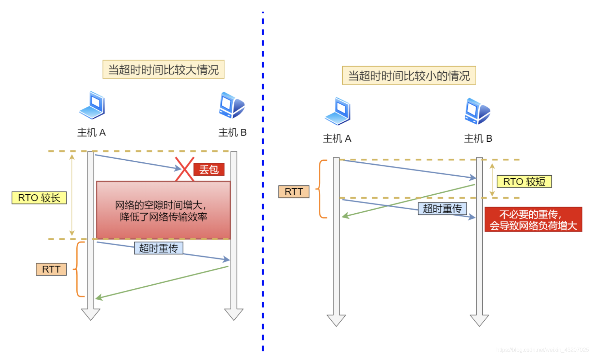

根据上述的两种情况，我们可以得知，超时重传时间 RTO 的值应该略大于报文往返 RTT 的值。

实际上「报文往返 RTT 的值」是经常变化的，因为我们的网络也是时常变化的。也就因为「报文往返 RTT 的值」 是经常波动变化的，所以「超时重传时间 RTO 的值」应该是一个动态变化的值。

估计往返时间，通常需要采样以下两个：

- 需要 TCP 通过采样 RTT 的时间，然后进行加权平均，算出一个平滑 RTT 的值，而且这个值还是要不断变化的，因为网络状况不断地变化。
- 除了采样 RTT，还要采样 RTT 的波动范围，这样就避免如果 RTT 有一个大的波动的话，很难被发现的情况。

RFC6289 建议使用以下的公式计算 RTO：

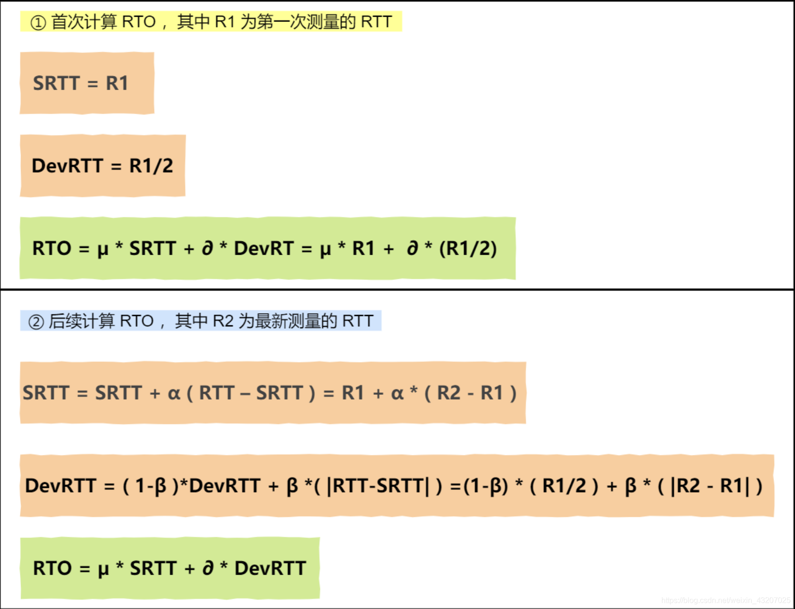

其中 `SRTT` 是计算平滑的 RTT ，`DevRTR` 是计算平滑的RTT 与 最新 RTT 的差距。


#### 快速重传

TCP 还有另外一种快速重传（Fast Retransmit）机制，它不以时间为驱动，而是以数据驱动重传。

快速重传的工作方式是当收到三个相同的 ACK 报文时，会在定时器过期之前，重传丢失的报文段。

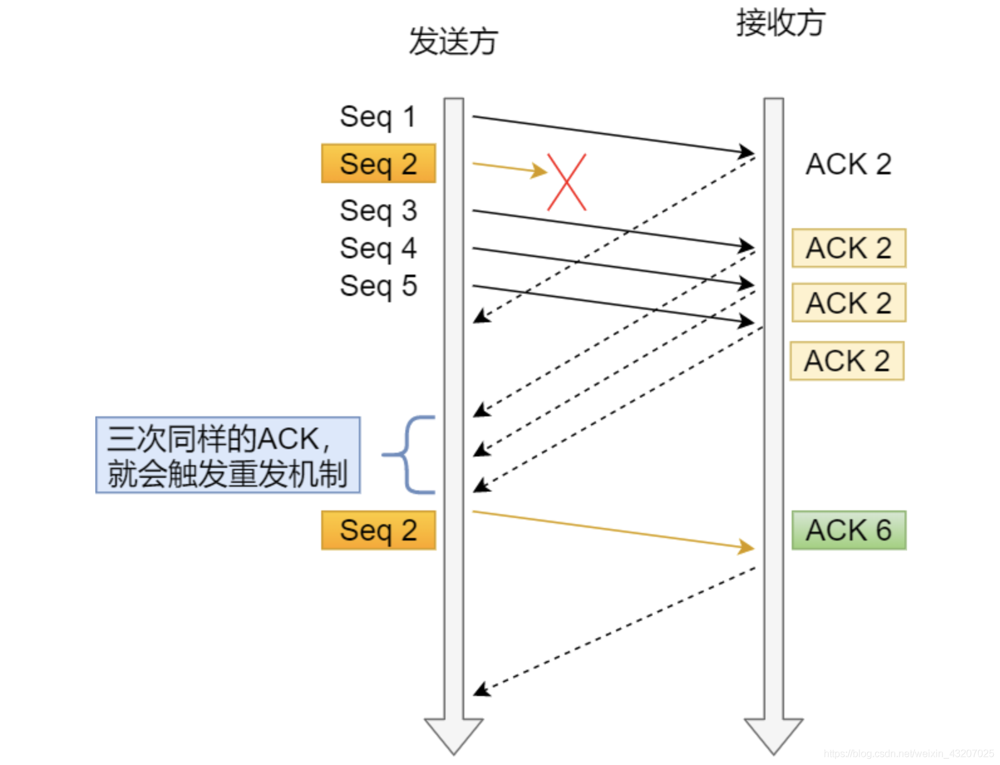

快速重传机制只解决了一个问题，就是超时时间的问题，但是它依然面临着另外一个问题。就是重传的时候，是重传之前的一个，还是重传所有的问题。

为了解决不知道该重传哪些 TCP 报文的问题，就有了 SACK 方法。


#### SACK 方法

还有一种实现重传机制的方式叫：SACK（ Selective Acknowledgment 选择性确认）。

这种方式需要在 TCP 头部「选项」字段里加一个 SACK 的东西，它可以将缓存的数据发送给发送方，这样发送方就可以知道哪些数据收到了，哪些数据没收到，知道了这些信息，就可以只重传丢失的数据。

如下图，发送方收到了三次同样的 ACK 确认报文，于是就会触发快速重发机制，通过 SACK 信息发现只有 200~299 这段数据丢失，则重发时，就只选择了这个 TCP 段进行重传。

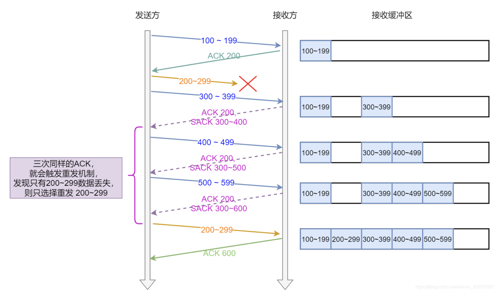


#### D-SACK 方法

Duplicate SACK 又称 D-SACK，其主要使用了 SACK 来告诉「发送方」有哪些数据被重复接收了。

下面举例两个例子，来说明 D-SACK 的作用。

**ACK 丢包**

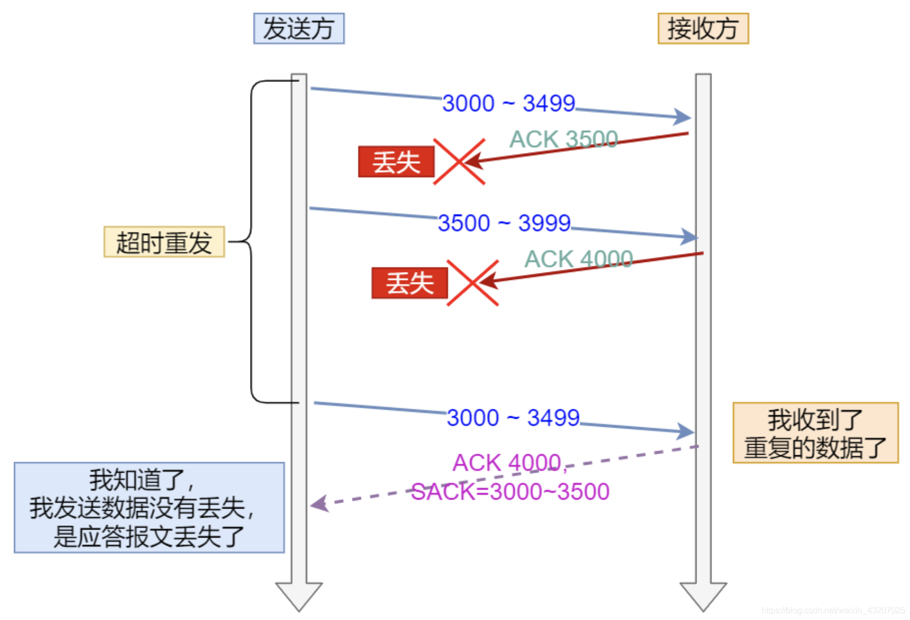

- 「接收方」发给「发送方」的两个 ACK 确认应答都丢失了，所以发送方超时后，重传第一个数据包（3000 ~ 3499）；
- 于是「接收方」发现数据是重复收到的，于是回了一个 SACK = 3000~3500，告诉「发送方」 3000~3500 的数据早已被接收了，因为 ACK 都到了 4000 了，已经意味着 4000 之前的所有数据都已收到，所以这个 SACK 就代表着 D-SACK；
- 这样「发送方」就知道了，数据没有丢，是「接收方」的 ACK 确认报文丢了。

**网络延时**

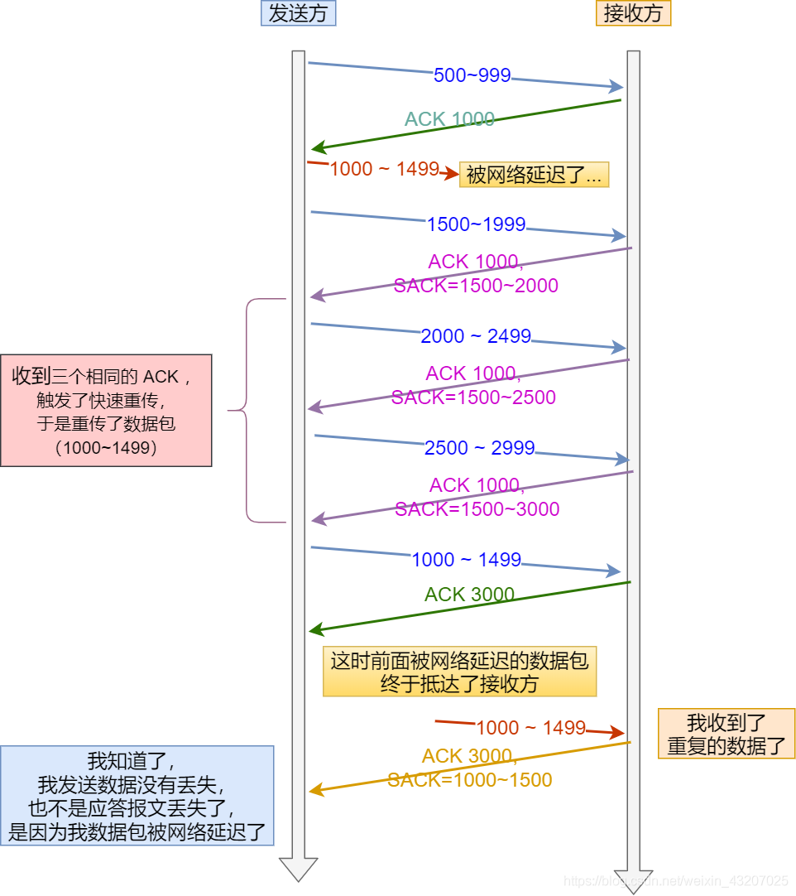

- 数据包（1000~1499） 被网络延迟了，导致「发送方」没有收到 ACK 1500 的确认报文。
- 而后面报文到达的三个相同的 ACK 确认报文，就触发了快速重传机制，但是在重传后，被延迟的数据包（1000~1499）又到了「接收方」；
- 所以「接收方」回了一个 SACK=1000~1500，因为 ACK 已经到了 3000，所以这个 SACK 是 D-SACK，表示收到了重复的包。
- 这样发送方就知道快速重传触发的原因不是发出去的包丢了，也不是因为回应的 ACK 包丢了，而是因为网络延迟了。

可见，D-SACK 有这么几个好处：

- 可以让「发送方」知道，是发出去的包丢了，还是接收方回应的 ACK 包丢了;
- 可以知道是不是「发送方」的数据包被网络延迟了;
- 可以知道网络中是不是把「发送方」的数据包给复制了。


### 流量控制

流量控制是为了控制发送方发送速率，保证接收方来得及接收。主要通过滑动窗口来实现。

接收方发送的确认报文中的窗口字段可以用来控制发送方窗口大小，从而影响发送方的发送速率。将窗口字段设置为 0，则发送方不能发送数据。


窗口是缓存的一部分，用来暂时存放字节流。发送方和接收方各有一个窗口，接收方通过 TCP 报文段中的窗口字段告诉发送方自己的窗口大小，发送方根据这个值和其它信息设置自己的窗口大小。

发送窗口内的字节都允许被发送，接收窗口内的字节都允许被接收。如果发送窗口左部的字节已经发送并且收到了确认，那么就将发送窗口向右滑动一定距离，直到左部第一个字节不是已发送并且已确认的状态；接收窗口的滑动类似，接收窗口左部字节已经发送确认并交付主机，就向右滑动接收窗口。

接收窗口只会对窗口内最后一个按序到达的字节进行确认，例如接收窗口已经收到的字节为 {31, 34, 35}，其中 {31} 按序到达，而 {32, 33} 就不是，因此只对字节 31 进行确认。发送方得到一个字节的确认之后，就知道这个字节之前的所有字节都已经被接收（**累计确认**）。

**发送窗口**

下图就是发送方缓存的数据，根据处理的情况分成四个部分，其中深蓝色方框是发送窗口，紫色方框是可用窗口：


- #1 是已发送并收到 ACK 确认的数据：1~31 字节
- #2 是已发送但未收到 ACK 确认的数据：32~45 字节
- #3 是未发送但总大小在接收方处理范围内（接收方还有空间）：46~51 字节
- #4 是未发送但总大小超过接收方处理范围（接收方没有空间）：52 字节以后

在下图，当发送方把数据「全部」都一下发送出去后，可用窗口的大小就为 0 了，表明可用窗口耗尽，在没收到 ACK 确认之前是无法继续发送数据了。


**程序是如何表示发送方的四个部分的呢？**

TCP 滑动窗口方案使用三个指针来跟踪在四个传输类别中的每一个类别中的字节。其中两个指针是绝对指针（指特定的序列号），一个是相对指针（需要做偏移）。

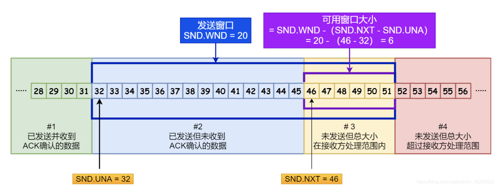

- SND.WND：表示发送窗口的大小（大小是由接收方指定的）；

- SND.UNA：是一个绝对指针，它指向的是已发送但未收到确认的第一个字节的序列号，也就是 #2 的第一个字节。

- SND.NXT：也是一个绝对指针，它指向未发送但可发送范围的第一个字节的序列号，也就是 #3 的第一个字节。

- 指向 #4 的第一个字节是个相对指针，它需要 SND.UNA 指针加上 SND.WND大小的偏移量，就可以指向 #4 的第一个字节了。

**接收窗口**

接收窗口相对简单一些，根据处理的情况划分成三个部分：

- #1 + #2 是已成功接收并确认的数据（等待应用进程读取）
- #3 是未收到数据但可以接收的数据
- #4 未收到数据并不可以接收的数据

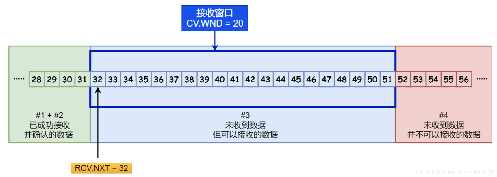

其中三个接收部分，使用两个指针进行划分:

- RCV.WND：表示接收窗口的大小，它会通告给发送方；
- RCV.NXT：是一个指针，它指向期望从发送方发送来的下一个数据字节的序列号，也就是 #3 的第一个字节；
- 指向 #4 的第一个字节是个相对指针，它需要 RCV.NXT 指针加上 RCV.WND 大小的偏移量，就可以指向 #4 的第一个字节了。

**以下进行滑动窗口模拟**

在 TCP 中，**滑动窗口是为了实现流量控制**。如果对方发送数据过快，接收方就来不及接收，接收方就需要通告对方，减慢数据的发送。 

<p align="center">

</p>


- **发送方接收到了对方发来的报文 ack = 33, win = 10，知道对方收到了 33 号前的数据**，现在期望接收 [33, 43) 号数据。发送方连续发送了 4 个报文段假设为 A, B, C, D, 分别携带 [33, 35), [35, 36), [36, 38), [38, 41) 号数据。

- 接收方接收到了报文段 A, C，但是没收到 B 和 D，也就是只收到了 [33, 35) 和 [36, 38) 号数据。接收方发送回对报文段 A 的确认：ack = 35, win = 10。

- 发送方收到了 ack = 35, win = 10，对方期望接收 [35, 45) 号数据。接着发送了一个报文段 E，它携带了 [41, 44) 号数据。

- 接收方接收到了报文段 B: [35, 36), D:[38, 41)，接收方发送对 D 的确认：ack = 41, win = 10. （这是一个累积确认）

- 发送方收到了 ack = 41, win = 10，对方期望接收 [41, 51) 号数据。

- ……

- 需要注意的是，接收方接收 tcp 报文的顺序是不确定的，并非是一定先收到 35 再收到 36，也可能是先收到 36，37，再收到 35。

**接收窗口和发送窗口的大小是相等的吗？**

并不是完全相等，接收窗口的大小是**约等于**发送窗口的大小的。

因为滑动窗口并不是一成不变的。比如，当接收方的应用进程读取数据的速度非常快的话，这样的话接收窗口可以很快的就空缺出来。那么新的接收窗口大小，是通过 TCP 报文中的 Windows 字段来告诉发送方。那么这个传输过程是存在时延的，所以接收窗口和发送窗口是约等于的关系。


### 拥塞控制

拥塞控制（Congestion Handling）的一般原理:

- 在某段时间，若对网络中某资源的需求超过了该资源所能提供的可用部分，网络的性能就要变坏——产生拥塞；
- 出现资源拥塞的条件：对资源需求的总和 > 可用资源；
- 若网络中有许多资源同时产生拥塞，网络的性能就要明显变坏，整个网络的吞吐量将随输入负荷的增大而下降。  

如果网络出现拥塞，分组将会丢失，此时发送方会继续重传，从而导致网络拥塞程度更高。因此当出现拥塞时，应当控制发送方的速率。这一点和流量控制很像，但是出发点不同。流量控制是为了让接收方能来得及接收，而拥塞控制是为了降低整个网络的拥塞程度。

<p align="center">

</p>


TCP 主要通过四种算法来进行拥塞控制：慢开始、拥塞避免、快重传、快恢复。

发送方需要维护一个叫做拥塞窗口（cwnd）的状态变量，注意拥塞窗口与发送方窗口的区别：拥塞窗口只是一个状态变量，**实际决定发送方能发送多少数据的是发送方窗口**。

为了便于讨论，做如下假设：

- 接收方有足够大的接收缓存，因此不会发生流量控制；
- 虽然 TCP 的窗口基于字节，但是这里设窗口的大小单位为报文段。

<p align="center">

</p>


#### 慢开始与拥塞避免

发送的最初执行慢开始，令 cwnd=1，发送方只能发送 1 个报文段；当收到确认后，将 cwnd 加倍，因此之后发送方能够发送的报文段数量为：2、4、8 ...

注意到慢开始每个轮次都将 cwnd 加倍，这样会让 cwnd 增长速度非常快，从而使得发送方发送的速度增长速度过快，网络拥塞的可能也就更高。设置一个慢启动阈值 ssthresh，当 cwnd >= ssthresh 时，进入拥塞避免，每个轮次只将 cwnd 加 1。

如果出现了超时，则令 ssthresh = cwnd/2，然后重新执行慢开始。

#### 快重传与快恢复

在接收方，要求每次接收到报文段都应该对最后一个已收到的有序报文段进行确认。例如已经接收到 M1 和 M2，此时收到 M4，应当发送对 M2 的确认。

在发送方，如果收到三个重复确认，那么可以知道下一个报文段丢失，此时执行快重传，立即重传下一个报文段。例如收到三个 M2，则 M3 丢失，立即重传 M3。

在这种情况下，只是丢失个别报文段，而不是网络拥塞。因此执行快恢复，令 ssthresh = cwnd/2 ，cwnd = ssthresh，注意到此时直接进入拥塞避免。慢开始和快恢复的快慢指的是 cwnd 的设定值，而不是 cwnd 的增长速率。慢开始 cwnd 设定为 1，而快恢复 cwnd 设定为 ssthresh。

<p align="center">

</p>


### 其他问题

#### TCP 和 HTTP 的关系

- TCP 是传输层协议，而 HTTP 是应用层协议
- HTTP 是要基于 TCP 连接基础上的

<p align="center">

</p>
二者区别总结如下：

- TCP 是底层通讯协议，定义的是数据传输和连接方式的规范；


- HTTP 是应用层协议，定义的是传输数据的内容的规范；


- HTTP 协议中的数据是利用 TCP 协议传输的，所以支持 HTTP 也就一定支持 TCP  ；


- HTTP 支持的是 www 服务，而 TCP/IP 是协议， 是 Internet 国际互联网络的基础，是网络中使用的基本的通信协议；


> TCP/IP 实际上是一组协议，它包括上百个各种功能的协议，如：远程登录、文件传输和电子邮件等，而 TCP 协议和 IP 协议是保证数据完整传输的两个基本的重要协议。通常说 TCP/IP 是 Internet 协议族，而不单单是 TCP 和 IP。


#### TCP 如何保证可靠传输

- TCP 给发送的每一个包进行**编号**，接收方对数据包进行排序，把有序数据传送给应用层。 
- 接受方发送 ACK **确认应答**报文。
- **超时重传**：当 TCP 发出一个段后，它启动一个定时器，等待目的端确认收到这个报文段。如果不能及时收到一个确认，将重发这个报文段。
- **校验和**：TCP 将保持它首部和数据的检验和。这是一个端到端的检验和，目的是检测数据在传输过程中的任何变化。如果收到段的检验和有差错，TCP 将丢弃这个报文段和不确认收到此报文段。
- TCP 的接收端会**丢弃重复的数据**。
- **流量控制**：TCP 连接的每一方都有固定大小的缓冲空间，TCP 的接收端只允许发送端发送接收端缓冲区能接纳的数据。当接收方来不及处理发送方的数据，能提示发送方降低发送的速率，防止包丢失。TCP 使用的流量控制协议是可变大小的滑动窗口协议。
- **拥塞控制**：当网络拥塞时，减少数据的发送。 


#### TCP 连接保持与异常检测

TCP 是一种有连接的协议，但是这个连接并不是指有一条实际的电路，而是一种虚拟的电路。TCP 的建立连接和断开连接都是通过发送数据实现的，也就是我们常说的三次握手、四次挥手。TCP 两端保存了一种数据的状态，就代表这种连接，TCP 两端之间的路由设备只是将数据转发到目的地，并不知道这些数据实际代表了什么含义，也并没有在其中保存任何的状态信息，也就是说中间的路由设备没有什么连接的概念，只是将数据转发到目的地，只有数据的发送者和接受者两端真正知道传输的数据代表着一条连接。

但是这就说明了一点，如果不发送数据那么是无法断开连接的。正常情况下当 TCP 的一端 A 调用了 SOCKET 的 close 或者进程结束，操作系统就会按照 TCP 协议发送 FIN 数据报文。B 端收到后就会断开连接。但是当出现了上文所说的异常情况时：被拔掉网线或者断掉电源，总结起来就是没有机会发出断开的 FIN 数据报文。那么和 A 直连的路由设备虽然知道 A 设备已经断开了，但是路由设备并没有保存连接的状态信息，所以路由设备也就不可能去通知 B 端 A 端的断开。而 B 端没有收到断开的数据报文就会依然保持连接。所以 A 端拔掉网线或者断掉电源后 B 端是没办法收到断开连接的通知的。

保持连接并不是毫无代价的，如果这种异常断开的连接有很多，那么势必会耗费大量的资源，必须要想办法检测出这种异常连接。

检测的方法很简单，只要让 B 端主动通过这个连接向 A 端继续发送数据即可。上文说过，A 端异常断开后，和 A 端直接连接的路由器是知道的。当 B 端发送的数据经过转发后到达这个路由器后，必然最终会返回 B 端一个目的不可达。此时 B 端立刻就会知道这条连接其实已经异常断开了。 

但是 B 端不可能知道什么时候会出现这种异常，所以 B 端必须定时发送数据来检测连接是否异常断开。数据的内容无关紧要，任何数据都能达到这个效果。这个数据就是我们经常在 TCP 编程中所说的**心跳**。

TCP 协议本身就提供了一种这样的机制来探测对端的存活。TCP 协议有一个**KEEP_LIVE**开关，只要打开这个开关就会定时发送一些数据长度为零的探测心跳包，发送的频率和次数都可以设置，具体的方法在网上搜索 tcp keepalive 即可，网上有很多文章，这里不再赘述。

除了使用 TCP 协议本身的保活开关机制，还可以在应用层主动发送心跳数据包，那么在应用层主动发送心跳数据包的方式和 TCP 协议本身的保活机制有什么区别呢？

应用层的心跳数据包会耗费更多的带宽，因为 TCP 协议的保活机制发送的是数据长度为零心跳包，而应用层的心跳数据包长度则必然会大于 0。应用层的心跳数据包可以带一些应用所需要的数据，随应用自己控制，而 TCP 协议的保活机制则是对于应用层透明的，无法利用心跳携带数据。

如果只是一端向另一端发送心跳就行了呢？显然不行。因为两端都有可能发生异常断开的情况。所以 TCP 连接的两端必须都向对端发送心跳。TCP 中不使用心跳通常来说并没有什么问题，但是一旦遇到了连接异常断开，那么就会出现问题。所以任何一个完善的 TCP 应用都应该使用心跳。 


#### 流量控制和拥塞控制 

- 拥塞控制所要做的都有一个前提，就是网络能够承受现有的网络负荷。

- 拥塞控制是一个全局性的过程，涉及到所有的主机、所有的路由器，以及与降低网络传输性能有关的所有因素。

- 流量控制往往指在给定的发送端和接收端之间的点对点通信量的控制。

- 流量控制所要做的就是抑制发送端发送数据的速率，以便使接收端来得及接收。 

- 流量控制属于通信双方协商；拥塞控制涉及通信链路全局。

- 流量控制需要通信双方各维护一个发送窗、一个接收窗，对任意一方，接收窗大小由自身决定，发送窗大小由接收方响应的 TCP 报文段中窗口值确定；拥塞控制的拥塞窗口大小变化由试探性发送一定数据量数据探查网络状况后而自适应调整。

- 实际最终发送窗口 = **min{接收方接收窗口，拥塞窗口}**。


#### 停止等待

通常我们说如果 A 和 B 双方建立好 tcp 连接后就可以相互发送数据了，A 为发送方，B 为接收方。因为这里讨论可靠传输原理，所以把传输的数据单元称为分组。“停止等待”就是每发送完一个分组就停止发送，等待对方确认后再发送下一个分组。停止等待协议考虑了数据在网络中传输出现的几种情况来提供有效措施保障数据的可靠传输，下面我们就一一来介绍这几种情况。

1. 出现差错或丢失的情况

当 A 在发送 M1 分组的过程中丢失时，又或者 B 接收到 M1 分组检测到差错并丢弃了 M1 分组时（注意：这里 B 不会发送 M1 确认分组，而是什么也不做），可靠传输协议是这样设计的：只要 A 没有在规定时间内收到 B 的确认，就认为刚才发送的分组丢失了，并对丢失的分组进行重传，这种方式叫`超时重传`。要实现超时重传，就要每发送完一个分组就设置一个超时计时器。如果在超时计时器到期之前收到了对方的确认，则撤销该超时计时器。

这里注意几点： 

- A 发送完一个分组后，必须暂时存储已发送的分组的副本（发生超时重传时使用），当收到该分组的确认时就清除本地存储的分组的副本；
- 分组和确认分组都必须进行编号，这样才能明确哪一个已发送的分组被确认，哪一个还没被确认；
- 超时计时器设置的重传时间比数据分组传输的平均往返时间更长一些，在设置重传时间也是有要求的。因为重传时间设置的过长会导致重传花费的时间长，通信效率慢，但是重传时间设置的过短会导致出现不必要的重传，浪费网络资源。

比如 B 发送的确认分组发生在网络中发生拥塞，传输的时间过长才到达 A，但是 A 设置的重传时间又很短，就会出现不必要的重传。因此设置重传时间是非常复杂的，因为分组在网络传输的过程中经过哪些网络，是否会出现网络拥塞或其他问题，都是不确定的。

2. 确认丢失的情况

当 B 收到 A 的 M1 分组后，B 发送的 M1 确认分组在网络中丢失了，且 A 在设定的超时重传时间内又没有收到 B 的 M1 确认分组，这时 A 无法知道是自己发送的 M1 分组出错丢失，还是 B 发送的 M1 确认分组丢失了，那么 A 会在超时计时器到期后重传 M1 分组。

如果 B 又收到了重传的分组 M1，这时 B 会丢弃重复的 M1 分组，并向 A 发送 M1 确认分组（很明显，因为 A 本来就没有收到过确认啊）。

3. 确认迟到的情况

这里我们需要假设这么一种情况：A 在发送 M1 分组后，B 发送的确认 M1 分组却迟到了，但是 A 在超时计时器规定的时间内又没有收到 B 的确认 M1 分组，那么 A 将会重传 M1 分组，根据前面所知的情况来看，B 在收到重复的 M1 分组后会丢弃并重传确认 M1 分组。那么在 A 收到重传的确认分组后，又收到了 B 迟到的确认 M1 分组，这时 A 会丢弃迟到的确认 M1 分组。

像上面所说的可靠传输协议通常称为自动重传请求，也就是说，重传是自动进行的，只要发送方没收到确认，就会重传。如果 A 不断重传分组却总是也收不到确认，这说明通信线路太差，不能进行通信。


## TCP 和 UDP 的区别

- UDP：
  - 无连接，即发送数据之前不需要建立连接；
  - 使用尽最大努力交付，即不保证可靠交付，同时也不使用拥塞控制； 
  - 面向报文；
  - 没有拥塞控制，很适合多媒体通信的要求；
  - 支持一对一、一对多、多对一和多对多的交互通信；
  - 首部开销小，只有 8 个字节。 

- TCP：
  - 面向连接的运输层协议；
  - 提供可靠交付的服务；
  - 面向字节流；
  - 每一条 TCP 连接只能有两个端点(endpoint)，每一条 TCP 连接只能是点对点的（一对一）；
  - TCP 提供全双工通信；
  - 首部最低 20 个字节。 


# 网络层

## ARP协议

地址解析协议（Address Resolution Protocol），其基本功能为通过目标设备的 IP 地址，查询目标设备的 MAC 地址，以保证通信的顺利进行。它是 IPv4 中网络层必不可少的协议，不过在 IPv6 中已不再适用，并被邻居发现协议（NDP）所替代。

### 工作流程

假设主机 A 和 B 在同一个网段，主机 A 要向主机 B 发送信息，具体的地址解析过程如下：

1. 主机 A 首先查看自己的 ARP 表，确定其中是否包含有主机 B 对应的 ARP 表项。如果找到了对应的 MAC 地址，则主机 A 直接利用 ARP 表中的 MAC 地址，对 IP 数据包进行帧封装，并将数据包发送给主机 B。

2. 如果主机 A 在 ARP 表中找不到对应的 MAC 地址，则将缓存该数据报文，然后以广播方式发送一个 ARP 请求报文。ARP 请求报文中的发送端 IP 地址和发送端 MAC 地址为主机 A 的 IP 地址和 MAC 地址，目标 IP 地址和目标 MAC 地址为主机 B 的 IP 地址和全 0 的 MAC 地址。由于 ARP 请求报文以广播方式发送，该网段上的所有主机都可以接收到该请求，但只有被请求的主机（即主机 B）会对该请求进行处理。

3. 主机 B 比较自己的 IP 地址和 ARP 请求报文中的目标 IP 地址，当两者相同时进行如下处理：将 ARP 请求报文中的发送端（即主机 A）的 IP 地址和 MAC 地址存入自己的 ARP 表中。之后以单播方式发送 ARP 响应报文给主机 A，其中包含了自己的 MAC 地址。

4. 主机 A 收到 ARP 响应报文后，将主机 B 的 MAC 地址加入到自己的 ARP 表中以用于后续报文的转发，同时将 IP 数据包进行封装后发送出去。

### 报文格式


> 一般来说，以太网地址就是指MAC地址。

​        字段 1 是 ARP 请求的目的以太网地址，全 1 时代表广播地址。

　　字段 2 是发送 ARP 请求的以太网地址。

　　字段 3 以太网帧类型表示的是后面的数据类型，ARP 请求和 ARP 应答这个值为 0x0806。

　　字段 4 表示硬件地址的类型，硬件地址不只以太网一种，是以太网类型时此值为 1。

　　字段 5 表示要映射的协议地址的类型，要对 IPv4 地址进行映射，此值为 0x0800。

　　字段 6 和 7 表示硬件地址长度和协议地址长度，MAC地址占 6 字节，IP地址占 4 字节。

　　字段 8 是操作类型字段，值为 1，表示进行 ARP 请求；值为 2，表示进行 ARP 应答；值为 3，表示进行 RARP 请求；值为 4，表示进行 RARP 应答。

　　字段 9 是发送端 ARP 请求或应答的硬件地址，这里是以太网地址，和字段 2 相同。

　　字段 10 是发送 ARP 请求或应答的 IP 地址。

　　字段 11 和 12 是目的端的硬件地址和协议地址。

### ARP 表

1. 动态 ARP 表

动态 ARP 表项由 ARP 协议通过 ARP 报文自动生成和维护，可以被老化，可以被新的 ARP 报文更新，可以被静态 ARP 表项覆盖。当到达老化时间、接口 down 时会删除相应的动态 ARP 表项。

2. 静态 ARP 表

静态 ARP 表项通过手工配置和维护，不会被老化，不会被动态 ARP 表项覆盖。

配置静态 ARP 表项可以增加通信的安全性。静态 ARP 表项可以限制和指定 IP 地址的设备通信时只使用指定的 MAC 地址，此时攻击报文无法修改此表项的 IP 地址和 MAC 地址的映射关系，从而保护了本设备和指定设备间的正常通信。

### 免费 ARP

免费 ARP 指主机发送 ARP 查找自己的 IP 地址，通常发生在系统引导期间进行接口配置时。与标准 ARP 的区别就是免费 ARP 分组的目的 IP 地址字段封装的是自己的 IP 地址，即向所在网络请求自己的 MAC 地址。

免费 ARP 的作用有：

- 一个主机可以通过它来确定另一个主机是否设置了相同的 IP 地址

  正常情况下发送免费 ARP 请求**不会**收到 ARP 应答，如果收到了一个 ARP 应答，则说明网络中存在与本机相同的 IP 地址的主机，发生了地址冲突。

- 更新其他主机高速缓存中旧的硬件地址信息

  如果发送免费 ARP 的主机正好改变了硬件地址，如更换了接口卡。其他主机接收到这个 ARP 请求的时候，发现自己的 ARP 高速缓存表中存在对应的 IP 地址，但是 MAC 地址不匹配，那么就需要利用接收的 ARP 请求来更新本地的 ARP 高速缓存表表项。

- 网关利用免费 ARP 防止 ARP 攻击

  有些网关设备在一定的时间间隔内向网络主动发送免费 ARP 报文，让网络内的其他主机更新 ARP 表项中的网关 MAC 地址信息，以达到防止或缓解 ARP 攻击的效果。

- 利用免费 ARP 进行 ARP 攻击

  ARP 协议并不只在发送了 ARP 请求才接收 ARP 应答，计算机只要接收到 ARP 应答数据包，就会使用应答中的 IP 和 MAC 地址对本地的 ARP 缓存进行更新。主机可以构造虚假的免费 ARP 应答，将 ARP 的源 MAC 地址设为错误的 MAC 地址，并把这个虚假的免费 ARP 应答发送到网络中，那么所有接收到这个免费 ARP 应答的主机都会更新本地 ARP 表项中相应 IP 地址对应的 MAC 地址。更新成功后，这些主机的数据报文就会被转发到错误的 MAC 地址，从而实现了 ARP 欺骗的攻击。

### 代理 ARP

代理 ARP 就是通过使用一个主机（通常为 router），来作为指定的设备使用自己的 MAC 地址来对另一设备的 ARP 请求作出应答。

为什么需要代理 ARP？

先要了解，路由器的重要功能之一就是把局域网的广播包限制在该网内，阻止其扩散，否则会造成网络风暴。ARP 请求是个广播包，它询问的对象如果在同一个局域网内，就会收到应答。但是如果询问的对象不在同一个局域网该如何处理？路由器就提供了代理 ARP 为这个问题提供了解决方案。

两台主机 A 和 B 处于同一网段但不同的广播段（不在同一物理网络上）时，主机 A 发送 ARP 请求主机 B 的 MAC 地址时，因为路由器不转发广播包的原因，ARP 请求只能到达路由器。如果路由器启用了代理 ARP 功能，并知道主机 B 属于它连接的网络，那么路由器就用自己接口的 MAC 地址代替主机 B 的 MAC 地址来对主机 A 进行 ARP 应答。主机 A 接收 ARP 应答，但并不知道代理 ARP 的存在。

代理 ARP 的优缺点：

- 优点：代理 ARP 能在不影响路由表的情况下添加一个新的 Router，使子网对该主机变得透明化。一般代理 ARP 应该使用在主机没有配置默认网关或没有任何路由策略的网络上。

- 缺点：从工作过程可以看到，这其实是一种 ARP 欺骗。而且，通过两个物理网络之间的路由器的代理 ARP 功能其实互相隐藏了物理网络，这导致无法对网络拓扑进行网络概括。此外，代理 ARP 增加了使用它的那段网络的 ARP 流量，主机需要更大的 ARP 缓存空间，也不会为不使用 ARP 进行地址解析的网络工作。

### ARP 攻击

ARP 协议的基本功能就是通过目标设备的 IP 地址，查询目标设备的 MAC 地址，以保证通信的进行。 基于 ARP 协议的这一工作特性，黑客向对方计算机不断发送有欺诈性质的 ARP 数据包，数据包内包含有与当前设备重复的 MAC 地址，使对方在回应报文时，由于简单的地址重复错误而导致不能进行正常的网络通信。

一般情况下，受到 ARP 攻击的计算机会出现两种现象：

- 不断弹出“本机的XXX段硬件地址与网络中的XXX段地址冲突”的对话框。
- 计算机不能正常上网，出现网络中断的症状。

因为这种攻击是利用 ARP 请求报文进行“欺骗”的，所以防火墙会误以为是正常的请求数据包，不予拦截，因此普通的防火墙很难抵挡这种攻击。

### ARP 过程

要想发送 ARP（地址解析协议）广播，我们需要有一个目标 IP 地址，同时还需要知道用于发送 ARP 广播的接口的 MAC 地址。

- 首先查询 ARP 缓存，如果缓存命中，我们返回结果：目标 IP = MAC；

如果缓存没有命中：

- 查看路由表，看看目标 IP 地址是不是在本地路由表中的某个子网内。是的话，使用跟那个子网相连的接口，否则使用与默认网关相连的接口；

- 查询选择的网络接口的 MAC 地址；

- 我们发送一个二层（ OSI 模型 中的数据链路层）`ARP Request`：

  ```c
  Sender MAC: interface:mac:address:here
  Sender IP: interface.ip.goes.here
  Target MAC: FF:FF:FF:FF:FF:FF (Broadcast)
  Target IP: target.ip.goes.here
  ```

  根据连接主机和路由器的硬件类型不同，可以分为以下几种情况：

  - 直连：如果我们和路由器是直接连接的，路由器会返回一个 ARP Reply （见下面）。

  - 集线器：如果我们连接到一个集线器，集线器会把 ARP 请求向所有其它端口广播，如果路由器也“连接”在其中，它会返回一个 ARP Reply 。

  - 交换机：

    - 如果我们连接到了一个交换机，交换机会检查本地 CAM/MAC 表，看看哪个端口有我们要找的那个 MAC 地址，如果没有找到，交换机会向所有其它端口广播这个 ARP 请求；

    - 如果交换机的 MAC/CAM 表中有对应的条目，交换机会向有我们想要查询的 MAC 地址的那个端口发送 ARP 请求；

    - 如果路由器也“连接”在其中，它会返回一个 `ARP Reply`:

      ```c
      Sender MAC: target:mac:address:here
      Sender IP: target.ip.goes.here
      Target MAC: interface:mac:address:here
      Target IP: interface.ip.goes.here
      ```

现在我们有了 DNS 服务器或者默认网关的 IP 地址，我们可以继续 DNS 请求了：

- 使用 53 端口向 DNS 服务器发送 UDP 请求包，如果响应包太大，会使用 TCP 协议；
- 如果本地/ISP DNS 服务器没有找到结果，它会发送一个递归查询请求，一层一层向高层 DNS 服务器做查询，直到查询到起始授权机构，如果找到会把结果返回。


## DHCP 协议

DHCP（Dynamic Host Configuration Protocol，动态主机配置协议），前身是 BOOTP 协议，是一个局域网的网络协议，使用 `UDP` 协议工作，统一使用两个 IANA 分配的端口：`67`（服务器端），`68`（客户端）。DHCP 通常被用于局域网环境，主要作用是集中的管理、分配 IP 地址，使 client 动态地获得 IP 地址、Gateway 地址、DNS 服务器地址等信息，并能够提升地址的使用率。简单来说，DHCP 就是一个不需要账号密码登录的、自动给内网机器分配 IP 地址等信息的协议。

DHCP 租约过程就是 DHCP 客户机动态获取 IP 地址的过程。
DHCP 租约过程分为 4 步：

1. 客户机请求 IP（客户机发 DHCP DISCOVER 广播包）；

2. 服务器响应（服务器发 DHCP OFFER 广播包）；

3. 客户机选择 IP（客户机发 DHCP REQUEST 广播包）；

4. 服务器确定租约（服务器发 DHCP ACK / DHCP NAK 广播包）。


## ICMP 协议

`ICMP`（Internet Control Message Protocol）因特网控制报文协议。它是 IPv4 协议族中的一个子协议，用于 IP 主机、路由器之间传递控制消息。控制消息是网络通不通、主机是否可达、路由是否可用等网络本身的消息。这些控制消息虽然不传输用户数据，但是对于用户数据的传递起着重要的作用。

ICMP 协议与 ARP 协议不同，ICMP 靠 IP 协议来完成任务，所以 ICMP 报文中要封装 IP 头部。它与传输层协议（如 TCP 和 UDP）的目的不同，一般不用来在端系统之间传送数据，不被用户网络程序直接使用（除了像 Ping 和 Tracert 这样的诊断程序）。

### 功能

ICMP 主要的功能包括：

- 确认 IP 包是否成功送达目标地址
- 报告发送过程中 IP 包被废弃的原因和改善网络设置等

在 IP 通信中如果某个 IP 包因为某种原因未能达到目标地址，那么这个具体的原因将由 ICMP 负责通知（使用 IP 进行发送）。

<p align="center">

</p>

### 报文格式

ICMP 报文封装在 IP 包里面，它工作在网络层，是 IP 协议的助手。


ICMP 报头的类型字段，大致可以分为两大类：

- 一类是用于诊断的查询消息，也就是「查询报文类型」
- 另一类是通知出错原因的错误消息，也就是「差错报文类型」

| 类型值 |                 内容                  |   种类   |
| :----: | :-----------------------------------: | :------: |
|   0    |        回送应答（Echo Reply）         | 查询报文 |
|   3    | 目标不可达（Destination Unreachable） | 差错报文 |
|   4    |       源端抑制（Source Quench）       | 差错报文 |
|   5    |          重定向（Redirect）           | 差错报文 |
|   8    |       回送请求（Echo Request）        | 查询报文 |
|   11   |         超时（Time Exceeded）         | 差错报文 |

1. 回送消息 —— 类型 0 和 8

回送消息用于进行通信的主机或路由器之间，判断所发送的数据包是否已经成功到达对端的一种消息，`ping` 命令就是利用这个消息实现的。

可以向对端主机发送回送请求的消息（ICMP Echo Request Message，类型 8），也可以接收对端主机发回来的回送应答消息（ICMP Echo Reply Message，类型 0）。


相比原生的 ICMP，这里多了两个字段：

- 标识符：用以区分是哪个应用程序发 ICMP 包，比如用进程 PID 作为标识符；
- 序号：序列号从 0 开始，每发送一次新的回送请求就会加 1， 可以用来确认网络包是否有丢失。

在选项数据中，ping 还会存放发送请求的时间值，来计算往返时间，说明路程的长短。

2. 目标不可达消息 —— 类型 3

IP 路由器无法将 IP 数据包发送给目标地址时，会给发送端主机返回一个目标不可达的 ICMP 消息，并在这个消息中显示不可达的具体原因，原因记录在 ICMP 包头的代码字段。

举例 6 种常见的目标不可达类型的代码：


3. 源端抑制消息 —— 类型 4

在使用低速广域线路的情况下，连接 WAN 的路由器可能会遇到网络拥堵的问题。ICMP 源端抑制消息就是为了缓和这种拥堵情况。

当路由器向低速线路发送数据时，其发送队列的缓存变为零而无法发送出去时，可以向 IP 包的源地址发送一个 ICMP 源端抑制消息。收到这个消息的主机借此了解在整个线路的某一处发生了拥堵的情况，从而增大 IP 包的传输间隔，减少网络拥堵的情况。

由于这种 ICMP 可能会引起不公平的网络通信，一般不被使用。

4. 重定向消息 —— 类型 5

如果路由器发现发送端主机使用了「不是最优」的路径发送数据，那么它会返回一个 ICMP 重定向消息给这个主机。在这个消息中包含了最合适的路由信息和源数据。这主要发生在路由器持有更好的路由信息的情况下。路由器会通过这样的 ICMP 消息告知发送端，让它下次发给另外一个路由器。

5. 超时消息 —— 类型 11

IP 包中有一个字段叫做 `TTL `（Time To Live，生存周期），它的值随着每经过一次路由器就会减 1，直到减到 0 时该 IP 包会被丢弃。此时，路由器将会发送一个 ICMP 超时消息给发送端主机，并通知该包已被丢弃。

> 设置 IP 包生存周期的主要目的，是为了在路由控制遇到问题发生循环状况时，避免 IP 包无休止地在网络上被转发。

此外，有时可以用 TTL 控制包的到达范围，例如设置一个较小的 TTL 值。

### ping —— 查询报文类型的使用

`PING` (Packet Internet Groper)，因特网包探索器，用于测试网络连通性（丢包率和网络时延）的程序，主要基于 ICMP 查询报文。

ping 的主要**用途**：

- ping localhost：localhost 的 IP 地址一般为 127.0.0.1, 也称 loopback（环回路由）。如果此时 ping 不通，则表示协议栈有问题。ping 该地址不经过网卡，仅仅是软件层面；
- ping 本机 IP：ping 本机 IP 其实是从驱动到网卡，然后原路返回；所以如果此时 ping 不通，则表示网卡驱动有问题，或者 NIC 硬件有问题；
- ping 网关：所谓网关，就是连接到另外一个网络的“关卡”， 一般为离我们终端最近的路由器。可以使用 ipconfig（windows）或 ifconfig （Linux）查看。若此时 ping 不通，则为主机到路由器间的网络故障；
- ping 目的 IP：若此步骤不成功，应该就是路由器到目的主机的网络有问题。

ping 的主要**过程**：

同个子网下的主机 A 和 主机 B，主机 A 执行ping 主机 B 后，我们来看看其间发送了什么？


1. ping 命令执行的时候，源主机首先会构建一个 ICMP 回送请求消息数据包。
   ICMP 数据包内包含多个字段，最重要的是两个：

   - 第一个是类型，对于回送请求消息而言该字段为 8；

   - 另外一个是序号，主要用于区分连续 ping 的时候发出的多个数据包。每发出一个请求数据包，序号会自动加 1。为了能够计算往返时间 RTT，它会在报文的数据部分插入发送时间。

     

2. 然后，由 ICMP 协议将这个数据包连同地址 192.168.1.2 一起交给 IP 层。IP 层将以 192.168.1.2 作为目的地址，本机 IP 地址作为源地址，协议字段设置为 1 表示是 ICMP 协议，再加上一些其他控制信息，构建一个 IP 数据包。

   

3. 接下来，需要加入 MAC 头。如果在本地 ARP 映射表中查找出 IP 地址 192.168.1.2 所对应的 MAC 地址，则可以直接使用；如果没有，则需要发送 ARP 协议查询 MAC 地址，获得 MAC 地址后，由数据链路层构建一个数据帧，目的地址是 IP 层传过来的 MAC 地址，源地址则是本机的 MAC 地址；还要附加上一些控制信息，依据以太网的介质访问规则，将它们传送出去。

   

4. 主机 B 收到这个数据帧后，先检查它的目的 MAC 地址，并和本机的 MAC 地址对比，如符合，则接收，否则就丢弃。
   接收后检查该数据帧，将 IP 数据包从帧中提取出来，交给本机的 IP 层。同样，IP 层检查后，将有用的信息提取后交给 ICMP 协议。

5. 主机 B 会构建一个 ICMP 回送响应消息数据包，回送响应数据包的类型字段为 0，序号为接收到的请求数据包中的序号，然后再发送出去给主机 A。

   

在规定的时候间内，源主机如果没有接到 ICMP 的应答包，则说明目标主机不可达；如果接收到了 ICMP 回送响应消息，则说明目标主机可达。此时，源主机会检查，用当前时刻减去该数据包最初从源主机上发出的时刻，就是 ICMP 数据包的时间延迟。

整个流程如下图：

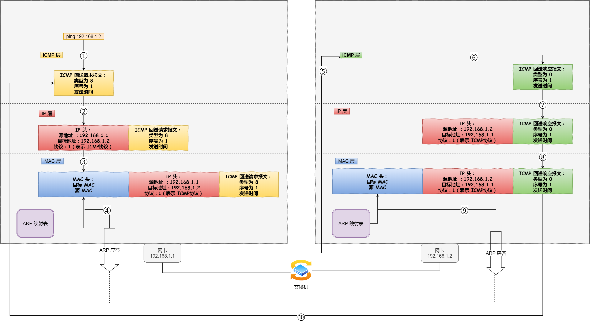

当然这只是最简单的，同一个局域网里面的情况。如果跨网段的话，还会涉及网关的转发、路由器的转发等等。但是对于 ICMP 的头来讲，是没什么影响的。会影响的是根据目标 IP 地址，选择路由的下一跳，还有每经过一个路由器到达一个新的局域网，需要换 MAC 头里面的 MAC 地址。

### traceroute —— 差错报文类型的使用

有一款充分利用 ICMP 差错报文类型的应用叫做 `traceroute`（在UNIX、MacOS中是这个命令，而在Windows中对等的命令叫做 `tracert` ）。

1. traceroute 追踪途经的路由器

traceroute 的第一个作用就是故意设置特殊的 `TTL`，来追踪去往目的地时沿途经过的路由器。它的原理就是利用 IP 包的生存期限，从 1 开始按照顺序递增的同时发送 `UDP` 包，强制接收 ICMP 超时消息的一种方法。

比如，将 TTL 设置 为 1，则遇到第一个路由器，就牺牲了，接着返回 ICMP 差错报文网络包，类型是时间超时。接下来将 TTL 设置为 2，第一个路由器过了，遇到第二个路由器也牺牲了，也同时返回了 ICMP 差错报文数据包，如此往复，直到到达目的主机。这样的过程，traceroute 就可以拿到了所有的路由器 IP。当然有的路由器根本就不会返回这个 ICMP，所以对于有的公网地址，是看不到中间经过的路由的。

> 发送方如何知道发出的 UDP 包是否到达了目的主机呢？

traceroute 在发送 `UDP` 包时，会填入一个**不可能的端口号**值作为 UDP 目标端口号（大于 `3000` ）。当目的主机，收到 UDP 包后，会返回 ICMP 差错报文消息，但这个差错报文消息的类型是「**端口不可达**」。 所以，当差错报文类型是端口不可达时，说明发送方发出的 UDP 包到达了目的主机。

2. traceroute 确定路径的 MTU

traceroute 还有一个作用是故意设置不分片，从而确定路径的 `MTU`。

有的时候我们并不知道路由器的 MTU 大小，以太网的数据链路上的 MTU 通常是 1500 字节，但是非以太网的 MTU 值就不一样了，所以我们要知道 MTU 的大小，从而控制发送的包大小。

它的工作原理如下：

- 首先在发送端主机发送 IP 数据报时，将 IP 包首部的分片禁止标志位设置为 1。根据这个标志位，途中的路由器不会对大数据包进行分片，而是将包丢弃；

- 随后，通过一个 ICMP 的不可达消息将数据链路上 MTU 的值一起给发送主机，不可达消息的类型为「需要进行分片但设置了不分片位」；

- 发送主机端每次收到 ICMP 差错报文时就减少包的大小，以此来定位一个合适的 MTU 值，以便能到达目标主机。


## 交换机和路由器

1. 路由器可以给你的局域网自动分配 IP，虚拟拨号，就像一个交通警察，指挥着你的电脑该往哪走，你自己不用操心那么多了。交换机只是用来分配网络数据的。

2. 路由器在网络层，路由器根据 IP 地址寻址，路由器可以处理 TCP/IP 协议，交换机不可以。

3. 交换机在中继层，交换机根据 MAC 地址寻址。路由器可以把一个 IP 分配给很多个主机使用，这些主机对外只表现出一个 IP。交换机可以把很多主机连起来，这些主机对外各有各的 IP。

4. 路由器提供防火墙的服务，交换机不能提供该功能。集线器、交换机都是做端口扩展的，就是扩大局域网(通常都是以太网)的接入点，也就是能让局域网可以连进来更多的电脑。路由器是用来做网间连接，也就是用来连接不同的网络。

交换机是利用**物理地址或者说 MAC 地址**来确定转发数据的目的地址。而路由器则是利用不同网络的 ID 号(即 IP 地址)来确定数据转发的地址。IP 地址是在软件中实现的，描述的是设备所在的网络，有时这些第三层的地址也称为协议地址或者网络地址。MAC 地址通常是硬件自带的，由网卡生产商来分配的，而且已经固化到了网卡中去，一般来说是不可更改的。而 IP 地址则通常由网络管理员或系统自动分配。

**路由器和交换机的区别一**：交换机是一根网线上网，但是大家上网是分别拨号，各自使用自己的宽带，大家上网没有影响。而路由器比交换机多了一个虚拟拨号功能，通过同一台路由器上网的电脑是共用一个宽带账号，大家上网要相互影响。
**路由器和交换机的区别二**：交换机工作在中继层，交换机根据 MAC 地址寻址。路由器工作在网络层，根据 IP 地址寻址，路由器可以处理 TCP/IP 协议，而交换机不可以。

**路由器和交换机的区别三**：交换机可以使连接它的多台电脑组成局域网，如果还有代理服务器的话还可以实现同时上网功能而且局域网所有电脑是共享它的带宽速率的，但是交换机没有路由器的自动识别数据包发送和到达地址的功能。路由器可以自动识别数据包发送和到达的地址，路由器相当于马路上的警察，负责交通疏导和指路的。

**路由器和交换机的区别四**：举几个例子，路由器是小邮局，就一个地址(IP)，负责一个地方的收发(个人电脑，某个服务器，所以你家上网要这个东西)，交换机是省里的大邮政中心，负责由一个地址给各个小地方的联系。简单的说路由器专管入网，交换机只管配送，路由就是给你找路让你上网的，交换机只负责开门，交换机上面要没有路由你是上不了网的。

**路由器和交换机的区别五**：路由器提供了防火墙的服务。路由器仅仅转发特定地址的数据包，不传送不支持路由协议的数据包传送和未知目标网络数据包的传送，从而可以防止广播风暴。


## IP 地址子网划分

| 二进制   | 十进制 |
| -------- | ------ |
| 1        | 1      |
| 10       | 2      |
| 100      | 4      |
| 1000     | 8      |
| 10000    | 16     |
| 100000   | 32     |
| 1000000  | 64     |
| 10000000 | 128    |
|          |        |
| 10000000 | 128    |
| 11000000 | 192    |
| 11100000 | 224    |
| 11110000 | 240    |
| 11111000 | 248    |
| 11111100 | 252    |
| 11111110 | 254    |
| 11111111 | 255    |

<p align="center">

</p>


```markdown
IP分类

公有地址：
IP分类         缺省掩码
A 1－127       /8
B 128－191     /16
C 192－223     /24
D 224－239     组播地址
E 240－247     保留地址

私有地址：
A：10.0.0.0 - 10.255.255.255
B:  172.16.0.0 - 172.31.255.255
C:  192.168.0.0 - 192.168.255.255

判断合法的主机（IP）地址：
192.168.10.240/24        合法
192.168.10.0/24          不合法，主机位全为0，网络地址
192.168.10.255/24        不合法，主机位全为1，子网广播地址
255.255.255.255          不合法，网络和主机位全为1，全网广播地址
127.x.x.x/8              不合法，本地环回地址
172.16.3.5/24            合法
192.168.5.240/32         合法
224.10.10.10.1           不合法，组播地址
300.2.4.200/24           不合法
```

- IP特殊地址
  - 本地环回地址：127.0.0.0 – 127.255.255.255，测试主机TCP/IP协议栈是否安装正确。
  - 本地链路地址：169.254.0.0 – 169.254.255.255，自动地址无法获取时系统自动配置占位。
  - 受限广播地址：255.255.255.255，发往这个地址的数据不能跨越三层设备，但本地网络内所有的主机都可以接收到数据


## 子网掩码

内网中192.168.1.199的前三组是网络号，后一组是主机号，子网掩码就是255.255.255.0

**首先要说明的是**：不是某个IP的网络号和主机号决定子网掩码是什么，而是子网掩码决定了某个IP地址的网络号与主机号是什么，IP地址是要搭配子网掩码使用的。例如上面的子网掩码决定了192.168.1.199的前三段192.168.1是网络号，最后一段199是主机号。

我们再来理解子网掩码的作用，先举个例子，市面上的两个厂家都生产电子秤，每个厂家都坚称他们的秤最准，那你是怎么知道他们的秤到底准不准？很简单，你去找一个 1KG 的国际千克原器，各放到他们的秤上测量，如果秤的测量值是1KG，那这把秤就是准的，**子网掩码的作用就相当于这个大家公认的国际千克原器，是我们测量两个IP是否属于同一个网段的一个工具（应该说是让你知道某个IP地址的网络号与主机号分别是什么） 。**


**如果让你判断一个IP地址：192.168.1.199的网络号和主机号分别是什么？**

请问你怎么判断？你凭什么说192.168.1是网络号？199是主机号？有什么根据吗？

但是如果我给你一个IP地址是以下（带子网掩码）形式的：

IP：192.168.1.199   

子网掩码：255.255.255.0 

那么根据大家公认的规则，你就可以得出这个IP的网络号和主机号了，怎么算呢？

子网掩码的长度和IP地址一样也是一串32位的二进制数字，只不过为人类的可读性和记忆性的方便，通常使用十进制数字来表示，例如把上面的IP地址和子网掩码都转换成相应的二进制就是下面这样的：

                        **十进制**                                                   **二进制**

IP    地址：192.168.1.199       **‐＞**11000000.10101000.00000001.11000111

子网掩码：255.255.255.0       **‐＞**11111111.11111111.11111111.00000000

十进制的显示形式是给人看的，二进制的显示形式是给计算机看的。。。

子网掩码的左边是网络位，用二进制数字“1”表示，1的数目等于网络位的长度；右边是主机位，用二进制数字“0”表示，0的数目等于主机位的长度。 

例如上面的子网掩码255.255.255.0的  “1”的个数是左边24位，则对应IP地址左边的位数也是24位;

                        **十进制**                                                   **二进制**

IP    地址：192.168.1.199       **‐＞11000000.10101000.00000001**.11000111

子网掩码：255.255.255.0       **‐＞11111111.11111111.11111111**.00000000

则这个IP地址的网络号就是11000000.10101000.00000001 ，转换成十进制就是 192.168.1，网掩码255.255.255.0的  “0”的个数是右边8位，则这个IP地址的主机号就是11000111，转换成十进制就是199.


# 应用层

## URL、URI、URN

- URI（Uniform Resource Identifier，统一资源标识符）

  web服务器资源的名字，例如： index.html

- URL（Uniform Resource Locator，统一资源定位符）

- URN（Uniform Resource Name，统一资源名称），例如 urn:isbn:0-486-27557-4。

URI 包含 URL 和 URN，目前 WEB 只有 URL 比较流行，所以见到的基本都是 URL。

<p align="center">

</p>


## DNS

DNS（Domain Name System）， 也叫网域名称系统，是互联网的一项服务。它实质上是一个域名和 IP 相互映射的分布式数据库，有了它，我们就可以通过域名更方便的访问互联网。

DNS 有以下特点：

- 分布式的

- 协议支持 TCP 和 UDP，常用端口是 53

- 每一级域名的长度限制是 63

- 域名总长度限制是 253

DNS 在什么情况下使用 TCP，什么情况下使用 UDP 呢?

最早的时候，DNS 的 UDP 报文上限大小是 512 字节， 所以当某个 response 大小超过512（返回信息太多），DNS 服务就会使用 TCP 协议来传输。后来 DNS 协议扩展了自己的UDP 协议，DNS client 发出查询请求时，可以指定自己能接收超过512字节的 UDP 包， 这种情况下，DNS 还是会使用 UDP 协议。

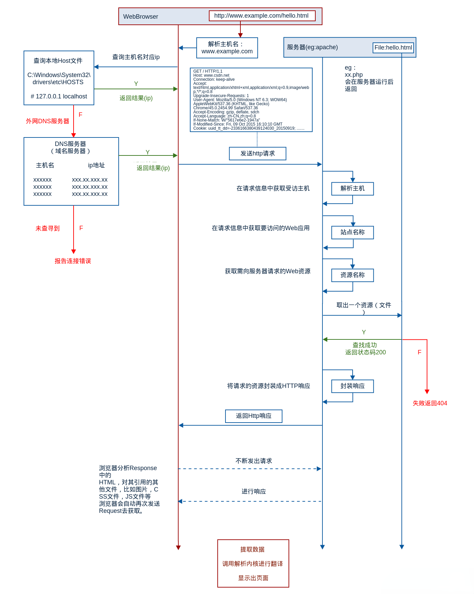


## HTTP

### HTTP 的请求和响应报文

* 请求报文

<p align="center">

</p>

* 响应报文

<p align="center">

</p>


### HTTP 状态

服务器返回的响应报文中第一行为状态行，包含了状态码以及原因短语，用来告知客户端请求的结果。

| 状态码 |             类别              |     原因短语     |
| ----- | ----------------------------- | ---------------- |
| 1XX   | Informational（信息性状态码）  | 接收的请求正在处理 |
| 2XX   | Success（成功状态码）          | 请求正常处理完毕   |
| 3XX   | Redirection（重定向状态码）| 需要进行附加操作以完成请求 |
| 4XX   | Client Error（客户端错误状态码）| 服务器无法处理请求 |
| 5XX   | Server Error（服务器错误状态码）| 服务器处理请求出错 |


* 1XX 信息
  - **100 Continue** ：表明到目前为止都很正常，客户端可以继续发送请求或者忽略这个响应。

- 2XX 成功
  - **200 OK**：请求成功，信息在返回的响应报文中。
  - **204 No Content** ：请求已经成功处理，但是返回的响应报文不包含实体的主体部分。一般在只需要从客户端往服务器发送信息，而不需要返回数据时使用。
  - **206 Partial Content** ：表示客户端进行了范围请求。响应报文包含由 Content-Range 指定范围的实体内容。

* 3XX 重定向
  - **301 Moved Permanently** ：永久性重定向。请求的对象已经被永久转移了，新的 URL 定义在响应报文的 Location：首部行中。客户软件将自动获取新的 URL 。
  - **302 Found** ：临时性重定向。类似于 301，但新的 URL 应该被视为临时性的替代，而不是永久性的。
  - **303 See Other** ：和 302 有着相同的功能，但是 303 明确要求客户端应该采用 GET 方法获取资源。
  - 注：虽然 HTTP 协议规定 301、302 状态下重定向时不允许把 POST 方法改成 GET 方法，但是大多数浏览器都会在 301、302 和 303 状态下的重定向把 POST 方法改成 GET 方法。
  - **304 Not Modified** ：如果请求报文首部包含一些条件，例如：If-Match，If-Modified-Since，If-None-Match，If-Range，If-Unmodified-Since，如果不满足条件，则服务器会返回 304 状态码。
  - **307 Temporary Redirect** ：临时重定向，与 302 的含义类似，但是 307 要求浏览器不会把重定向请求的 POST 方法改成 GET 方法。

- 4XX 客户端错误
  - **400 Bad Request** ：请求报文中存在语法错误，该请求不能被服务器理解。
  - **401 Unauthorized** ：该状态码表示发送的请求需要有认证信息（BASIC 认证、DIGEST 认证）。如果之前已进行过一次请求，则表示用户认证失败。
  - **403 Forbidden** ：请求被拒绝，服务器端没有必要给出拒绝的详细理由。
  - **404 Not Found**：被请求的文档不在服务器上。

* 5XX 服务器错误
  - **500 Internal Server Error** ：服务器正在执行请求时发生错误。
  - **502 Bad Gateway** : 是用来表示代理或网关在处理请求时发生了错误，并不一定是原始服务器出现了问题。
  - **503 Service Unavailable** ：服务器暂时处于超负载或正在进行停机维护，现在无法处理请求。
  - **504 Gateway Timeout**：作为网关或者代理工作的服务器尝试执行请求时，未能及时从上游服务器（URI 标识出的服务器，例如HTTP、FTP、LDAP）或者辅助服务器（例如DNS）收到响应。　

注意：某些代理服务器在 DNS 查询超时时会返回 400 或者 500 错误。


### HTTP 方法

客户端发送的 **请求报文** 第一行为请求行，包含了方法字段。

* GET

> 获取资源

当前网络请求中，绝大部分使用的是 GET 方法。

* HEAD

> 获取报文首部

和 GET 方法一样，但是不返回报文实体主体部分。

主要用于确认 URL 的有效性以及资源更新的日期时间等。

* POST

> 传输实体主体

POST 主要用来传输数据，而 GET 主要用来获取资源。

* PUT

> 上传文件

由于自身不带验证机制，任何人都可以上传文件，因此存在安全性问题，一般不使用该方法。

```
PUT /new.html HTTP/1.1
Host: example.com
Content-type: text/html
Content-length: 16

<p>New File</p>
```
* PATCH

> 对资源进行部分修改

PUT 也可以用于修改资源，但是只能完全替代原始资源，PATCH 允许部分修改。

```markdown
PATCH /file.txt HTTP/1.1
Host: www.example.com
Content-Type: application/example
If-Match: "e0023aa4e"
Content-Length: 100

[description of changes]
```

* DELETE

> 删除文件

与 PUT 功能相反，并且同样不带验证机制。

```bash
DELETE /file.html HTTP/1.1
```

* OPTIONS

> 查询支持的方法

查询指定的 URL 能够支持的方法。

会返回 Allow: GET, POST, HEAD, OPTIONS 这样的内容。

* CONNECT

> 要求在与代理服务器通信时建立隧道

使用 SSL（Secure Sockets Layer，安全套接层）和 TLS（Transport Layer Security，传输层安全）协议把通信内容加密后经网络隧道传输。

```bash
CONNECT www.example.com:443 HTTP/1.1
```

<p align="center">

</p>

* TRACE

> 追踪路径

服务器会将通信路径返回给客户端。

发送请求时，在 Max-Forwards 首部字段中填入数值，每经过一个服务器就会减 1，当数值为 0 时就停止传输。

通常不会使用 TRACE，并且它容易受到 XST 攻击（Cross-Site Tracing，跨站追踪）。

#### GET 和 POST 的区别

|     |  GET  | POST |
|-----|-------|------|
| 后退按钮/刷新 |	无害 | 数据会被重新提交（浏览器应该告知用户数据会被重新提交） |
| 书签 | 可收藏为书签 | 不可收藏为书签 |
| 缓存 | 能被缓存 | 不能缓存 |
| 历史 | 参数保留在浏览器历史中 | 参数不会保存在浏览器历史中 |
| 对数据长度的限制 | 有限制。当发送数据时，GET 方法向 URL 添加数据；URL 的长度是受限制的（URL 的最大长度是 2048 个字符）。 | 无限制 |
| 对数据类型的限制 | 只允许 ASCII 字符 | 没有限制。也允许二进制数据。 |
| 安全性 | 与 POST 相比，GET 的安全性较差，因为所发送的数据是 URL 的一部分。（在发送密码或其他敏感信息时绝不要使用 GET ！） | 	POST 比 GET 更安全，因为参数不会被保存在浏览器历史或 web 服务器日志中。 |
| 可见性 | 数据在 URL 中，对所有人都是可见的 | 数据不会显示在 URL 中 |

* GET 被强制服务器支持 
* 浏览器对 URL 的长度有限制，所以 GET 请求不能代替 POST 请求发送大量数据
* GET 请求是幂等的 
  - 幂等的意味着对同一URL的多个请求应该返回同样的结果 
* GET 请求一般不应产生副作用。就是说，它仅仅是获取资源信息，就像数据库查询一样，不会修改，增加数据，不会影响资源的状态。
* POST 用于修改服务器上的资源
* 发送包含未知字符的用户输入时，POST 比 GET 更稳定也更可靠 


**引申：说完原理性的问题，我们从表面上来看看 GET 和 POST 的区别：**

* GET 是从服务器上获取数据，POST 是向服务器传送数据。 GET 和 POST 只是一种传递数据的方式，GET 也可以把数据传到服务器，他们的本质都是发送请求和接收结果。只是组织格式和数据量上面有差别，http 协议里面有介绍。

* GET 是把参数数据队列加到提交表单的 ACTION 属性所指的 URL 中，值和表单内各个字段一一对应，在 URL 中可以看到；POST 是通过 HTTP POST 机制，将表单内各个字段与其内容放置在 HTML HEADER 内一起传送到 ACTION 属性所指的 URL 地址，用户看不到这个过程。 

* 因为 GET 设计成传输小数据，而且最好是不修改服务器的数据，所以浏览器一般都在地址栏里面可以看到，但 POST 一般都用来传递大数据，或比较隐私的数据，所以在地址栏看不到，能不能看到不是协议规定，是浏览器规定的。

* 对于 GET 方式，服务器端用 `Request.QueryString` 获取变量的值，对于 POST 方式，服务器端用 `Request.Form` 获取提交的数据。怎么获得变量和你的服务器有关，和 GET 或 POST 无关，服务器都对这些请求做了封装。

* GET 传送的数据量较小，不能大于 2KB。POST 传送的数据量较大，一般被默认为不受限制。但理论上，IIS4 中最大量为 80KB，IIS5 中为 100KB。 POST 基本没有限制，我想大家都上传过文件，都是用 POST 方式的。只不过要修改 form 里面的那个 type 参数。 

* GET 安全性非常低，POST 安全性较高。如果没有加密，他们安全级别都是一样的，随便一个监听器都可以把所有的数据监听到。


### HTTP 代理

#### 普通代理

由修订后的 RFC 2616, HTTP/1.1 协议的第一部分描述。

普通代理扮演着中间人的角色，对于连接到它的客户端来说它是服务端，对于要连接的服务端来说它是客户端，它负责在两端之间来回传送 HTTP 报文。

普通代理原理：HTTP 客户端向代理发送请求报文，代理服务器需要正确地处理请求和连接，同时向服务器发送请求，并将接收到的响应转发给客户端。


对于目标服务器来说，会将代理作为客户端，也就完全觉察不到真正客户端的存在，这实现了隐藏客户端 IP 的目的。代理也可以修改 HTTP 请求头，通过 X-Forwarded-IP 自定义头部字段告知目标服务器真正的客户端。但目标服务器是无法验证自定义头部是由代理添加的还是由客户端添加的，所以从 HTTP 头部字段获取 IP 时需格外小心。

- 正向代理

  给浏览器显式地指定代理时需手动修改浏览器或操作系统相关配置，或指明 PAC(Proxy Auto-Configuration，自动配置代理) 文件自动设置。某些浏览器支持 WPAD(Web Proxy Autodiscovery Protocol，Web代理自动发现协议)。显式地指定浏览器代理这种方式一般称为正向代理，浏览器启用正向代理后会对 HTTP 请求报文做一些修改，来规避老旧代理服务器的一些问题。

- 反向代理 

  另外一种情况是访问目标服务器时实际上访问的是代理，代理接收到请求报文后，再向真正提供服务的服务器发起请求，并将响应转发给浏览器，这种情况称为反向代理。反向代理可隐藏服务器 IP 与端口。使用反向代理需通过修改 DNS 让域名解析到代理服务器 IP，此时浏览器无法察觉到真正服务器的存在。

#### 隧道代理

通过 Web 代理服务器使用隧道方式传输基于 TCP 的协议。

隧道代理通过 HTTP 协议正文部分 (Body) 完成通讯，以 HTTP 的方式实现任意基于 TCP 的应用层协议的代理。

隧道代理使用 HTTP 的 CONNECT 方法建立连接，但 CONNECT 最开始并不是 RFC 2616 - HTTP/1.1 的一部分，直到 2014 年发布的 HTTP/1.1 修订版中，才增加了对 CONNECT 以及隧道技术的描述。

隧道代理原理：HTTP 客户端通过 CONNECT 方法请求隧道代理创建一条到达任意目标服务器和端口的 TCP 连接，并对客户端和服务端之间的后续数据进行盲转发。

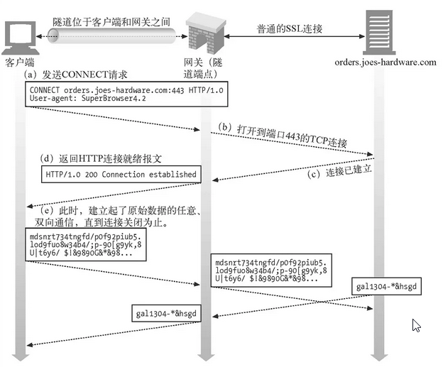

对于 CONNECT 连接来说，只是用来让代理创建 TCP 连接，所以只需要提供服务器域名和端口即可，并不需要具体的资源路径。

浏览器建立到服务器 TCP 连接产生的 HTTP 往返完全是明文的，这也是为什么 CONNECT 请求只需要提供 IP 和端口。若发送完整的 URL、Cookie 等信息会被中间人一览无余，降低了 HTTPS 的安全性。

```c
CONNECT www.microsoft.com:443 HTTP/1.0
 User-Agent: Mozilla/5.0 (Windows NT 6.1; WOW64; Trident/7.0; rv:11.0) like Gecko
 Host: www.microsoft.com
 Content-Length: 0
 DNT: 1
 Connection: Keep-Alive
 Pragma: no-cache
```

当代理服务器接收到这个请求后，会在对应的端口上与目标站点建立一个 TCP 连接，连接建立成功后返回一个 HTTP 200 状态码告诉浏览器与该站点的加密通道已经建立完成。

```c
HTTP/1.0 200 Connection Established
 FiddlerGateway: Direct
 StartTime: 11:56:22.008
 Connection: close
 EndTime: 11:56:22.538
 ClientToServerBytes: 1416
 ServerToClientBytes: 1358
```

浏览器接收到响应报文后，即可认为到服务端的 TCP 连接已经打通，后续直接往这个 TCP 连接写协议数据即可。

使用注意

- HTTP 代理协议只有当浏览器配置为使用代理服务器时才会使用到 CONNECT 方法；
- HTTP CONNECT METHOD 的作用是将服务器作为代理，让服务器代理用户去访问网页，之后将数据返回给用户；
- HTTP CONNECT METHOD 是通过 TCP 连接代理服务器。

CONNECT 的作用是把服务器作为跳板，让服务器代替用户取访问其它 URL，之后把数据原原本本的返回给用户，这样用户就可以访问一些只有服务器上才能访问的站点，这也就是 HTTP 代理。

#### GET vs CONNECT

CONNECT 与 GET 不同之处在于：代理服务器对 CONNECT 连接处理上，它会为其建立一个到目标服务器的连接，而不把 CONNECT 请求发送出去，建立连接以后代理服务器不会对连接数据做任何修改，只是转发 (通常使用的是 SSL 的 443 端口)，代理服务器可在 80 端口通知支持 GET 和 CONNECT。

代理服务器如何处理 GET 呢？

代理服务器会分析出目标服务器地址后建立连接，然后修改 GET 请求为直接发往目标服务器的格式，比如会删掉只是用来提供给代理的部分，以降低 HTTP 版本为代理服务器所能支持的版本，比如会降低 HTTP/1.1 为 HTTP/1.0。

使用 Golang 实现支持 HTTP CONNECT 方法的隧道代理服务器:

```go
package main
 
import (
    "io"
    "log"
    "net"
    "net/http"
    "sync"
)
 
var (
    addr = "127.0.0.1:7100"
    username = "administrator"
    password = "1234567"
)
 
//tunnel 通道处理
func tunnel(w http.ResponseWriter, r *http.Request){
    //判断请求方法
    if r.Method != http.MethodConnect{
        log.Println(r.Method, r.RequestURI)
        http.NotFound(w, r)//404
        return
    }
    //获取用户名与密码
    auth := r.Header.Get("Proxy-Authorization")//获取客户端授权信息
    //设置用户名与密码
    r.Header.Set("Authorization", auth)
 
    //验证账户密码
    u,p,ok := r.BasicAuth()//BasicAuth依赖Authorization
    if !ok || !(username==u || password==p){
        log.Printf("bad credential: username %s or password %s\n", u, p)
        http.Error(w, "Method Not Allowed", http.StatusMethodNotAllowed)
        return
    }
 
    //获取目标服务器地址
    dstAddr := r.RequestURI
 
    //连接远程服务器
    dstConn,err := net.Dial("tcp", dstAddr)
    if err!=nil {
        http.Error(w, err.Error(), http.StatusBadRequest)
        return
    }
    defer dstConn.Close()
 
    //为客户端返回成功消息
    w.Write([]byte("HTTP/1.1 200 OK\r\n\r\n"))
 
    //劫持writer获取潜在conn
    //HTTP是应用层协议，下层TCP是网络层协议，hijack可从HTTP Response获取TCP连接，若是HTTPS服务器则是TLS连接。
    //bio是带缓冲的读写者
    srcConn,bio,err := w.(http.Hijacker).Hijack()
    if err!= nil{
        http.Error(w, err.Error(), http.StatusInternalServerError)
        return
    }
    defer srcConn.Close()
    //创建两个线程
    wg := &sync.WaitGroup{}
    wg.Add(2)
    //并发执行单元1: 将TCP连接拷贝到HTTP连接中
    go func(){
        defer wg.Done()
        //缓存处理
        n := bio.Reader.Buffered()
        if n>0 {
            n64,err := io.CopyN(dstConn, bio, int64(n))
            if n64!=int64(n) || err!=nil{
                log.Printf("io.CopyN: %d %v\n", n64, err)
                return
            }
        }
        //进行全双工的双向数据拷贝(中继)
        io.Copy(dstConn, srcConn)//relay: src->dst
    }()
    //并发执行单元2：将HTTP连接拷贝到TCP连接中
    go func(){
        defer wg.Done()
        //进行全双工的双向数据拷贝(中继)
        io.Copy(srcConn, dstConn)//relay:dst->src
    }()
    wg.Wait()
}
 
//服务器 go run main.go
//客户端 curl -p --proxy username:password@hostname:port http://target.com
//curl -p --proxy administartor:1234567@127.0.0.1:7100 http://www.baidu.com
func main(){
    //HTTP处理器
    handler := http.HandlerFunc(tunnel)
    //建立HTTP服务器
    err := http.ListenAndServe(addr, handler)
    if err!=nil{
        panic(err)
    }
}
```

运行服务器:

```shell
$ go run main.go
```

测试：

```shell
$ curl -p --proxy administartor:1234567@127.0.0.1:7100 http://www.baidu.com
```

cURL 在目标 HTTP 而非 HTTPS 时会采用 GET 请求，为保证数据安全、防监听、插入广告，在服务器上应使用HTTPS，使用ListenAndServeTLS替换ListenAndServe即可。


### HTTP 协议是无状态的

HTTP 协议是`无状态`的（stateless），指的是协议对于事务处理没有记忆能力，服务器不知道客户端是什么状态。也就是说，打开一个服务器上的网页和上一次打开这个服务器上的网页之间没有任何联系。

HTTP是一个无状态的面向连接的协议，无状态不代表 HTTP 不能保持 TCP 连接，更不能代表 HTTP 使用的是 UDP 协议（无连接）。 

缺少状态意味着如果后续处理需要前面的信息，则它必须重传，这样可能导致每次连接传送的数据量增大。另一方面，在服务器不需要先前信息时它的应答就较快。 


### 短连接和长连接

在 **HTTP/1.0** 中默认使用**短连接**。也就是说，客户端和服务器每进行一次 HTTP 操作，就建立一次连接，任务结束就中断连接。当客户端浏览器访问的某个 HTML 或其他类型的 Web 页中包含有其他的 Web 资源（如 JavaScript 文件、图像文件、CSS 文件等），每遇到这样一个 Web 资源，浏览器就会重新建立一个 HTTP 会话。

而从 **HTTP/1.1** 起，默认使用**长连接**，用以保持连接特性。使用长连接的 HTTP 协议，会在响应头加入这行代码：

```bash
Connection:keep-alive
```

在使用长连接的情况下，当一个网页打开完成后，客户端和服务器之间用于传输 HTTP 数据的 TCP 连接不会关闭，客户端再次访问这个服务器时，会继续使用这一条已经建立的连接。Keep-Alive 不会永久保持连接，它有一个保持时间，可以在不同的服务器软件（如 Apache）中设定这个时间。实现长连接需要客户端和服务端都支持长连接。

HTTP 协议的长连接和短连接，实质上是 TCP 协议的长连接和短连接。


### Cookie

HTTP 协议是无状态的，主要是为了让 HTTP 协议尽可能简单，使得它能够处理大量事务。**HTTP/1.1** 引入 Cookie 来保存状态信息。

Cookie 是服务器发送到用户浏览器并保存在本地的一小块数据，它会在浏览器下次向同一服务器再发起请求时被携带并发送到服务器上。它用于告知服务端两个请求是否来自同一浏览器，并保持用户的登录状态。

#### 用途

- 会话状态管理（如用户登录状态、购物车、游戏分数或其它需要记录的信息）
- 个性化设置（如用户自定义设置、主题等）
- 浏览器行为跟踪（如跟踪分析用户行为等）

Cookie 曾一度用于客户端数据的存储，因为当时并没有其它合适的存储办法而作为唯一的存储手段，但现在随着现代浏览器开始支持各种各样的存储方式，Cookie 渐渐被淘汰。由于服务器指定 Cookie 后，浏览器的每次请求都会携带 Cookie 数据，会带来额外的性能开销（尤其是在移动环境下）。新的浏览器 API 已经允许开发者直接将数据存储到本地，如使用 Web storage API （本地存储和会话存储）或 IndexedDB。


#### 创建过程

服务器发送的响应报文包含 Set-Cookie 首部字段，客户端得到响应报文后把 Cookie 内容保存到浏览器中。

```bash
HTTP/1.0 200 OK
Content-type: text/html
Set-Cookie: yummy_cookie=choco
Set-Cookie: tasty_cookie=strawberry

[page content]
```
客户端之后对同一个服务器发送请求时，会从浏览器中读出 Cookie 信息通过 Cookie 请求首部字段发送给服务器。

```bash
GET /sample_page.html HTTP/1.1
Host: www.example.org
Cookie: yummy_cookie=choco; tasty_cookie=strawberry
```

#### 分类

- 会话期 Cookie：浏览器关闭之后它会被自动删除，也就是说它仅在会话期内有效。
- 持久性 Cookie：指定一个特定的过期时间（Expires）或有效期（max-age）之后就成为了持久性的 Cookie。

```bash
Set-Cookie: id=a3fWa; Expires=Wed, 21 Oct 2015 07:28:00 GMT;
```

#### Secure 和 HttpOnly

标记为 Secure 的 Cookie 只应通过被 HTTPS 协议加密过的请求发送给服务端。但即便设置了 Secure 标记，敏感信息也不应该通过 Cookie 传输，因为 Cookie 有其固有的不安全性，Secure 标记也无法提供确实的安全保障。

标记为 HttpOnly 的 Cookie 不能被 JavaScript 脚本调用。因为跨域脚本 (XSS) 攻击常常使用 JavaScript 的 `Document.cookie`API 窃取用户的 Cookie 信息，因此使用 HttpOnly 标记可以在一定程度上避免 XSS 攻击。

```bash
Set-Cookie: id=a3fWa; Expires=Wed, 21 Oct 2015 07:28:00 GMT; Secure; HttpOnly
```

#### 作用域

Domain 标识指定了哪些主机可以接受 Cookie。如果不指定，默认为当前文档的主机（不包含子域名）。如果指定了 Domain，则一般包含子域名。例如，如果设置 Domain=mozilla.org，则 Cookie 也包含在子域名中（如 developer.mozilla.org）。

Path 标识指定了主机下的哪些路径可以接受 Cookie（该 URL 路径必须存在于请求 URL 中）。以字符 %x2F ("/") 作为路径分隔符，子路径也会被匹配。例如，设置 Path=/docs，则以下地址都会匹配：

- /docs
- /docs/Web/
- /docs/Web/HTTP


### Session

除了可以将用户信息通过 Cookie 存储在用户浏览器中，也可以利用 Session 存储在服务器端，存储在服务器端的信息更加安全。

`Session` 可以存储在服务器上的文件、数据库或者内存中，现在最常见的是将 Session 存储在内存型数据库中，比如 `Redis`。

使用 Session 维护用户登录的过程如下：

- 用户进行登录时，用户提交包含用户名和密码的表单，放入 HTTP 请求报文中；
- 服务器验证该用户名和密码；
- 如果正确则把用户信息存储到 Redis 中，它在 Redis 中的 ID 称为 Session ID；
- 服务器返回的响应报文的 Set-Cookie 首部字段包含了这个 Session ID，客户端收到响应报文之后将该 Cookie 值存入浏览器中；
- 客户端之后对同一个服务器进行请求时会包含该 Cookie 值，服务器收到之后提取出 Session ID，从 Redis 中取出用户信息，继续之后的业务操作。

应该注意 Session ID 的安全性问题，不能让它被恶意攻击者轻易获取，那么就不能产生一个容易被猜到的 Session ID 值。此外，还需要经常重新生成 Session ID。在对安全性要求极高的场景下，例如转账等操作，除了使用 Session 管理用户状态之外，还需要对用户进行重新验证，比如重新输入密码，或者使用短信验证码等方式。

<p align="center">

</p>

若浏览器禁用 Cookie，此时无法使用 Cookie 来保存用户信息，只能使用 Session。除此之外，不能再将 Session ID 存放到 Cookie 中，而是使用 **URL 重写技术**，将 Session ID 作为 URL 的参数进行传递。


### Cookie 与 Session 的选择

- Cookie 只能存储 ASCII 码字符串，而 Session 则可以存取任何类型的数据，因此在考虑数据复杂性时首选 Session；

- Cookie 存储在浏览器中，容易被恶意查看。如果非要将一些隐私数据存在 Cookie 中，可以将 Cookie 值进行加密，然后在服务器进行解密；

- 对于大型网站，如果用户所有的信息都存储在 Session 中，那么开销是非常大的，因此不建议将所有的用户信息都存储到 Session 中。


## SSL/TLS

### SSL 

`SSL`（Secure Socket Layer，安全套接字层）为 Netscape 所研发，用以保障在 Internet 上数据传输之安全，利用数据加密（Encryption）技术，可确保数据在网络上之传输过程中不会被截取，当前为 3.0 版本。

SSL 协议可分为两层： SSL 记录协议（SSL Record Protocol）：它建立在可靠的传输协议（如 TCP）之上，为高层协议提供数据封装、压缩、加密等基本功能的支持。 SSL 握手协议（SSL Handshake Protocol）：它建立在 SSL 记录协议之上，用于在实际的数据传输开始前，通讯双方进行身份认证、协商加密算法、交换加密密钥等。


### TLS 

`TLS`（Transport Layer Security，传输层安全协议）用于两个应用程序之间提供保密性和数据完整性。

TLS 1.0 是 IETF（Internet Engineering Task Force，Internet 工程任务组）制定的一种新的协议，它建立在 SSL 3.0 协议规范之上，是 SSL 3.0 的后续版本，可以理解为 SSL 3.1，它是写入了 RFC 的。

TLS 协议由两层组成： TLS 记录协议（TLS Record）和 TLS 握手协议（TLS Handshake）。较低的层为 TLS 记录协议，位于某个可靠的传输协议（例如 TCP）上面。


### SSL/TLS 握手

SSL/TLS 四次握手是为了安全地协商出一份对称加密的密钥，这个过程很有意思，下面我们一起来了解一下。

<p align="center">

</p>

**第一次握手**

1. Client Hello

客户端向服务端发送 Client Hello 消息，这个消息里包含了一个客户端生成的随机数 `Random1`、客户端支持的加密套件列表（`Support Ciphers`）和压缩算法列表（`Compression Methods`）、支持的最高 TSL 协议版本 `SSL Version` 、扩展字段 `Extensions` 等信息。

**第二次握手**

2. Server Hello

服务端返回协商的信息结果，包括选择使用的协议版本 `SSL Version`，选择的加密套件 `Cipher Suite`，选择的压缩算法 `Compression Method`、随机数 `Random2` 等，其中随机数用于后续的密钥协商。

3. Server Certificate 

服务端将自己的证书下发给客户端，让客户端验证自己的身份。

4. Server Hello Done

通知客户端 Server Hello 信息发送结束。

* Check Server Certificate (Client)

客户端收到服务端传来的证书后，先从 CA 验证该证书的合法性，验证通过后取出证书中的服务端公钥。

**第三次握手**

5. Client Key Exchange

合法性验证通过之后，客户端计算产生随机数字 `Random3`，再用服务端公钥非对称加密 Random3 生成 `PreMaster Key`，发送给服务器。

至此，客户端和服务端都拥有 `Random1 + Random2 + Random3`，两边再根据同样的算法就可以生成一份秘钥，握手结束后的应用层数据都是使用这个秘钥进行对称加密。

为什么要使用三个随机数呢？这是因为 SSL/TLS 握手过程的数据都是明文传输的，并且多个随机数种子来生成秘钥不容易被暴力破解出来。

6. Change Cipher Spec (Client)

客户端通知服务器后续的通信都采用协商的通信密钥和加密算法进行加密通信。

7. Finished (Client)

结合之前所有通信参数的 Hash 值与其它相关信息生成一段数据，采用协商密钥 Session Secret 与算法进行加密，得到 `Encrypted Handshake Message`， 然后发送给服务器用于数据与握手验证。

* Check Encrypted Handshake Message (Server)

服务器用私钥解密 PreMaster Key，得到随机数字 Random3，加上之前交换的两个明文随机数 Random1 和 Random2，计算得到协商密钥。

计算之前所有接收信息的 Hash 值，然后解密客户端发送的 Encrypted Handshake Message，验证数据和密钥正确性。

**第四次握手**

8. Change Cipher Spec (Server)

验证通过之后，服务器同样发送 Change Cipher Spec 以告知客户端后续的通信都采用协商的密钥与算法进行加密通信。

9. Finished (Server)

服务器也结合所有当前的通信参数信息生成一段数据并采用协商密钥 Session Secret 与算法加密，生成 `Encrypted Handshake Message` 并发送到客户端。

* Check Encrypted Handshake Message (Client)

客户端计算所有接收信息的 hash 值，并采用协商密钥解密 `Encrypted Handshake Message`，验证服务器发送的数据和密钥，验证通过则**握手完成**。

**握手后续**

10-11. Application Data

到这里，双方已安全地协商出了同一份秘钥，所有的应用层数据都会用这个秘钥加密后再通过 TCP 进行可靠传输。 

12. Alert：warning, close notify

用于指明在握手或通信过程中的状态改变或错误信息，一般告警信息触发条件是连接关闭，收到不合法的信息，信息解密失败，用户取消操作等，收到告警信息之后，通信会被断开或者由接收方决定是否断开连接。

客户端决定断开连接时，发送 close_notify 报文。上图做了一些省略，在这步之后再发送一种叫做 MAC（Message Authentication Code）的报文摘要。MAC 能够查知报文是否遭到篡改，从而保护报文的完整性。

* Demand Client Certificate

Certificate Request 是服务端要求客户端上报证书（第二次握手），这一步是可选的，对于安全性要求高的场景会用到。

<p align="center">

</p>
**TLS 1.3** 握手过程相比以前版本做了不少优化，握手过程耗时降低到 1- RTT，客户端发送 ClientHello，服务端响应 ServerHello 之后，握手就完成了，如图所示。


ClientHello 已经为支持的每种加密套件生成本该在 Client Key Exchange 消息传递的参数，因此不管服务端选择哪种加密套件，后续都节省了一次 Client Key Exchange 消息。而客户端发送的 Change Cipher Spec 消息改为在发送应用数据的数据包带上，也就不需要 Finished 消息了。

ServerHello 也将 Server Key Exchange 消息合并在一起发送了。所以总的，就减少了一次 RTT。


## HTTPS

HTTP 有以下安全性问题：

- 使用明文进行通信，内容可能会被窃听；
- 不验证通信方的身份，通信方的身份有可能遭遇伪装；
- 无法证明报文的完整性，报文有可能遭篡改。

HTTPs（Hyper Text Transfer Protocol over Secure Socket Layer），是以安全为目标的 HTTP 通道，简单讲 HTTPs 是 HTTP 的安全版。

HTTPs 并不是新协议，而是让 HTTP 先和 `SSL`（Secure Sockets Layer）通信，再由 SSL 和 TCP 通信。也就是说 HTTPs 使用了隧道进行通信。

通过使用 SSL，HTTPs 具有了加密（**防窃听**）、认证（**防伪装**）和完整性保护（**防篡改**）。

HTTPS 是建立在密码学基础之上的一种安全通信协议，严格来说是基于 HTTP 协议和 SSL/TLS 的组合。理解 HTTPS 之前有必要弄清楚一些密码学的相关基础概念，比如：明文、密文、密码、密钥、对称加密、非对称加密、信息摘要、数字签名、数字证书。下文提到的『数据』、『消息』都是同一个概念，表示用户之间通信的内容载体，此外提到了以下几个角色：

- Alice：消息发送者
- Bob：消息接收者
- Attacker：中间攻击者
- Trent：第三方认证机构

### 密码学基础

#### 对称加密与非对称加密

`对称密钥`（Symmetric-key algorithm）又称为共享密钥加密，加密和解密使用相同的密钥。常见的对称加密算法有DES、3DES、AES、RC5、RC6。对称密钥的优点是计算速度快，但是它有缺点，接收者需要发送者告知密钥才能解密，因此密钥如何安全的发送给接收者成为了一个问题。

<p align="center">

</p>

Alice 给 Bob 发送数据时，把数据用对称加密后发送给 Bob，发送过程中由于对数据进行了加密，因此即使有人窃取了数据也没法破解，因为它不知道密钥是什么。但是同样的问题是 Bob 收到数据后也一筹莫展，因为它也不知道密钥是什么，那么 Alice 是不是可以把数据和密钥一同发给 Bob 呢。当然不行，一旦把密钥和密钥一起发送的话，那就跟发送明文没什么区别了，因为一旦有人把密钥和数据同时获取了，密文就破解了。所以对称加密的密钥匹配是个问题。如何解决呢，公钥加密是一个办法。

`公开密钥加密`（public-key cryptography）简称公钥加密，这套密码算法包含配对的密钥对，分为加密密钥和解密密钥。发送者用加密密钥进行加密，接收者用解密密钥进行解密。加密密钥是公开的，任何人都可以获取，因此加密密钥又称为公钥（public key），解密密钥不能公开，只能自己使用，因此它又称为私钥（private key）。常见的公钥加密算法有 RSA。

还是以Alice 给 Bob 发送数据为例，公钥加密算法由接收者 Bob 发起

1. Bob 生成公钥和私钥对，私钥自己保存，不能透露给任何人。
2. Bob 把公钥发送给 Alice，发送过程中即使被人窃取也没关系
3. Alice 用公钥把数据进行加密，并发送给 Bob，发送过程中被人窃取了同样没关系，因为没有配对的私钥进行解密是没法破解的
4. Bob 用配对的私钥解密。

<p align="center">

</p>

虽然公钥加密解决了密钥配送的问题，但是你没法确认公钥是不是合法的，Bob 发送的公钥你不能肯定真的是 Bob 发的，因为也有可能在 Bob 把公钥发送给 Alice 的过程中出现中间人攻击，把真实的公钥掉包替换。
而对于 Alice 来说完全不知。还有一个缺点是它的运行速度比对称加密慢很多。

**HTTPs 采用混合的加密机制**，使用非对称密钥加密用于传输对称密钥来保证安全性，之后使用对称密钥加密进行通信来保证效率。

<p align="center">

</p>

#### 消息摘要

消息摘要（message digest）函数是一种用于判断数据完整性的算法，也称为散列函数或哈希函数，函数返回的值叫散列值，散列值又称为消息摘要或者指纹（fingerprint）。这种算法是一个不可逆的算法，因此你没法通过消息摘要反向推倒出消息是什么。所以它也称为`单向散列函数`。

下载软件时如何确定是官方提供的完整版呢，如果有中间人在软件里面嵌入了病毒，你也不得而知。所以我们可以使用散列函数对消息进行运算，生成散列值，通常软件提供方会同时提供软件的下载地址和软件的散列值，用户把软件下载后在本地用相同的散列算法计算出散列值，与官方提供的散列值对比，如果相同，说明该软件是完整的，否则就是被人修改过了。常用的散列算法有MD5、SHA。

<p align="center">

</p>

散列函数可以保证数据的完整性，识别出数据是否被篡改，但它并不能识别出数据是不是伪装的，因为中间人可以把数据和消息摘要同时替换，数据虽然是完整的，但真实数据被掉包了，接收者收到的并不是发送者发的，而是中间人的。
消息认证是解决数据真实性的办法。认证使用的技术有消息认证码和数字签名。

#### 消息认证码

消息认证码（message authentication code）是一种可以确认消息完整性并进行认证（消息认证是指确认消息来自正确的发送者）的技术，简称 MAC。消息认证码可以简单理解为一种与密钥相关的单向散列函数。

<p align="center">

</p>

Alice 给 Bob 发送消息前，先把共享密钥（key）发送给 Bob，Alice 把消息计算出 MAC 值，连同消息一起发送给 Bob，Bob 接收到消息和 MAC 值后，与本地计算得到的 MAC 值对比，如果两者相同，就说明消息是完整的，而且可以确定是 Alice 发送的，没有中间人伪造。不过，消息认证码同样会遇到对称加密的密钥配送问题，因此解决密钥配送问题还是要采用公钥加密的方式。

此外，消息认证码还有一个无法解决的问题，Bob 虽然可以识别出消息的篡改和伪装，但是 Alice 可以否认说：“我没发消息，应该是 Bob 的密钥被 Attacker 盗取了，这是 Attacker 发的吧”。Alice 这么说你还真没什么可以反驳的，那么如何防止 Alice 不承认呢，数字签名可以实现。

#### 数字签名

Alice 发邮件找 Bob 借1万钱，因为邮件可以被人篡改（改成10万），也可以被伪造（Alice 根本就没发邮件，而是 Attacker 伪造 Alice 在发邮件），Alice 借了钱之后还可以不承认（不是我借的，我没有签名啊）。

消息认证码可以解决篡改和伪造的问题，Alice 不承认自己借了钱时，Bob 去找第三方机构做公正，即使这样，公正方也没法判断 Alice 有没有真的借钱，因为他们俩共享了密钥，也就是说两个都可以计算出正确的 MAC 值，Bob 说：“明明你发的消息和 MAC 值和我自己生成的 MAC 值一样，肯定是你发的消息”，Alice 说：“你把密钥透露给了其他人，是他发的邮件，你找他去吧”。Alice 矢口否认。

数字签名（Digital Signature）就可以解决否认的问题，发送消息时，Alice 和 Bob 使用不同的密钥，**把公钥加密算法反过来使用**，发送者 Alice 使用私钥对消息进行签名，而且只能是拥有私钥的 Alice 可以对消息签名，Bob 用配对的公钥去验证签名，第三方机构也可以用公钥验证签名，如果验证通过，说明消息一定是 Alice 发送的，抵赖也不行，因为你只有 Alice 可以生成签名。这就防止了否认的问题。

<p align="center">

</p>

它的流程是:

第一步：发送者 Alice **把消息哈希函数处理生成消息摘要，摘要信息使用私钥加密之后生成签名**，连同消息一起发送给接收者 Bob。

第二步：数据经过网络传输，Bob收到数据后，把签名和消息分别提取出来。

第三步：对签名进行验证，验证的过程是先把消息提取出来做同样的 Hash 处理，得到消息摘要，再把 Alice 传过来的签名用公钥解密，如果两者相等，就表示签名验证成功，否则验证失败，表示不是 Alice发的。

#### 公钥证书

公钥密码在数字签名技术里面扮演举足轻重的角色，但是如何保证公钥是合法的呢，如果是遭到中间人攻击，掉包怎么办？这个时候公钥就应该交给一个第三方权威机构来管理，这个机构就是认证机构（Certification Authority）CA，CA 把用户的姓名、组织、邮箱地址等个人信息收集起来，还有此人的公钥，并由 CA 提供数字签名生成公钥证书（Public-Key Certificate）PKC，简称证书。

<p align="center">

</p>

Alice 向 Bob 发送消息时，是通过 Bob 提供的公钥加密后的数据，而 Alice 获取的公钥并不是由 Bob 直接给的，而是由委托一个受信任的第三方机构给的。

1. Bob 生成密钥对，私钥自己保管，公钥交给认证机构 Trent。
2. Trent 经过一系列严格的检查确认公钥是 Bob 本人的
3. Trent 事先也生成自己的一套密钥对，用自己的私钥对 Bob 的公钥进行数字签名并生成数字证书。证书中包含了 Bob 的公钥。公钥在这里是不需要加密的，因为任何人获取 Bob 的公钥都没事，只要确定是 Bob 的公钥就行。
4. Alice 获取 Trent 提供的证书。
5. Alice 用 Trent 提供的公钥对证书进行签名验证，签名验证成功就表示证书中的公钥是 Bob 的。
6. 于是 Alice 就可以用 Bob 提供的公钥对消息加密后发送给 Bob。
7. Bob 收到密文后，用与之配对的私钥进行解密。

至此，一套比较完善的数据传输方案就完成了。HTTPS（SSL/TLS）就是在这样一套流程基础之上建立起来的。

### HTTP 和 HTTPS 的区别

- HTTP 是 HTTP 协议运行在 TCP 之上。所有传输的内容都是明文，客户端和服务器端都无法验证对方的身份。 

- HTTPS 是 HTTP 运行在 SSL/TLS 之上，SSL/TLS 运行在 TCP 之上。所有传输的内容都经过加密，加密采用对称加密，但对称加密的密钥用服务器方的证书进行了非对称加密。此外客户端可以验证服务器端的身份，如果配置了客户端验证，服务器方也可以验证客户端的身份。 

- HTTPS 协议需要到 CA 申请证书，一般免费证书很少，需要交费。 

- HTTP 是超文本传输协议，信息是明文传输，HTTPS 则是具有安全性的 SSL 加密传输协议 

- HTTP 和 HTTPS 使用的是完全不同的连接方式用的端口也不一样，前者是`80`，后者是`443`。  

- HTTPS 协议是由 SSL + HTTP 协议构建的可进行加密传输、身份认证的网络协议，要比 HTTP 协议安全。


## HTTP2

HTTP/2 通过支持请求与响应的**多路复用**来减少延迟，通过**压缩HTTP首部**字段将协议开销降至最低，同时增加对**请求优先级**和**服务器端推送**的支持。 

### HTTP2 特性

#### 二进制分帧

先来理解几个概念：

- 帧：HTTP/2 数据通信的最小单位。消息：指 HTTP/2 中逻辑上的 HTTP 消息，例如请求和响应等，消息由一个或多个帧组成。

- 流：存在于连接中的一个虚拟通道。流可以承载双向消息，每个流都有一个唯一的整数ID。

HTTP/2 采用二进制格式传输数据，而非 HTTP 1.x 的文本格式，二进制协议解析起来更高效。 HTTP/1 的请求和响应报文，都是由起始行，首部和实体正文（可选）组成，各部分之间以文本换行符分隔。HTTP/2 将请求和响应数据分割为更小的帧，并且它们采用二进制编码。 

#### 多路复用

多路复用，代替原来的序列和阻塞机制。所有请求都通过一个 TCP连接并发完成。 HTTP 1.x 中，如果想并发多个请求，必须使用多个 TCP 链接，且浏览器为了控制资源，还会对单个域名有 6-8个的TCP链接请求限制，若域名链接数已超过限制，则会被挂起等待一段时间。

在 HTTP/2 中，有了二进制分帧之后，HTTP/2 不再依赖 TCP 链接去实现多流并行了，在 HTTP/2中：

- 同域名下所有通信都在**单个连接**上完成。
- 单个连接可以承载**任意数量**的双向数据流。
- 数据流以消息的形式发送，而消息又由一个或多个帧组成，多个帧之间可以**乱序发送**，因为根据帧首部的流标识可以重新组装。

这一特性，使性能有了极大提升：

- 同个域名只需要占用一个 TCP 连接，消除了因多个 TCP 连接而带来的延时和内存消耗。
- 单个连接上可以并行交错地请求和响应，之间互不干扰。
- 在 HTTP/2 中，每个请求都可以带一个 31bit 的优先值，0 表示最高优先级， 数值越大优先级越低。有了这个优先值，客户端和服务器就可以在处理不同的流时采取不同的策略，以最优的方式发送流、消息和帧。

#### 服务器推送

服务端可以在发送页面 HTML 时主动推送其它资源，而不用等到浏览器解析到相应位置，发起请求再响应。例如服务端可以主动把 JS 和 CSS 文件推送给客户端，而不需要客户端解析 HTML 时再发送这些请求。

服务端可以主动推送，客户端也有权利选择是否接收。如果服务端推送的资源已经被浏览器缓存过，浏览器可以通过发送 RST_STREAM 帧来拒收。主动推送也遵守同源策略，服务器不会随便推送第三方资源给客户端。

#### 头部压缩

HTTP 1.1 请求的大小变得越来越大，有时甚至会大于 TCP 窗口的初始大小，因为它们需要等待带着 ACK 的响应回来以后才能继续被发送。HTTP/2 对消息头采用 HPACK（专为 HTTP/2 头部设计的压缩格式）进行压缩传输，能够节省消息头占用的网络的流量。而 HTTP/1.x 每次请求，都会携带大量冗余头信息，浪费了很多带宽资源。 


## HTTP3

<p align="center">

</p>

HTTP2 协议虽然大幅提升了 HTTP/1.1 的性能，然而，基于 TCP 实现的 HTTP2 遗留下 3 个问题：

- 有序字节流引出的队头阻塞（Head-of-line blocking），使得 HTTP2 的多路复用能力大打折扣；
- TCP 与 TLS 叠加了握手时延，建立连接的时长还有 1 倍的下降空间；
- 基于 TCP 四元组确定一个连接，这种诞生于有线网络的设计，并不适合移动状态下的无线网络，这意味着 IP 地址的频繁变动会导致 TCP 连接、TLS 会话反复握手，成本高昂。

HTTP3 协议解决了这些问题：

- HTTP3 基于 `UDP` 协议重新定义了连接，在 QUIC 层实现了无序、并发字节流的传输，解决了队头阻塞问题（包括基于 QPACK 解决了动态表的队头阻塞）；
- HTTP3 重新定义了 TLS 协议加密 QUIC 头部的方式，既提高了网络攻击成本，又降低了建立连接的速度（仅需 1 个 RTT 就可以同时完成建立连接与密钥协商）；
- HTTP3 将 Packet、QUIC Frame、HTTP3 Frame 分离，实现了连接迁移功能，降低了 5G 环境下高速移动设备的连接维护成本。


## QUIC

如何基于 UDP 协议实现可靠传输？

如果只是把 TCP 可靠传输的特性（**序列号、确认应答、超时重传**）在应用层实现一遍，那么为什么不直接使用 TCP 呢？

这是因为 TCP 协议有着四个方面的缺陷：

- 实现在操作系统内核，升级困难；
- 建立连接的延迟；
- 存在队头阻塞问题；
- 网络迁移需要重新建立连接。

现在市已经有基于 UDP 协议实现的可靠传输协议的成熟方案了，那就是应用于 HTTP/3 的 `QUIC` 协议。

下面将介绍 QUIC 是如何实现可靠传输的，又是如何解决上面 TCP 协议四个方面缺陷的。


### 实现可靠传输

以 HTTP/3 为例，在 UDP 报文头部与 HTTP 消息之间，共有 3 层头部：


整体看的视角是这样的：


这 3 层 Header 实现的功能各不相同：

- Packet Header 实现了可靠的连接。当 UDP 报文丢失后，通过 Packet Header 中的 Packet Number 实现报文重传。连接也是通过其中的 Connection ID 字段定义的；
- QUIC Frame Header 在无序的 Packet 报文中，基于 QUIC Stream 概念实现了有序的字节流，这允许 HTTP 消息可以像在 TCP 连接上一样传输；
- HTTP3 Frame Header 定义了 HTTP Header、Body 的格式，以及服务器推送、QPACK 编解码流等功能。


#### Packet Header

首次建立连接和日常传输数据时使用的 Packet Header 是不同的，分为以下两种：

- Long Packet Header ：用于首次建立连接；
- Short Packet Header ：用于日常传输数据。


QUIC 也是需要三次握手来建立连接的，主要目的是为了确定连接 ID。

建立连接时，连接 ID 是由服务器根据客户端的 Source Connection ID 字段生成的，后续传输时，双方固定 Destination Connection ID（连接 ID ），从而实现连接迁移功能。所以，日常传输数据的 Short Packet Header 不需要再传输 Source Connection ID 字段。

Short Packet Header 中的 Packet Number 是每个报文独一无二的编号，它是严格递增的，也就是说就算 Packet N 丢失了，重传的 Packet N 的 Packet Number 已经不是 N，而是一个比 N 大的值。


之所以这样设计，是为了避免 TCP 重传的歧义问题。


如上图，当 TCP 发生超时重传后，客户端发起重传，然后接收到了服务端确认 ACK 。由于客户端原始报文和重传报文序列号都是一样的，那么服务端针对这两个报文回复的都是相同的 ACK。这样的话，客户端就无法判断出是原始报文的响应还是重传报文的响应，那么在计算 RTT（往返时间） 时应该选择从发送原始报文开始计算，还是重传原始报文开始计算？

- 如果算成原始报文的响应，但实际上是重传报文的响应（上图右），会导致采样 RTT 变大；
- 如果算成重传报文的响应，但实际上是原始报文的响应（上图左），又很容易导致采样 RTT 过小。

RTT 计算不精确的话，那么 RTO （超时时间）也就不精确，因为 RTO 是基于 RTT 来计算的，RTO 计算不准确可能导致重传的概率事件增大。

QUIC 报文中的 Pakcet Number 是严格递增的， 即使是重传报文，它的 Pakcet Number 也是递增的，这样就能更加精确计算出报文的 RTT。


另外，QUIC 使用 Packet Number 单调递增的设计，可以让数据包不再像 TCP 那样必须有序确认，QUIC 支持乱序确认，当数据包 Packet N 丢失后，只要有新的已接收数据包确认，当前窗口就会继续向右滑动。

待发送端超过一定时间没收到 Packet N 的确认报文后，会将需要重传的数据包放到待发送队列，重新编号比如数据包 Packet N+M 后重新发送给接收端，对重传数据包的处理跟发送新的数据包类似，这样就不会因为丢包重传将当前窗口阻塞在原地，从而解决了队头阻塞问题。

总结而言，Packet Number 单调递增的两个好处：

- 可以更加精确计算 RTT，没有 TCP 重传的歧义性问题；
- 可以支持乱序确认，防止因为丢包重传将当前窗口阻塞在原地，而 TCP 必须是顺序确认的，丢包时会导致窗口停止滑动。

#### QUIC Frame Header

一个 Packet 报文中可以存放多个 QUIC Frame。


每一个 Frame 都有明确的类型，针对类型的不同，功能也不同，自然格式也不同。这里只举例 Stream 类型的 Frame 格式，Stream 可以认为就是一条 HTTP 请求：


- Stream ID 作用：多个并发传输的 HTTP 消息，通过不同的 Stream ID 加以区别；

- Offset 作用：类似于 TCP 协议中的 Seq 序号，保证数据的顺序性和可靠性；
- Length 作用：指明了 Frame 数据的长度。

Packet Number 是严格递增的，既然重传数据包的 Packet N+M 与丢失数据包的 Packet N 编号并不一致，我们怎么确定这两个数据包的内容一样呢？

所以引入 Frame Header 这一层，通过 Stream ID + Offset 字段信息实现数据的有序性，通过比较两个数据包的 Stream ID 与 Stream Offset ，如果都是一致，就说明这两个数据包的内容一致。

举个例子，下图中，数据包 Packet N 丢失了，后面重传该数据包的编号为 Packet N+2，丢失的数据包和重传的数据包 Stream ID 与 Offset 都一致，说明这两个数据包的内容一致。这些数据包传输到接收端后，接收端能根据 Stream ID 与 Offset 字段信息将 Stream x 和 Stream x+y 按照顺序组织起来，然后交给应用程序处理。


总的来说，QUIC 通过单向递增的 Packet Number，配合 Stream ID 与 Offset 字段信息，可以支持乱序确认而不影响数据包的正确组装，摆脱了 TCP 必须按顺序确认应答 ACK 的限制，解决了 TCP 因某个数据包重传而阻塞后续所有待发送数据包的问题。


### 解决队头阻塞

#### TCP 的队头阻塞

TCP 队头阻塞的问题要从两个角度看，一个是发送窗口的队头阻塞，另外一个是接收窗口的队头阻塞。

1. 发送窗口的队头阻塞

TCP 发送出去的数据，都是需要按序确认的，只有在数据都被按顺序确认完后，发送窗口才会往前滑动。

举个例子，比如下图的发送方把发送窗口内的数据全部都发出去了，可用窗口的大小就为 0 了，表明可用窗口耗尽，在没收到 ACK 确认之前是无法继续发送数据了。


接着，当发送方收到对第 32~36 字节的 ACK 确认应答后，则滑动窗口往右边移动 5 个字节，因为有 5 个字节的数据被应答确认，接下来第 52~56 字节又变成了可用窗口，那么后续也就可以发送 52~56 这 5 个字节的数据了。


但是如果某个数据报文丢失或者其对应的 ACK 报文在网络中丢失，会导致发送方无法移动发送窗口，这时就无法再发送新的数据，只能超时重传这个数据报文，直到收到这个重传报文的 ACK，发送窗口才会移动，继续后面的发送行为。

举个例子，比如下图，客户端是发送方，服务器是接收方。

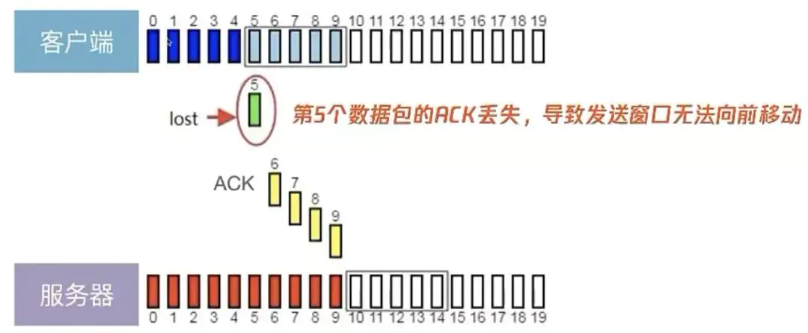

客户端发送了第 5～9 字节的数据，但是第 5 字节的 ACK 确认报文在网络中丢失了，那么即使客户端收到第 6～9 字节的 ACK 确认报文，发送窗口也不会往前移动。

此时的第 5 字节相当于“队头”，因为没有收到“队头”的 ACK 确认报文，导致发送窗口无法往前移动，此时发送方就无法继续发送后面的数据，相当于按下了发送行为的暂停键，这就是发送窗口的队头阻塞问题。

2. 接收窗口的队头阻塞

接收方收到的数据范围必须在接收窗口范围内，如果收到超过接收窗口范围的数据，就会丢弃该数据，比如下图接收窗口的范围是 32 ～ 51 字节，如果收到第 52 字节以上数据都会被丢弃。

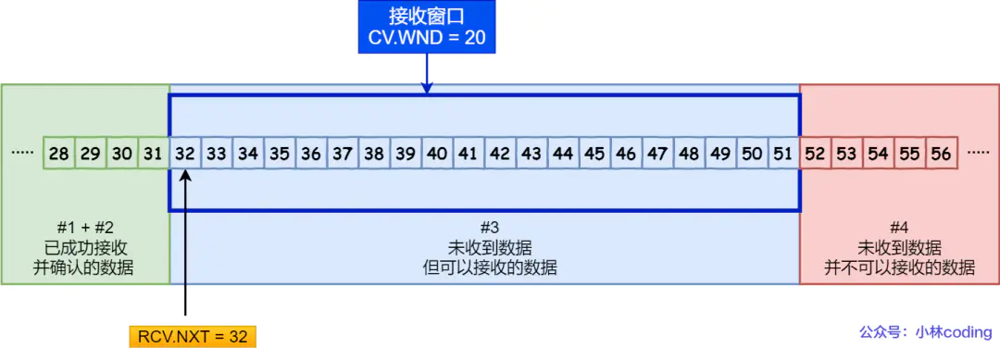

当接收窗口收到有序数据时，接收窗口才能往前滑动，然后那些已经接收并且被确认的「有序」数据就可以被应用层读取。

当接收窗口收到的数据不是有序的，比如收到第 33～40 字节的数据，由于第 32 字节数据没有收到， 接收窗口无法向前滑动，那么即使先收到第 33～40 字节的数据，这些数据也无法被应用层读取的。只有当发送方重传了第 32 字节数据并且被接收方收到后，接收窗口才会往前滑动，然后应用层才能从内核读取第 32～40 字节的数据。这就是接收窗口的队头阻塞问题。

发送窗口和接收窗口的队头阻塞问题的产生都是因为 TCP 必须按序处理数据，也就是 TCP 层为了保证数据的有序性，只有在处理完有序的数据后，滑动窗口才能往前滑动，否则就停留。

- 停留「发送窗口」会使得发送方无法继续发送数据；

- 停留「接收窗口」会使得应用层无法读取新的数据。

#### HTTP/2 的队头阻塞

HTTP/2 通过抽象出 Stream 的概念，实现了 HTTP 并发传输，一个 Stream 就代表 HTTP/1.1 里的请求和响应。


在 HTTP/2 连接上，不同 Stream 的帧是可以乱序发送的（因此可以并发不同的 Stream ），因为每个帧的头部会携带 Stream ID 信息，所以接收端可以通过 Stream ID 有序组装成 HTTP 消息，而同一 Stream 内部的帧必须是严格有序的。

但是 HTTP/2 多个 Stream 请求都是在一条 TCP 连接上传输，这意味着多个 Stream 共用同一个 TCP 滑动窗口，那么当发生数据丢失，滑动窗口是无法往前移动的，此时就会阻塞住所有的 HTTP 请求，这属于 TCP 层队头阻塞。


#### 没有队头阻塞的 QUIC

QUIC 也借鉴 HTTP/2 里的 Stream 的概念，在一条 QUIC 连接上可以并发发送多个 HTTP 请求 (Stream)。

但是 QUIC 给每一个 Stream 都分配了一个独立的滑动窗口，这样使得一个连接上的多个 Stream 之间没有依赖关系，都是相互独立的，各自控制的滑动窗口。

假如 Stream2 丢了一个 UDP 包，也只会影响 Stream2 的处理，不会影响其他 Stream，与 HTTP/2 不同，HTTP/2 只要某个流中的数据包丢失了，其他流也会因此受影响。

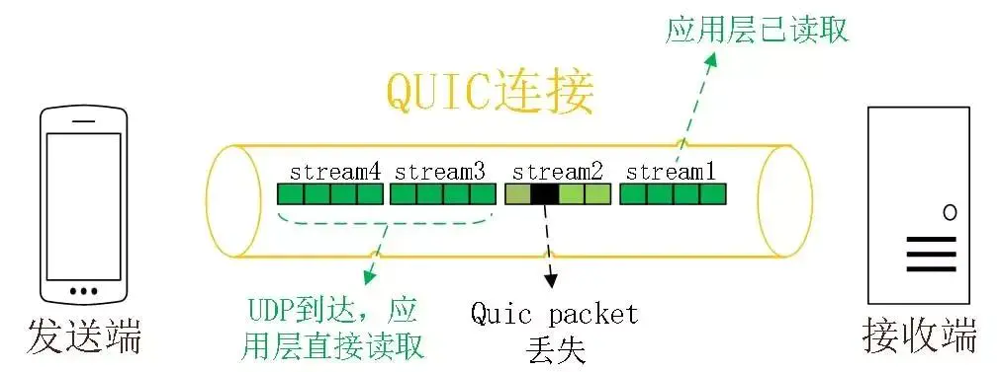


### 实现流量控制

TCP 流量控制是通过让「接收方」告诉「发送方」，它（接收方）的接收窗口有多大，从而让「发送方」根据「接收方」的实际接收能力控制发送的数据量。TCP 的接收窗口在收到有序的数据后，接收窗口才能往前滑动，否则停止滑动；TCP 的发送窗口在收到对已发送数据的顺序确认 ACK后，发送窗口才能往前滑动，否则停止滑动。

QUIC 是基于 UDP 传输的，而 UDP 没有流量控制，因此 QUIC 实现了自己的流量控制机制。不过，QUIC 的滑动窗口滑动的条件跟 TCP 有所差别的。

QUIC 实现了两种级别的流量控制，分别为 Stream 和 Connection 两种级别：

- Stream 级别的流量控制：每个 Stream 都有独立的滑动窗口，所以每个 Stream 都可以做流量控制，防止单个 Stream 消耗连接（Connection）的全部接收缓冲；

- Connection 流量控制：限制连接中所有 Stream 相加起来的总字节数，防止发送方超过连接的缓冲容量。

#### Stream 流量控制

回想一下 TCP，当发送方发送 seq1、seq2、seq3 报文，由于 seq2 报文丢失了，接收方收到 seq1 后会 ack1，然后接收方收到 seq3 后还是回 ack1（因为没有收到 seq2），这时发送窗口无法往前滑动。

但是，QUIC 就不一样了，即使中途有报文丢失，发送窗口依然可以往前滑动，具体怎么做到的呢？

最开始，接收方的接收窗口初始状态如下：


接着，接收方收到了发送方发送过来的数据，有的数据被上层读取了，有的数据丢包了，此时的接收窗口状况如下：


可以看到，接收窗口的左边界取决于接收到的最大偏移字节数，此时的接收窗口 = 最大窗口数 - 接收到的最大偏移数，这里就跟 TCP 不一样了。

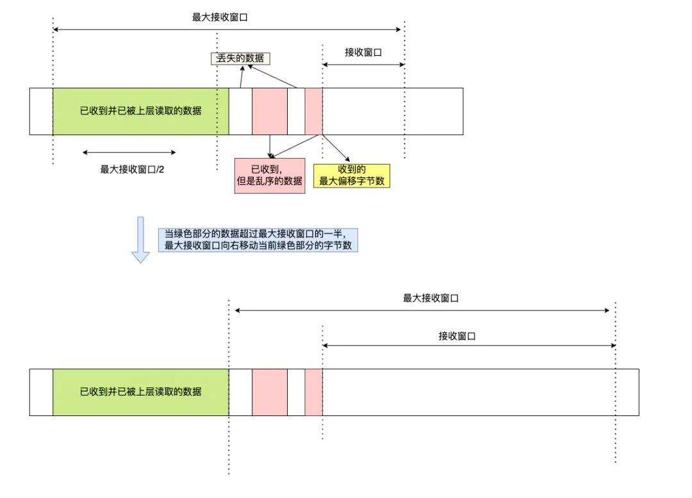

当图中的绿色部分数据超过最大接收窗口的一半后，最大接收窗口向右移动，同时给对端发送「窗口更新帧」。当发送方收到接收方的窗口更新帧后，发送窗口也会往前滑动，即使中途有丢包，依然也会滑动，这样就防止像 TCP 那样在出现丢包的时候，导致发送窗口无法移动，从而避免了无法继续发送数据。

在前面我们说过，每个 Stream 都有各自的滑动窗口，不同 Stream 互相独立，队头的 Stream A 被阻塞后，不妨碍 Stream B、C的读取。而对于 TCP 而言，其不知道将不同的 Stream 交给上层哪一个请求，因此同一个Connection内，Stream A 被阻塞后，Stream B、C 必须等待。

总而言之，QUIC 协议中同一个 Stream 内，滑动窗口的移动仅取决于接收到的最大字节偏移（尽管期间可能有部分数据未被接收），而对于 TCP，窗口滑动必须保证此前的 packet 都有序的接收到了，其中一个 packet 丢失就会导致窗口等待。

#### Connection 流量控制

而对于 Connection 级别的流量窗口，其接收窗口大小就是各个 Stream 接收窗口大小之和。

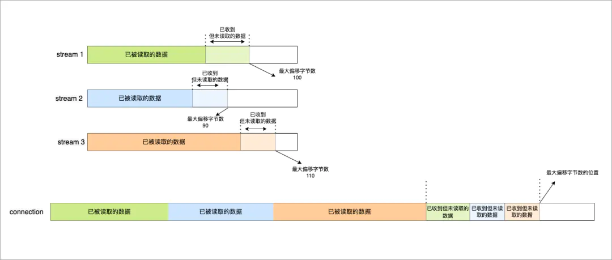

上图所示的例子，所有 Streams 的最大窗口数为 120，其中：

- Stream 1 的最大接收偏移为 100，可用窗口 = 120 - 100 = 20
- Stream 2 的最大接收偏移为 90，可用窗口 = 120 - 90 = 30
- Stream 3 的最大接收偏移为 110，可用窗口 = 120 - 110 = 10

那么整个 Connection 的可用窗口 = 20 + 30 + 10 = 60

> 可用窗口 = Stream 1 可用窗口 + Stream 2 可用窗口 + Stream 3 可用窗口


### 其他

#### 对拥塞控制的改进

QUIC 协议当前默认使用了 TCP 的 Cubic 拥塞控制算法（我们熟知的慢开始、拥塞避免、快重传、快恢复策略），同时也支持 CubicBytes、Reno、RenoBytes、BBR、PCC 等拥塞控制算法，相当于将 TCP 的拥塞控制算法照搬过来了，QUIC 是如何改进 TCP 的拥塞控制算法的呢？

QUIC 是处于应用层的，应用程序层面就能实现不同的拥塞控制算法，不需要操作系统，不需要内核支持。这是一个飞跃，因为传统的 TCP 拥塞控制，必须要端到端的网络协议栈支持，才能实现控制效果。而内核和操作系统的部署成本非常高，升级周期很长，所以 TCP 拥塞控制算法迭代速度是很慢的。而 QUIC 可以随浏览器更新，QUIC 的拥塞控制算法就可以有较快的迭代速度。

TCP 更改拥塞控制算法是对系统中所有应用都生效，无法根据不同应用设定不同的拥塞控制策略。但是因为 QUIC 处于应用层，所以就可以针对不同的应用设置不同的拥塞控制算法，这样灵活性就很高了。

#### 更快的连接建立

对于 HTTP/1 和 HTTP/2 协议，TCP 和 TLS 是分层的，分别属于内核实现的传输层、openssl 库实现的表示层，因此它们难以合并在一起，需要分批次来握手，先 TCP 握手（1RTT），再 TLS 握手（2RTT），所以需要 3RTT 的延迟才能传输数据，就算 Session 会话复用（TLS 1.3），也需要至少 2 个 RTT。

HTTP/3 在传输数据前虽然需要 QUIC 协议握手，这个握手过程只需要 1 RTT，握手的目的是为确认双方的「连接 ID」，连接迁移就是基于连接 ID 实现的。

但是 HTTP/3 的 QUIC 协议并不是与 TLS 分层，而是QUIC 内部包含了 TLS，它在自己的帧会携带 TLS 里的“记录”，再加上 QUIC 使用的是 TLS 1.3，因此仅需 1 个 RTT 就可以「同时」完成建立连接与密钥协商，甚至在第二次连接的时候，应用数据包可以和 QUIC 握手信息（连接信息 + TLS 信息）一起发送，达到 0-RTT 的效果。

如下图右边部分，HTTP/3 当会话恢复时，有效负载数据与第一个数据包一起发送，可以做到 0-RTT：


#### QUIC 连接迁移

基于 TCP 传输协议的 HTTP 协议，由于是通过四元组（源 IP、源端口、目的 IP、目的端口）确定一条 TCP 连接。


那么当移动设备的网络从 4G 切换到 WIFI 时，意味着 IP 地址变化了，那么就必须要断开连接，然后重新建立 TCP 连接。

而建立连接的过程包含 TCP 三次握手和 TLS 四次握手的时延，以及 TCP 慢启动的减速过程，给用户的感觉就是网络突然卡顿了一下，因此连接的迁移成本是很高的。

QUIC 协议没有用四元组的方式来“绑定”连接，而是通过连接 ID 来标记通信的两个端点，客户端和服务器可以各自选择一组 ID 来标记自己，因此即使移动设备的网络变化后，导致 IP 地址变化了，只要仍保有上下文信息（比如连接 ID、TLS 密钥等），就可以“无缝”地复用原连接，消除重连的成本，没有丝毫卡顿感，达到了连接迁移的功能。


# 网络编程

## IO 多路复用

IO 多路复用（IO Multiplexing）是一种同步 IO 模型，单个进程/线程就可以同时处理多个 IO 请求。一个进程/线程可以监视多个文件句柄；一旦某个文件句柄就绪，就能够通知应用程序进行相应的读写操作；没有文件句柄就绪时会阻塞应用程序，交出 cpu。多路是指网络连接，复用指的是同一个进程/线程。

一个进程/线程虽然任一时刻只能处理一个请求，但是处理每个请求的事件时，耗时控制在 1 毫秒以内，这样 1 秒内就可以处理上千个请求，把时间拉长来看，多个请求复用了一个进程/线程，这就是多路复用，这种思想很类似一个 CPU 并发多个进程，所以也叫做时分多路复用。


### 背景

我们需要先知道计算机是如何接受网络数据的。简单来讲，就是当网络数据到达网卡的时候，网卡会通过中断控制器向 CPU 发送中断信号，CPU 接收到中断信号的时候会根据接收到的中断向量号调用提前在中段描述符表中注册好的中断处理程序，中断处理程序会保存当前正在执行的程序的上下文，然后将网卡的中的数据复制到内核缓冲区，再等待空闲的时间将内核缓冲区的数据复制到用户缓冲区中供用户进程处理。

用户程序进行 IO 操作实际依赖于 linux 系统内核 read()、write() 函数。read() 函数的调用并不是直接从网卡把数据读取到用户内存中，而是把内核缓冲区中的数据复制到用户缓冲区中；write() 函数的调用也并不是直接把数据写入网卡中，而是把用户缓冲区的数据写入到内核缓冲区中。网卡与内核缓冲区数据的读写则是由操作系统内核完成。

> 阻塞 IO 和非阻塞 IO：
>
> 网卡同步数据到内核缓冲区，如果内核缓冲区中的数据未准备好，用户进程发起 read 操作，阻塞 IO 会一直等待内核缓冲区数据完整后再解除阻塞，非阻塞 IO 则会立即返回。内核缓冲区与用户缓冲区之间的读写操作肯定是阻塞的。
>
> 同步和异步：
>
> 同步是调用者主动发起请求，并主动等待这个结果返回，一但调用就必须有返回值；异步是调用发出后直接返回，所以没有返回结果，被调用者处理完成后通知回调、通知等机制来通知调用者。
>

在没有使用 IO 多路复用机制时，有 `BIO`、`NIO` 两种实现方式，但是会出现阻塞或者开销大的问题。

#### 同步阻塞（BIO）


读取数据流程：

- 用户进程调用 read() 系统函数，用户进程进入阻塞状态；
- 系统内核收到 read() 系统调用，网卡开始准备接收数据，在一开始内核缓冲区数据为空，内核在等待接收数据，用户进程同步阻塞等待；
- 内核缓冲区中有完整的数据后，内核会将内核缓冲区中的数据复制到用户缓冲区；
- 直到用户缓冲区中有数据，用户进程才能解除阻塞状态继续执行。

同步阻塞 IO 底层实现：

```c
// 创建socket
int listenfd = socket(AF_INET, SOCK_STREAM, 0);
// 绑定
bind(listenfd, (struct sockaddr*)&my_addr, sizeof(my_addr));
// 监听
listen(listenfd, 5);
// 接受客户端连接
int socketFd = accept(listenfd, (struct sockaddr*) &clientaddr, &clientaddrlen) 
// 接收客户端数据
recv(socketFd, buf, 256, 0); 
```

1. 服务端采用单线程

   当 accept 一个请求后，在 recv 和 send 调用阻塞时，将无法 accept 其他请求（必须等上一个请求处理完 recv 或 send），不能处理并发。

   ```c
   // 伪代码描述
   while(1) {
     // accept阻塞
     client_fd = accept(listen_fd)
     fds.append(client_fd)
     for (fd in fds) {
       // recv阻塞（会影响上面的accept）
       if (recv(fd)) {
         // logic
       }
     }  
   }
   ```

2. 服务端采用多线程

   当 accept 一个请求后，开启线程进行 recv，可以完成并发处理，但随着请求数增加需要增加系统线程，大量的线程占用很大的内存空间，并且线程切换会带来很大的开销，10000 个线程真正发生读写事件的线程数不会超过 20%，每次 accept 都开一个线程也是一种资源浪费。

   ```c
   // 伪代码描述
   while(1) {
     // accept阻塞
     client_fd = accept(listen_fd)
     // 开启线程read数据（fd增多导致线程数增多）
     new Thread func() {
       // recv阻塞（多线程不影响上面的accept）
       if (recv(fd)) {
         // logic
       }
     }  
   }
   ```

BIO 的优缺点：

优点：

- 开发简单，由于 accept()、recv() 都是阻塞的，为了服务于多个客户端请求，新的连接创建一个线程去处理即可；

- 阻塞的时候，线程挂起，不消耗 CPU 资源。

缺点：

- 每新来一个 IO 请求，都需要新建一个线程对应，高并发下系统开销大，多线程上下文切换频繁；
- 创建线程太多，内存消耗大。

#### 同步非阻塞（NIO）


读取数据流程：

- 用户进程发起请求调用 read() 函数，系统内核收到 read() 系统调用，网卡开始准备接收数据；

- 内核缓冲区数据没有准备好，请求立即返回，用户进程不断的重试查询内核缓冲区数据有没有准备好；

- 当内核缓冲区数据准备好了之后，用户进程阻塞，内核开始将内核缓冲区数据复制到用户缓冲区；

- 复制完成后，用户进程解除阻塞，读取数据继续执行。

同步非阻塞 IO 底层实现：

```c
// 创建socket
int listenfd = socket(AF_INET, SOCK_STREAM, 0);
// 绑定
bind(listenfd, (struct sockaddr*)&my_addr, sizeof(my_addr));
// 监听
listen(listenfd, 5);
// 设置为非阻塞
ioctl(listenfd, FIONBIO, 1);
// 接受客户端连接
int socketFd = accept(listenfd, (struct sockaddr*) &clientaddr, &clientaddrlen);
// 设置为非阻塞
ioctl(socketFd, FIONBIO, 1);
while (1) {
    int fd;
    // 循环遍历
    for (fd : fds) {
        // 接收客户端数据
		recv(fd, buf, 256, 0); 
    }
}
```

服务器端当 accept 一个请求后，加入 fds 集合，每次轮询一遍 fds 集合 recv（非阻塞）数据，没有数据则立即返回错误，每次轮询所有 fd（包括没有发生读写事件的 fd）会很浪费 cpu。

```c
setNonblocking(listen_fd)
// 伪代码描述
while(1) {
  // accept非阻塞（cpu一直忙轮询）
  client_fd = accept(listen_fd)
  if (client_fd != null) {
    // 有人连接
    fds.append(client_fd)
  } else {
    // 无人连接
  }  
  for (fd in fds) {
    // recv非阻塞
    setNonblocking(client_fd)
    // recv 为非阻塞命令
    if (len = recv(fd) && len > 0) {
      // 有读写数据
      // logic
    } else {
       无读写数据
    }
  }  
}
```

同步非阻塞 IO 的优缺点：

优点：

- 非阻塞， accept()、recv() 均不阻塞，用户线程立即返回；
- 规避了同步阻塞模式的多线程问题。

缺点：

- 假如现在有 1 万个客户端连接，但只有 1 个客户端发送数据过来，为了获取这个 1 个客户端发送的消息，我需要循环向内核发送 1 万遍 recv() 系统调用，而这其中有 9999 次是无效的请求，浪费 CPU 资源。

#### IO 多路复用


IO 多路复用，即一个线程监测多个 IO 操作。

IO 多路复用模型是建立在内核提供的多路分离函数 select 基础之上的，使用 select 函数可以避免同步非阻塞 IO 模型中轮询等待的问题，即一次性将 N 个客户端 socket 连接传入内核然后阻塞，交由内核去轮询，当某一个或多个 socket 连接有事件发生时，解除阻塞并返回事件列表，用户进程再循环遍历处理有事件的 socket 连接。这样就避免了多次调用 recv() 系统调用，避免了用户态到内核态的切换。  

服务器端采用单线程通过 select/epoll 等系统调用获取 fd 列表，遍历有事件的 fd 进行 accept/recv/send，使其能支持更多的并发连接请求。

```c
fds = [listen_fd]
// 伪代码描述
while(1) {
  // 通过内核获取有读写事件发生的fd，只要有一个则返回，无则阻塞
  // 整个过程只在调用select、poll、epoll这些调用的时候才会阻塞，accept/recv是不会阻塞
  for (fd in select(fds)) {
    if (fd == listen_fd) {
        client_fd = accept(listen_fd)
        fds.append(client_fd)
    } elseif (len = recv(fd) && len != -1) { 
      // logic
    }
  }  
}
```


### 实现

#### select

select 函数仅仅知道有几个 I/O 事件发生了，但并不知道具体是哪几个 socket 连接有 I/O 事件，还需要轮询去查找，时间复杂度为 O(n)，处理的请求数越多，所消耗的时间越长。

select 函数执行流程：

- 从用户空间拷贝 fd_set（注册的事件集合）到内核空间；
- 遍历所有 fd 文件，并将当前进程挂到每个 fd 的等待队列中，当某个 fd 文件设备收到消息后，会唤醒设备等待队列上睡眠的进程，那么当前进程就会被唤醒；
- 如果遍历完所有的 fd 没有 I/O 事件，则当前进程进入睡眠，当有某个 fd 文件有 I/O 事件或当前进程睡眠超时后，当前进程重新唤醒再次遍历所有 fd 文件。

select 函数接口定义：

```c
#include <sys/select.h>
#include <sys/time.h>

// 最大支持1024个连接
#define FD_SETSIZE 1024
#define NFDBITS (8 * sizeof(unsigned long))
#define __FDSET_LONGS (FD_SETSIZE/NFDBITS)

/**
* 数据结构 (bitmap)
* fd_set保存了相关的socket事件
*/
typedef struct {
    unsigned long fds_bits[__FDSET_LONGS];
} fd_set;

/**
* select是一个阻塞函数
*/
// 返回值就绪描述符的数目
int select(
    int max_fd,  // 最大的文件描述符值，遍历时取0-max_fd
    fd_set *readset,  // 读事件列表
    fd_set *writeset,  // 写事件列表
    fd_set *exceptset,  // 异常列表
    struct timeval *timeout  // 阻塞超时时间
)

FD_ZERO(int fd, fd_set* fds)   // 清空集合
FD_SET(int fd, fd_set* fds)    // 将给定的描述符加入集合
FD_ISSET(int fd, fd_set* fds)  // 判断指定描述符是否在集合中 
FD_CLR(int fd, fd_set* fds)    // 将给定的描述符从文件中删除  
```

select 使用示例：

```c
#include<stdio.h>
#include <stdio.h>
#include <stdlib.h>
#include <string.h>						
#include <unistd.h>
#include <sys/socket.h>
#include <netinet/in.h>
#include <arpa/inet.h>	

void server() {
	
	// 创建socket连接
	int lfd = socket(AF_INET,SOCK_STREAM,0);
	struct sockaddr_in my_addr; 
	bzero(&my_addr, sizeof(my_addr));
	my_addr.sin_family = AF_INET; // ipv4
	my_addr.sin_port   = htons(9090);
	my_addr.sin_addr.s_addr = htonl(INADDR_ANY); 
	// 绑定端口
	bind(lfd, (struct sockaddr*)&my_addr, sizeof(my_addr));
	// 监听连接请求
	listen(lfd, 128);
	printf("listen client @port=%d...\n", 9090);
	int lastfd = lfd;
	// 定义文件描述符集
	fd_set read_fd_set, all_fd_set;
	// 服务socket描述符加入set集合中
	FD_ZERO(&all_fd_set);
	FD_SET(lfd, &all_fd_set);
	printf("准备进入while循环\n");
	while (1) {
		read_fd_set = all_fd_set;
		printf("阻塞中... lastfd=%d\n", lastfd);
		int nready = select(lastfd+1, &read_fd_set, NULL, NULL, NULL);
		switch (nready) {
			case 0 :
				printf("select time out ......\n");
				break;
			case -1 :
				perror("select error \n");
				break;
			default:
				// 监听到新的客户端连接
				if (FD_ISSET(lfd, &read_fd_set)) {
					struct sockaddr_in client_addr;	
					socklen_t cliaddr_len = sizeof(client_addr);
					char cli_ip[INET_ADDRSTRLEN] = "";	
					// 肯定有连接不会阻塞
					int clientfd = accept(lfd, (struct sockaddr*)&client_addr, &cliaddr_len);
					inet_ntop(AF_INET, &client_addr.sin_addr, cli_ip, INET_ADDRSTRLEN);
					printf("----------------------------------------------\n");
					printf("client ip=%s,port=%d\n", cli_ip, ntohs(client_addr.sin_port));
					// 将clientfd加入读集合
					FD_SET(clientfd, &all_fd_set);	
					lastfd = clientfd;
					if(0 == --nready) {
						continue;
					}
				}
				int i;
				for (i = lfd + 1;i <= lastfd; i++) {
					// 处理读事件
					if (FD_ISSET(i, &read_fd_set)) {
						char recv_buf[512] = "";
						int rs = read(i, recv_buf, sizeof(recv_buf));
						if (rs == 0 ) {
							close(i);
							FD_CLR(i, &all_fd_set);
						} else {
							printf("%s\n",recv_buf);
							// 给每一个服务端写数据
							int j;
							for (j = lfd + 1;j <= lastfd; j++) {
								if (j != i) {
									write(j, recv_buf, strlen(recv_buf));
								}
							}
						}
					}
				}
		}
		
	}
}

int main(){
	server();
	return 0;
}
```

select 的缺点：

- 单个进程所打开的 FD 是有限制的，通过 `FD_SETSIZE` 设置，默认 1024；

- 每次调用 select，都需要把 fd 集合从用户态拷贝到内核态，这个开销在 fd 很多时会很大；
- 每次调用 select 都需要将进程加入到所有监视 socket 的等待队列，每次唤醒都需要从每个队列中移除；
- select 函数在每次调用之前都要对参数进行重新设定，这样做比较麻烦，而且会降低性能；

- 对 socket 扫描时是线性扫描，采用轮询的方法，效率较低（高并发时）。


#### poll 函数

poll 本质上和 select 没有区别，它将用户传入的数组拷贝到内核空间，然后查询每个 fd 对应的设备状态， 但是它没有最大连接数的限制，原因是它是基于链表来存储的。

poll 函数接口：

```c
#include <poll.h>
// 数据结构
struct pollfd {
    int fd;                         // 需要监视的文件描述符
    short events;                   // 需要内核监视的事件
    short revents;                  // 实际发生的事件，1：表示有事件发生，0：没有事件发生
};

// 阻塞方法
int poll(struct pollfd fds[],   // 需要监听的文件描述符列表
         nfds_t nfds,           // 文件描述符个数
         int timeout            // 超时时间
        );
```

poll 使用示例：

```cython
#include <stdio.h>
#include <stdlib.h>
#include <string.h>
#include <sys/types.h>
#include <sys/socket.h>
#include <netinet/in.h>
#include <arpa/inet.h>
#include <poll.h>
#include <unistd.h>
#include <sys/time.h>


#define MAX_POLLFD_LEN 4096  
#define PORT 9108


void server() {
	
	// 创建socket连接
	int lfd = socket(AF_INET,SOCK_STREAM,0);
	struct sockaddr_in my_addr; 
	bzero(&my_addr, sizeof(my_addr));
	my_addr.sin_family = AF_INET; // ipv4
	my_addr.sin_port   = htons(PORT);
	my_addr.sin_addr.s_addr = htonl(INADDR_ANY); 
	// 绑定端口
	bind(lfd, (struct sockaddr*)&my_addr, sizeof(my_addr));
	// 监听连接请求
	listen(lfd, 128);
	printf("listen client @port=%d...\n",PORT);
	
	// 定义pollfd对象
	struct pollfd fds[MAX_POLLFD_LEN];
	memset(fds, 0, sizeof(fds));
	// 添加socket服务监听
	fds[0].fd = lfd;
	fds[0].events = POLLIN;
	int nfds = 1;
	int i;
	for(i = 1; i < MAX_POLLFD_LEN; i++) {
		fds[i].fd = -1;
	}
	int maxFds = 0;
	printf("准备进入while循环\n");
	while (1) {
		printf("阻塞中, [maxFds=%d]...\n", maxFds);
		int nready = poll(fds, maxFds + 1, -1);
		switch (nready) {
			case 0 :
				printf("select time out ......\n");
				break;
			case -1 :
				perror("select error \n");
				break;
			default:
				// 监听到新的客户端连接
				if (fds[0].revents & POLLIN) {
					struct sockaddr_in client_addr;	
					socklen_t cliaddr_len = sizeof(client_addr);
					char cli_ip[INET_ADDRSTRLEN] = "";	
					// 肯定有连接不会阻塞
					int clientfd = accept(lfd, (struct sockaddr*)&client_addr, &cliaddr_len);
					inet_ntop(AF_INET, &client_addr.sin_addr, cli_ip, INET_ADDRSTRLEN);
					printf("----------------------------------------------\n");
					printf("client ip=%s,port=%d\n", cli_ip, ntohs(client_addr.sin_port));
					// 将clientfd加入读集合
					int j;
					for (j = 1; j < MAX_POLLFD_LEN; ++j) {
						if (fds[j].fd < 0) {
							fds[j].fd = clientfd;
							fds[j].events = POLLIN;
							printf("添加客户端成功...\n");
							maxFds++;   
							break;
						}
						if(j == MAX_POLLFD_LEN){
							printf("too many clients"); 
							exit(1);
						}
						
					}
				    
					if(--nready <= 0) {
						continue;
					}
				}
				int i;
				printf("maxFds=%d\n", maxFds);
				for (i = 1; i <= maxFds; i++) {
					printf("i=%d\n", i);
					// 处理读事件
					if (fds[i].revents & POLLIN) {
						int sockfd = fds[i].fd;
						char recv_buf[512] = "";
						int rs = read(sockfd, recv_buf, sizeof(recv_buf));

						if (rs == 0) {
							close(sockfd);
							fds[i].fd = -1;
						} else {
							printf("%s\n",recv_buf);
							// 给每一个服务端写数据
							int j;
							for (j = 1;j <= maxFds; j++) {
								if (j != i) {
									write(fds[j].fd, recv_buf, strlen(recv_buf));
								}
							}
						}
					}
				}
		}
		
	}
}

int main(){
	server();
	return 0;
}
```

poll 缺点和 select 相同。

#### epoll 函数

epoll 可以理解为 event pool，不同与 select、poll 的轮询机制，epoll 采用的是事件驱动机制，每个 fd 上注册有回调函数，当网卡接收到数据时会回调该函数，同时将该 fd 的引用放入 rdlist 就绪列表中。

当调用 epoll_wait 检查是否有事件发生时，只需要检查 eventpoll 对象中的 rdlist 双链表中是否有 epitem 元素即可。如果 rdlist 不为空，则把发生的事件复制到用户态，同时将事件数量返回给用户。

epoll 执行流程：

- 调用 epoll_create() 创建一个 ep 对象，即红黑树的根节点，返回一个文件句柄；
- 调用 epoll_ctl() 向这个 ep 对象（红黑树）中添加、删除、修改感兴趣的事件；
- 调用 epoll_wait() 等待，当有事件发生时网卡驱动会调用 fd 上注册的函数并将该 fd 添加到 rdlist 中，解除阻塞。


epoll 函数的接口定义：

```c
#include <sys/epoll.h>

// 数据结构
// 每一个epoll对象都有一个独立的eventpoll结构体
// 用于存放通过epoll_ctl方法向epoll对象中添加进来的事件
// epoll_wait检查是否有事件发生时，只需要检查eventpoll对象中的rdlist双链表中是否有epitem元素即可
struct eventpoll {
    /*红黑树的根节点，这颗树中存储着所有添加到epoll中的需要监控的事件*/
    struct rb_root  rbr;
    /*双链表中则存放着将要通过epoll_wait返回给用户的满足条件的事件*/
    struct list_head rdlist;
};

// API
// 内核中间加一个 ep 对象，把所有需要监听的socket都放到ep对象中
int epoll_create(int size); 
// epoll_ctl 负责把 socket 增加、删除到内核红黑树
int epoll_ctl(int epfd,  // 创建的ep对象
              int op,    // 操作类型 新增、删除等
              int fd,    // 要操作的对象
              struct epoll_event *event  // 事件
             ); 
// epoll_wait 负责检测可读队列，没有可读 socket 则阻塞进程
int epoll_wait(int epfd, struct epoll_event * events, int maxevents, int timeout);
```

epoll 使用示例：

```c
#include<stdio.h>
#include <stdio.h>
#include <stdlib.h>
#include <string.h>						
#include <unistd.h>
#include <sys/socket.h>
#include <netinet/in.h>
#include <arpa/inet.h>	
#include <sys/epoll.h>

void server() {
	
	// 创建socket连接
	int lfd = socket(AF_INET,SOCK_STREAM,0);
	struct sockaddr_in my_addr; 
	bzero(&my_addr, sizeof(my_addr));
	my_addr.sin_family = AF_INET; // ipv4
	my_addr.sin_port   = htons(8088);
	my_addr.sin_addr.s_addr = htonl(INADDR_ANY); 
	// 绑定端口
	bind(lfd, (struct sockaddr*)&my_addr, sizeof(my_addr));
	// 监听连接请求
	listen(lfd, 128);
	printf("listen client @port=%d...\n", 8088);
	int epct, i;
	struct epoll_event event;
	struct epoll_event events[100];
	memset(events, 0, 100 * sizeof(struct epoll_event));
	int epfd = epoll_create(1);
	event.data.fd = lfd;
	event.events = EPOLLIN;
	epoll_ctl(epfd, EPOLL_CTL_ADD, lfd, &event);
	while (1) {
		printf("阻塞中....\n");
		int nready = epoll_wait(epfd, events, 20, -1);
		int i;
		for (i = 0; i < nready; ++i) {
			// 监听到新的客户端连接
			if (events[i].data.fd == lfd) {
				struct sockaddr_in client_addr;	
				socklen_t cliaddr_len = sizeof(client_addr);
				char cli_ip[INET_ADDRSTRLEN] = "";	
				// 肯定有连接不会阻塞
				int clientfd = accept(lfd, (struct sockaddr*)&client_addr, &cliaddr_len);
				inet_ntop(AF_INET, &client_addr.sin_addr, cli_ip, INET_ADDRSTRLEN);
				
				event.data.fd = clientfd;
				event.events = EPOLLIN | EPOLLET;
				epoll_ctl(epfd, EPOLL_CTL_ADD, clientfd, &event);
				
				printf("----------------------------------------------\n");
				printf("client ip=%s,port=%d\n", cli_ip, ntohs(client_addr.sin_port));
			} else {
				char recv_buf[512] = "";
				int rs = read(events[i].data.fd, recv_buf, sizeof(recv_buf));
				if (rs < 0) {
					close(events[i].data.fd);
					epoll_ctl(epfd, EPOLL_CTL_DEL, events[i].data.fd, &event);
					continue;
				}
				printf("%s\n",recv_buf);
			}
		}
	}
}

int main(){
	server();
	return 0;
}
```

epoll 有 EPOLLLT 和 EPOLLET 两种触发模式，`LT` 是默认的模式，`ET` 是“高速”模式。

- LT 模式下，只要这个 fd 还有数据可读，每次 epoll_wait 都会返回它的事件，提醒用户程序去操作;
- ET 模式下，它只会提示一次，直到下次再有数据流入之前都不会再提示了，无论 fd 中是否还有数据可读。所以在 ET 模式下，read 一个 fd 的时候一定要把它的 buffer 读完，或者遇到 EGAIN 错误。

epoll 总结：

- epoll 支持的最大文件描述符上限是整个系统最大可打开的文件数目, 1G 内存理论上最大创建 10 万个文件描述符；
- select、poll 采用轮询的方式来检查文件描述符是否处于就绪态，而 epoll 采用回调机制。造成的结果就是，随着 fd 的增加，select 和 poll 的效率会线性降低，而 epoll 不会受到太大影响，除非活跃的 socket 很多。

epoll 缺点：

- 只能在 Linux 下工作

#### select\poll\epoll 对比

|            |          select          |        poll        |                         epoll                          |
| :--------- | :----------------------: | :----------------: | :----------------------------------------------------: |
| 数据结构   |          bitmap          |        数组        |                         红黑树                         |
| 最大连接数 | 1024 (x86) 或 2048 (x64) |       无上限       |                         无上限                         |
| fd 拷贝    |   每次调用 select 拷贝   | 每次调用 poll 拷贝 | fd 首次调用 epoll_ctl 拷贝，每次调用 epoll_wait 不拷贝 |
| 工作效率   |       轮询：O(n）        |    轮询：O(n）     |                      回调：O(1）                       |


# 其它问题

## 浏览器中输入 URL 之后发生了什么

<p align="center">

</p>

1. URL 解析

首先判断你输入的是一个合法的 URL 还是一个待搜索的关键词，并且根据你输入的内容进行对应操作。

一个 URL 的结构解析如下：

<p align="center">

</p>


2. DNS 查询

查找 URL 中域名对应的 IP 地址。

浏览器会先按照 `浏览器 DNS 缓存 -> 系统 DNS 缓存 -> 本地 hosts 文件` 的顺序去查找。如有缓存，就直接显示；如果没有，则系统会再将网址提交 DNS 域名解析服务器进行 IP 地址的解析。

- 如果 DNS 服务器和我们的主机在同一个子网内，系统会对 DNS 服务器进行 ARP 查询；
- 如果 DNS 服务器和我们的主机在不同的子网，系统会对默认网关进行 ARP 查询。

<p align="center">

</p>

3. TCP 连接

在确定目标服务器的 IP 地址后，通过三次握手与其建立 TCP 连接。

<p align="center">

</p>

4. 发送 HTTP 请求

当建立 TCP 连接之后，就可以在这基础上进行通信，浏览器发送 HTTP 请求到目标服务器。

请求的内容包括：

- 请求行
- 请求头
- 请求主体

<p align="center">

</p>

5. 服务器响应请求

后端从在固定的端口接收到 TCP 报文开始，这一部分对应于编程语言中的 socket。它会对 TCP 连接进行处理，对 HTTP 协议进行解析，并按照报文格式进一步封装成 HTTP Request 对象，供上层使用。这一部分工作一般是由 Web 服务器去进行。

HTTPD（HTTP Daemon）在服务器端处理请求/响应。最常见的 HTTPD 有 Linux 上常用的 Apache（阿帕奇）和 Nginx（engine x），以及 Windows 上的 IIS。

- HTTPD 接收请求；

- 服务器把请求拆分为以下几个参数：
  - HTTP 请求方法(`GET`, `POST`, `HEAD`, `PUT`, `DELETE`, `CONNECT`, `OPTIONS`, 或者 `TRACE`)。直接在地址栏中输入 URL 的情况下，使用的是 GET 方法
  - 域名：google.com
  - 请求路径/页面：/ （若未请求指定页面，则为默认路径）

- 服务器验证其上已经配置了 www.test101.com 的虚拟主机；

- 服务器验证 www.test101.com 接受 GET 方法；

- 服务器验证该用户可以使用 GET 方法（根据 IP 地址，身份信息等）；

- 如果服务器安装了 URL 重写模块（例如 Apache 的 mod_rewrite 和 IIS 的 URL Rewrite），服务器会尝试匹配重写规则，如果匹配上的话，服务器会按照规则重写这个请求；

- 服务器根据请求信息获取相应的响应内容，这种情况下由于访问路径是 "/" ，会访问首页文件（你可以重写这个规则，但是这个是最常用的）；

- 服务器会使用指定的处理程序分析处理这个文件，假如使用 PHP，服务器会使用 PHP 解析 index 文件，并捕获输出，把 PHP 的输出结果返回给请求者。

处理完成之后返回一个 HTTP 响应消息，包括：

- 状态行
- 响应头
- 响应正文

<p align="center">

</p>
6. 页面渲染

当浏览器接收到服务器响应的资源后，首先会对资源进行解析：

- 查看响应头的信息，根据不同的指示做对应处理，比如重定向，存储 cookie，解压 gzip，缓存资源等等；
- 查看响应头的 Content-Type的值，根据不同的资源类型采用不同的解析方式。

关于页面的渲染过程如下：

- 解析 HTML，构建 DOM 树；
- 解析 CSS ，生成 CSS 规则树；
- 合并 DOM 树和 CSS 规则，生成 render 树
- 布局 render 树（Layout / reflow），负责各元素尺寸、位置的计算；
- 绘制 render 树（paint），绘制页面像素信息；
- 浏览器会将各层的信息发送给 GPU，GPU 会将各层合成（composite），显示在屏幕上。

<p align="center">

</p>
超详细版本请转向阅读：[what-happens-when-zh_CN](https://github.com/skyline75489/what-happens-when-zh_CN)